[原文地址](https://github.com/lcxfs1991/blog/issues/8)
[本文start kit: steamer-react](https://github.com/SteamerTeam/steamer-react/tree/react)

PS: 要看效果得将一个QQ群组转换成家校群，可到此网址进行转换（手Q/PC都可以访问）：
[http://qun.qq.com/homework/](http://qun.qq.com/homework/)。转换之后，可以通过QQ群的加号面板，或者群资料卡进入。

最近一个季度，我们都在为手Q家校群做重构优化，将原有那套问题不断的框架换掉。经过一些斟酌，决定使用react 进行重构。选择react，其实也主要是因为它具有下面的三大特性。
## React的特性
### 1. Learn once, write anywhere

学习React的好处就是，学了一遍之后，能够写web, node直出，以及native，能够适应各种纷繁复杂的业务。需要轻量快捷的，直接可以用Reactjs；需要提升首屏时间的，可以结合React Server Render；需要更好的性能的，可以上React Native。

但是，这其实暗示学习的曲线非常陡峭。单单是Webpack+ React + Redux就已够一个入门者够呛，更何况还要兼顾直出和手机客户端。不是一般人能hold住所有端。
### 2. Virtual Dom

Virtual Dom（下称vd）算是React的一个重大的特色，因为Facebook宣称由于vd的帮助，React能够达到很好的性能。是的，Facebook说的没错，但只说了一半，它说漏的一半是：“除非你能正确的采用一系列优化手段”。
### 3. 组件化

另一个被大家所推崇的React优势在于，它能令到你的代码组织更清晰，维护起来更容易。我们在写的时候也有同感，但那是直到我们踩了一些坑，并且渐渐熟悉React+ Redux所推崇的那套代码组织规范之后。

### 那么？

上面的描述不免有些先扬后抑的感觉，那是因为往往作为React的刚入门者，都会像我们初入的时候一样，对React满怀希望，指意它帮我们做好一切，但随着了解的深入，发现需要做一些额外的事情来达到我们的期待。

## 对React的期待

初学者对React可能满怀期待，觉得React可能完爆其它一切框架，甚至不切实际地认为React可能连原生的渲染都能完爆——对框架的狂热确实会出现这样的不切实际的期待。让我们来看看React的官方是怎么说的。React官方文档在Advanced Performanec这一节，这样写道：

```
One of the first questions people ask when considering React for a project is whether their application will be as fast and responsive as an equivalent non-React version
```

显然React自己也其实只是想尽量达到跟非React版本相若的性能。React在减少重复渲染方面确实是有一套独特的处理办法，那就是vd，但显示在首次渲染的时候React绝无可能超越原生的速度，或者一定能将其它的框架比下去。因此，我们在做优化的时候，可的期待的东西有：
- 首屏时间可能会比较原生的慢一些，但可以尝试用React Server Render (又称Isomorphic)去提高效率
- 用户进行交互的时候，有可能会比原生的响应快一些，前提是你做了一些优化避免了浪费性能的重复渲染。

## 以手Q家校群功能页React重构优化为例

手Q家校群功能页主要由三个页面构成，分别是列表页、布置页和详情页。列表页已经重构完成并已发布，布置页已重构完毕准备提测，详情页正在重构。与此同时我们已完成对列表页的同构直出优化，并已正在做React Native优化的铺垫。

这三个页面的重构其实覆盖了不少页面的案例，所以还是蛮有代表性的，我们会将重构之中遇到的一些经验穿插在文章里论述。

在手Q家校群重构之前，其实我们已经做了一版PC家校群。当时将native的页面全部web化，直接就采用了React比较常用的全家桶套装：
- 构建工具 => gulp + webpack
- 开发效率提升 => redux-dev-tools + hot-reload
- 统一数据管理=> redux
- 性能提升 => immutable + purerender
- 路由控制器 => react-router(手Q暂时没采用)

为什么我们在优化的时候主要讲手Q呢？毕竟PC的性能在大部份情况下已经很好，在PC上一些存在的问题都被PC良好的性能掩盖下去。手机的性能不如PC，因此有更多有价值的东西深挖。开发的时候我就跟同事开玩笑说：“没做过手机web优化的都真不好意思说自己做过性能优化啊“。
## 构建针对React做的优化

我在《性能优化三部曲之一——构建篇》提出，“通过构建，我们可以达成开发效率的提升，以及对项目最基本的优化”。在进行React重构优化的过程中，构建对项目的优化作用必不可少。在本文暂时不赘述，我另外开辟了一篇[《webpack使用优化（react篇）》](https://github.com/lcxfs1991/blog/issues/7)进行具体论述。

## 开发效率提升工具

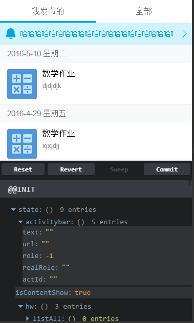

在PC端使用Redux的时候，我们都很喜欢使用Redux-Devtools来查看Redux触发的action，以及对应的数据变化。PC端使用的时候，我们习惯摆在右边。但移动端的屏幕较少，因此家校群项目使用的时候放在底部，而且由于性能问题，我们在constant里设一个debug参数，然后在chrome调试时打开，移动端非必须的时候关闭。否则，它会导致移动web的渲染比较低下。
## 数据管理及性能优化
### Redux统一管理数据

这一部份算是重头戏吧。React作为View层的框架，已经通过vd帮助我们解决重复渲染的问题。但vd是通过看数据的前后差异去判断是否要重复渲染的，但React并没有帮助我们去做这层比较。因此我们需要使用一整套数据管理工具及对应的优化方法去达成。在这方法，我们选择了Redux。

Redux整个数据流大体可以用下图来描述：

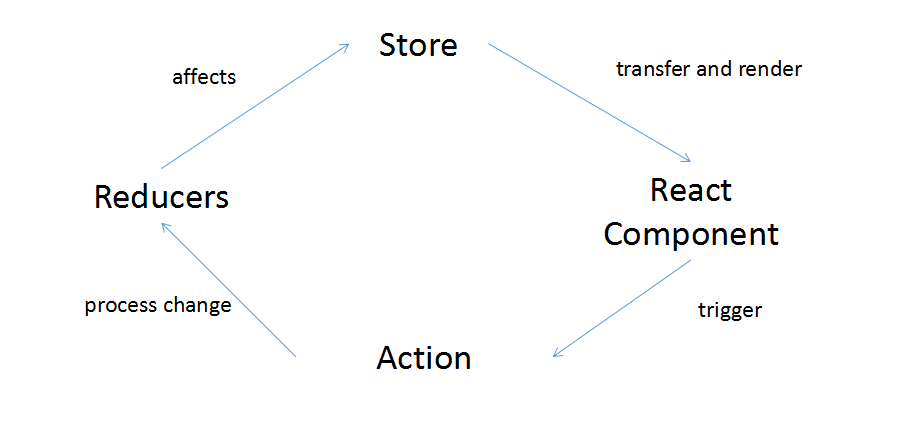

Redux这个框架的好处在于能够统一在自己定义的reducer函数里面去进行数据处理，在View层中只需要通过事件去处触发一些action就可以改变地应的数据，这样能够使数据处理和dom渲染更好地分离，而避免手动地去设置state。

在重构的时候，我们倾向于将功能类似的数据归类到一起，并建立对应的reducer文件对数据进行处理。如下图，是手Q家校群布置页的数据结构。有些大型的SPA项目可能会将初始数据分开在不同的reducer文件里，但这里我们倾向于归到一个store文件，这样能够清晰地知道整个文件的数据结构，也符合Redux想统一管理数据的想法。然后数据的每个层级与reducer文件都是一一对应的关系。

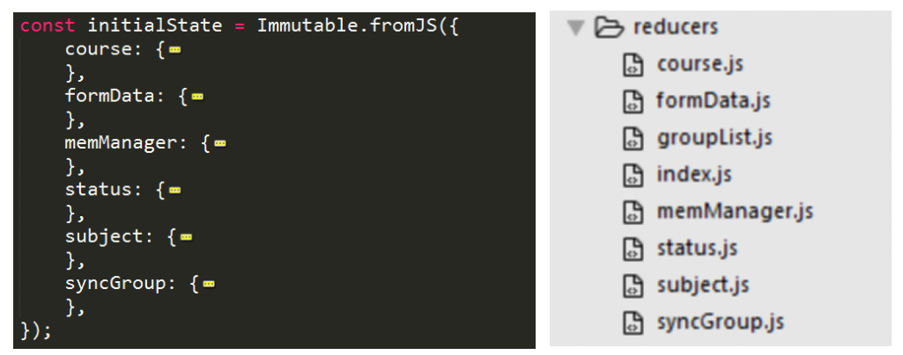
### 重复渲染导致卡顿

这套React + Redux的东西在PC家校群页面上用得很欢乐， 以至于不用怎么写shouldComponentUpdate都没遇到过什么性能问题。但放到移动端上，我们在列表页重构的时候就马上遇到卡顿的问题了。

什么原因呢？是重复渲染导致的！！！！！！

说好的React vd可以减少重复渲染呢？！！！

请别忘记前提条件！！！！

你可以在每个component的render里，放一个console.log("xxx component")。然后触发一个action，在优化之前，几乎全部的component都打出这个log，表明都重复渲染了。
更正：可见后面yeatszhang同学的解释。
### React性能的救星Immutablejs

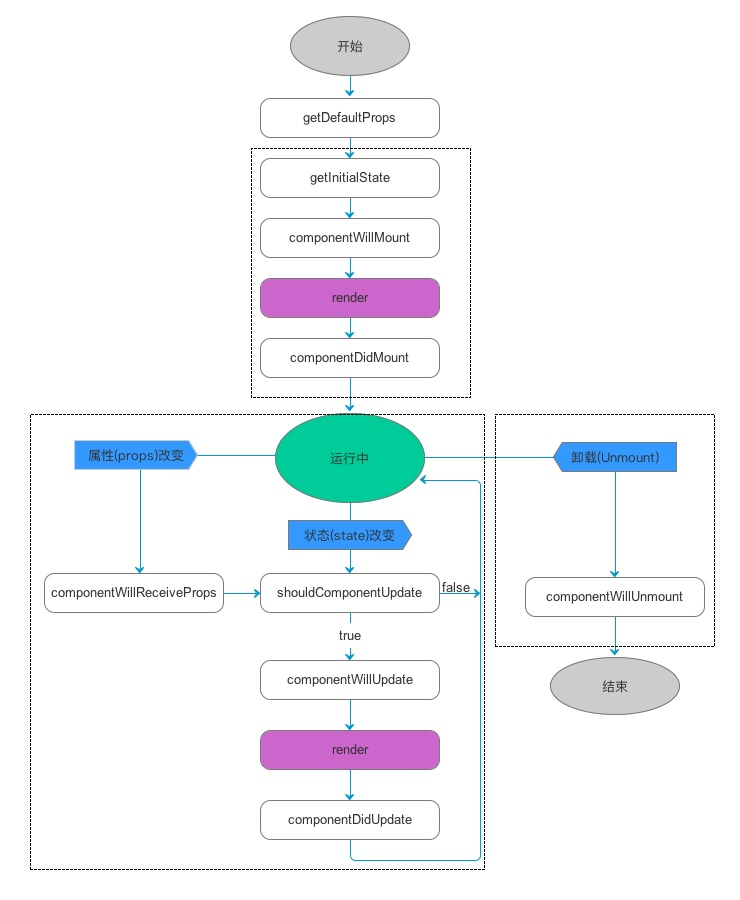

上图是React的生命周期，还没熟悉的同学可以去熟悉一下。因为其中的shouldComponentUpdate是优化的关键。React的重复渲染优化的核心其实就是在shouldComponentUpdate里面做数据比较。在优化之前，shouldComponentUpdate是默认返回true的，这导致任何时候触发任何的数据变化都会使component重新渲染。这必然会导致资源的浪费和性能的低下——你可能会感觉比较原生的响应更慢。

这时你开始怀疑这世界——是不是Facebook在骗我。

当时遇到这个问题我的开始翻阅文档，也是在Facebook的Advanced Performance一节中找到答案：Immutablejs。这个框架已被吹了有一年多了吧，吹这些框架的人理解它的原理，但不一定实践过——因为作为一线移动端开发者，打开它的github主页看dist文件，50kb，我就已经打退堂鼓了。只是遇到了性能问题，我们才再认真地去了解一遍。

Immutable这个的意思就是不可变，Immutablejs就是一个生成数据不可变的框架。一开始你并不理解不可变有什么用。最开始的时候Immutable这种数据结构是为了解决数据锁的问题，而对于js，就可以借用来解决前后数据比较的问题——因为同时Immutablejs还提供了很好的数据比较方法——Immutable.is()。小结一下就是：
- Immutablejs本身就能生成不可变数据，这样就不需要开发者自己去做数据深拷贝，可以直接拿prevProps/prevState和nextProps/nextState来比较。
- Immutable本身还提供了数据的比较方法，这样开发者也不用自己去写数据深比较的方法。

说到这里，已万事俱备了。那东风呢？我们还欠的东风就是应该在哪里写这个比较。答案就是shouldComponentUpdate。这个生命周期会传入nextProps和nextState，可以跟component当前的props和state直接比较。这个就可以参考pure-render的做法，去重写shouldComponentUpdate，在里面写数据比较的逻辑。

其中一位同事polarjiang利用Immutablejs的is方法，参考pure-render-decorator写了一个[immutable-pure-render-decorator](https://github.com/lcxfs1991/pure-render-deepCompare-decorator/blob/master/src/immutable-pure-render-decorator)。

那具体怎么使用immutable + pure-render呢？

对于immutable，我们需要改写一下reducer functions里面的处理逻辑，一律换成Immutable的api。

至于pure-render，若是es5写法，可以用使mixin；若是es6/es7写法，需要使用decorator，在js的babel loader里面，新增plugins: [‘transform-decorators-legacy’]。其es6的写法是

```
@pureRender
export default class List extends Component { ... }
```
### Immutablejs带来的一些问题
#### 不重新渲染

你可能会想到Immutable能减少无谓的重新渲染，但可能没想过会导致页面不能正确地重新渲染。目前列表页在老师进入的时候是有2个tab的，tab的切换会让列表也切换。目前手Q的列表页学习PC的列表页，两个列表共用一套dom结构（因为除了作业布置者名字之外，两个列表一模一样）。上了Immutablejs之后，当碰巧“我发布的“列表和”全部“列表开头的几个作业都是同一个人布置的时候，列表切换就不重新渲染了。

引入immutable和pureRender后，render里的JSX注意一定不要有同样的key（如两个列表，有重复的数据，此时以数据id来作为key就不太合适，应该要用数据id + 列表类型作为key），会造成不渲染新数据情况。列表页目前的处理办法是将key值换成id + listType。

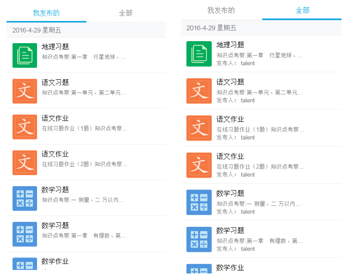(列表页两个列表的切换)

这样写除了保证在父元素那一层知晓数据(key值）不同需要重新渲染之外，也保证了React底层渲染知道这是两组不同的数据。在React源文件里有一个ReactChildReconciler.js主要是写children的渲染逻辑。其中的updateChildren里面有具体如何比较前后children，然后再决定是否要重新渲染。在比较的时候它调用了shouldUpdateReactComponent方法。我们看到它有对key值做比较。在两个列表中有不同的key，在数据相似的情况下，能保证两者切换的时候能重新渲染。

```
function shouldUpdateReactComponent(prevElement, nextElement) {
  var prevEmpty = prevElement === null || prevElement === false;
  var nextEmpty = nextElement === null || nextElement === false;
  if (prevEmpty || nextEmpty) {
    return prevEmpty === nextEmpty;
  }

  var prevType = typeof prevElement;
  var nextType = typeof nextElement;
  if (prevType === 'string' || prevType === 'number') {
    return nextType === 'string' || nextType === 'number';
  } else {
    return nextType === 'object' && prevElement.type === nextElement.type && prevElement.key === nextElement.key;
  }
}
```
#### Immutablejs太大了

上文也提到Immutablejs编译后的包也有50kb。对于PC端来说可能无所谓，网速足够快，但对于移动端来说压力就大了。有人写了个[seamless-immutable](https://github.com/rtfeldman/seamless-immutable)，算是简易版的Immutablejs，只有2kb，只支持Object和Array。

但其实数据比较逻辑写起来也并不难，因此再去review代码的时候，我决定尝试自己写一个，也是这个决定让我发现了更多的奥秘。

针对React的这个数据比较的深比较deepCompare，要点有2个：
- 尽量使传入的数据扁平化一点
- 比较的时候做一些限制，避免溢出栈

先上一下列表页的代码，如下图。这里当时是学习了PC家校群的做法，将component作为props传入。这里的`<Scroll>`封装的是滚动检测的逻辑，而`<List>`则是列表页的渲染，`<Empty>`是列表为空的时候展示的内容，`<Loading>`是列表底部加载的显示横条。

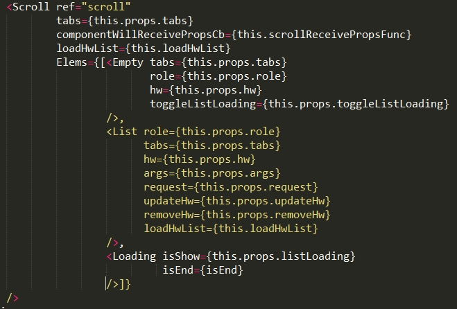

针对deepCompare的第1个要点，扁平化数据，我们很明显就能定位出其中一个问题了。例如`<Empty>`，我们传入了props.hw，这个props包括了两个列表的数据。但这样的结构就会是这样

```
props.hw = {
    listMine: [
        {...}, {...}, ...
    ],
    listAll: [
        {...}, {...}, ...
    ],
}
```

但如果我们提前在传入之前判断当前在哪个列表，然后传入对应列表的数量，则会像这样：
props.hw = 20;

两者比较起来，显示是后者简单得多。

针对deepCompare第2点，限制比较的条件。首先让我们想到的是比较的深度。一般而言，对于Object和Array数据，我们都需要递归去进行比较，出于性能的考虑，我们都会限制比较的深度。

除此之外，我们回顾一下上面的代码，我们将几个React component作为props传进去了，这会在shouldComponentUpdate里面显示出来。这些component的结构大概如下：

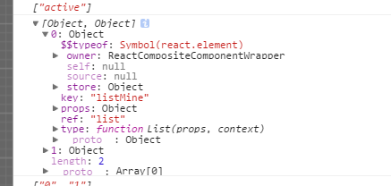

```
$$typeof // 类型
_owner // 父组件
_self: // 仅开发模式出现
_source: //  仅开发模式出现
_store //  仅开发模式出现
key // 组件的key属性值
props // 从传入的props
ref // 组件的ref属性值
type 本组件ReactComponent
```

因此，针对component的比较，有一些是可以忽略的，例如`$$typeof, _store, _self, _source, _owner`。`type`这个比较复杂，可以比较，但仅限于我们定好的比较深度。如果不做这些忽略，这个深比较将会比较消耗性能。关于这个deepCompare的代码，我放在了[pure-render-deepCompare-decorator](https://github.com/lcxfs1991/pure-render-deepCompare-decorator)。

不过其实，将component当作props传入更为灵活，而且能够增加组件的复用性，但从上面看来，是比较消耗性能的。看了官方文档之后，我们尝试换种写法，主要就是采用`<Scroll>`包裹`<List>`的做法，然后用this.props.children在`<Scroll>`里面渲染，并将`<Empty>`, `<Loading>`抽出来。

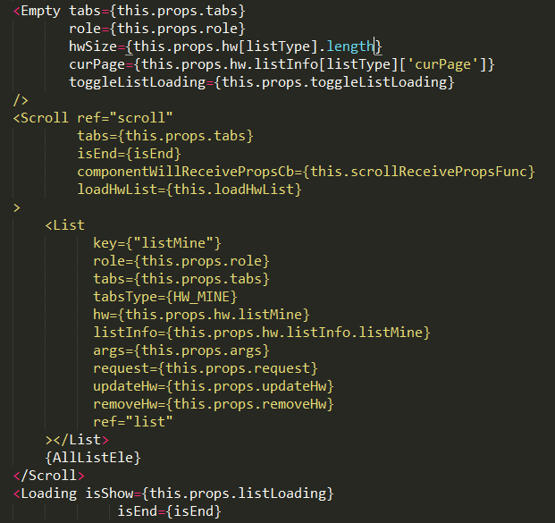

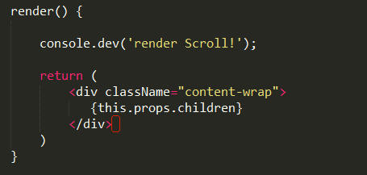

本以为React可能会对children这个props有什么特殊处理，但它依然是将children当作props，传入shouldComponentUpdate，这就迫使父元素`<Scroll>`要去判断是否要重新渲染，进而跳到子无素`<List>`再去判断是否进一步进行渲染。

那`<Scroll>`究竟要不要去做这重判断呢？针对列表页这种情况，我们觉得可以暂时不做，由于`<Scroll>`包裹的元素不多，`<Scroll>`可以先重复渲染，然后再交由子元素`<List>`自己再去判断。这样我们对[pure-render-deepCompare-decorator](https://github.com/lcxfs1991/pure-render-deepCompare-decorator)要进行一些修改，当轮到props.children判断的时候，我们要求父元素直接重新渲染，这样就能交给子元素去做下一步的处理。

如果`<Scroll>`包裹的只有`<List>`还好，如果还有像`<Empty>`, `<Loading>`甚至其它更多的子元素，那`<Scroll>`重新渲染会触发其它子元素去运算，判断自己是否要做重新渲染，这就造成了浪费。react的官方论坛上已经有人提出，React的将父子元素的重复渲染的决策都放在shouldComponentUpdate，可能导致了耦合[Shouldcomponentupdate And Children](https://discuss.reactjs.org/t/shouldcomponentupdate-and-children/2055)。

#### lodash.merge可以解决大部份场景

此段更新于2016年6月30日
由于immutable的大小问题一直萦绕头上，久久不得散去，因此再去找寻其它的方案。后面决定尝试一下lodash.merge，并用上之前自己写的pureRender。在渲染性能上还可以接受，在仅比immutable差一点点（后面会披露具体数据），但却带来了30kb的减包。

## 性能优化小Tips

这里归纳了一些其它性能优化的小Tips

### 请慎用setState，因其容易导致重新渲染

既然将数据主要交给了Redux来管理，那就尽量使用Redux管理你的数据和状态state，除了少数情况外，别忘了shouldComponentUpdate也需要比较state。

### 请将方法的bind一律置于constructor

Component的render里不动态bind方法，方法都在constructor里bind好，如果要动态传参，方法可使用闭包返回一个最终可执行函数。如：`showDelBtn(item) { return (e) => {}; }`。如果每次都在render里面的jsx去bind这个方法，每次都要绑定会消耗性能。

### 请只传递component需要的props

传得太多，或者层次传得太深，都会加重shouldComponentUpdate里面的数据比较负担，因此，也请慎用`spread attributes <Component {...props} />`。
### 请尽量使用const element

这个用法是工业聚在React讨论微信群里教会的，我们可以将不怎么变动，或者不需要传入状态的component写成const element的形式，这样能加快这个element的初始渲染速度。
## 路由控制与拆包

当项目变得更大规模与复杂的时候，我们需要设计成SPA，这时路由管理就非常重要了，这使特定url参数能够对应一个页面。

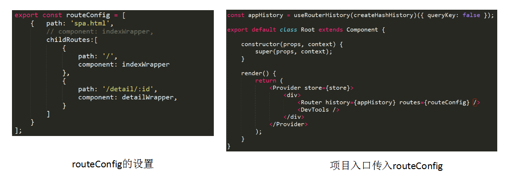

PC家校群整个设计是一个中型的SPA，当js bundle太大的时候，需要拆分成几个小的bundle，进行异步加载。这时可以用到webpack的异步加载打包功能，require。

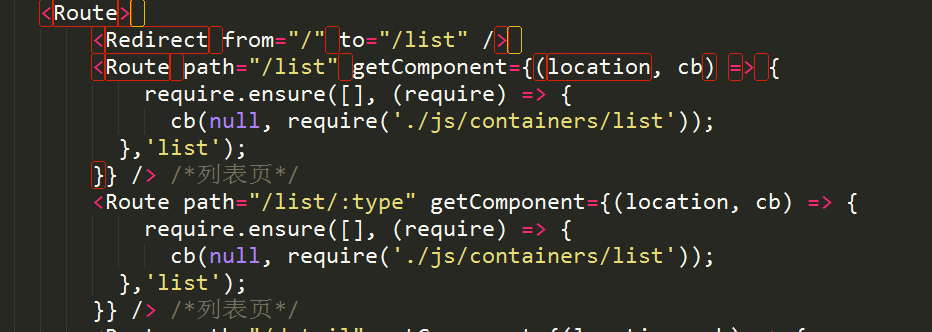

在重构手Q家校群布置页的时候，我们有不少的浮层，列表有布置页内容主浮层、同步到多群浮层、科目管理浮层以及指定群成员浮层。这些完全可以使用react-router进行管理。但是由于当时一早使用了Immutablejs，js bundle已经比较大，我们就不打算使用react-router了。但后面仍然发现包比重构前要大一些，因此为了保证首屏时间不慢于重构前，我们希望在不用react-router的情况下进行分包，其实也并不难，如下面2幅图：

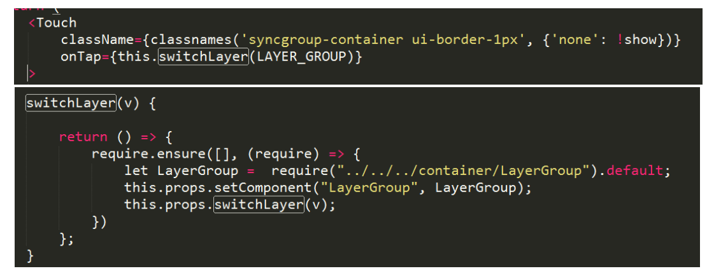

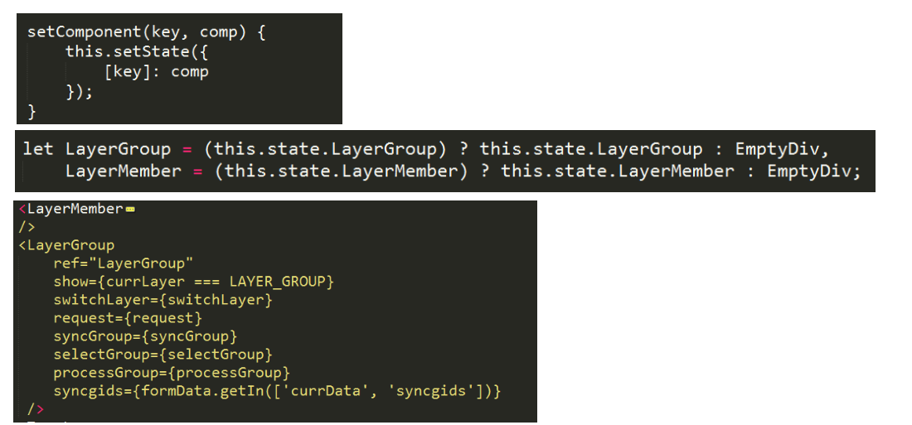

首先在切换浮层方法里面，使用require.ensure，指定要加载哪个包。
在setComponent方法里，将component存在state里面。
在父元素的渲染方法里，当state有值的时候，就会自动渲染加载回来的component。
## 性能数据
### 首屏可交互时间

目前只有列表页发布外网了，我们比较了优化前后的首屏可交互时间，分别有18%和5.3%的提升。

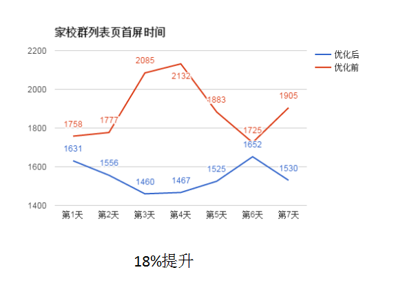

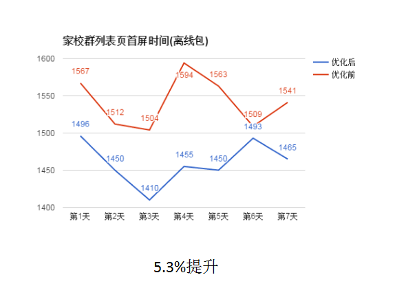
### 渲染FPS

更新于2016年7月2日

#### Android

React重构后第一版，当时还没做任何的优化，发现平均FPS只有22（虽然Android的肉眼感受不出来），而后面使用Immutable或者Lodash.merge都非常接近，能达到42或以上。而手机QQ可接受的FPS最少值是30FPS。因此使用Immutable和Lodash.merge的优化还是相当明显的。

- 重构后第一版
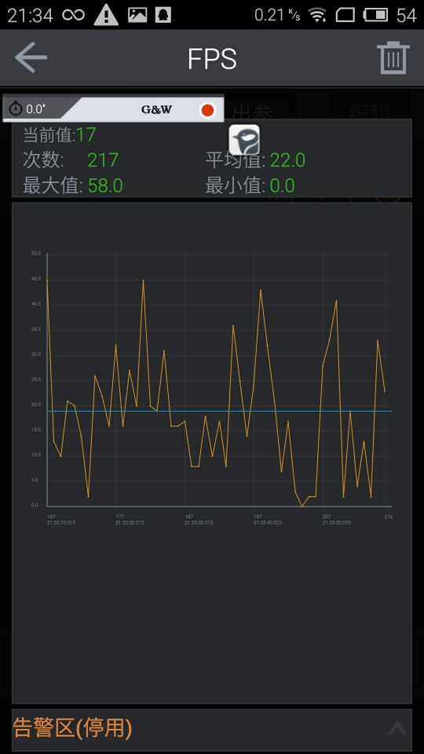

- Immutable
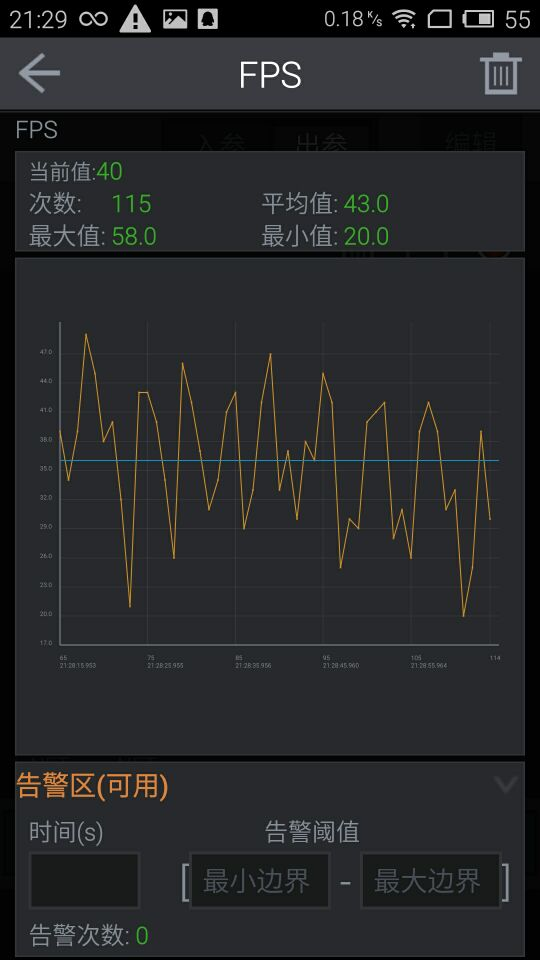

- Lodash.merge
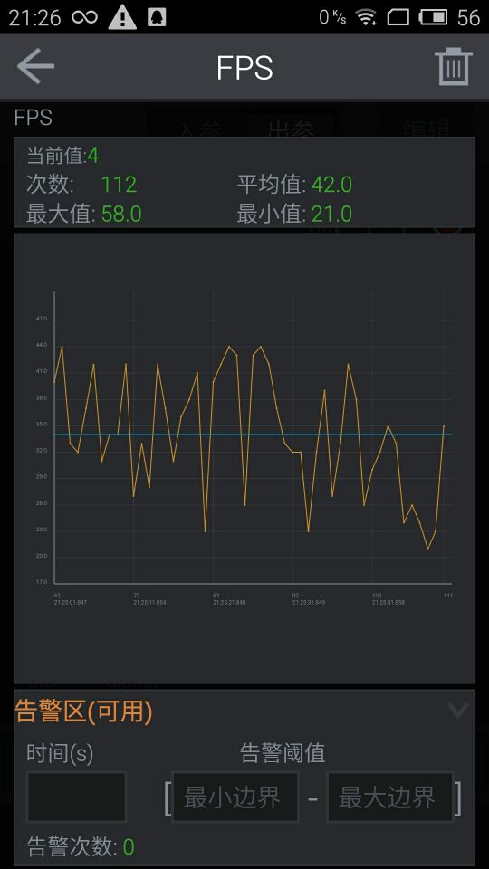

#### iOS

在iOS上的fps差距尤为明显。重构后第一版，拉了大概5屏之后，肉眼会有卡顿的感觉，拉到了10屏之后，数据开始掉到了20多30。而Immutable和Lodash.merge则大部份时间保持在50fps以上，很多时候还能达到非常流畅的60fps。
- 重构后第一版
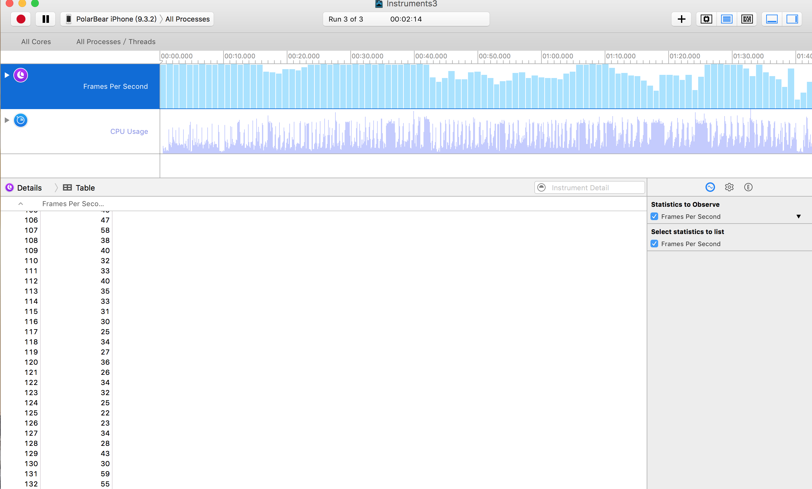

- Immutable
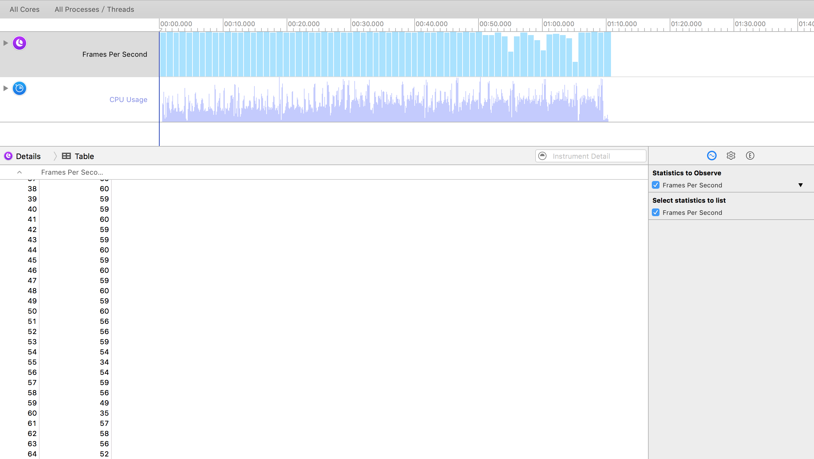

- Lodash.merge
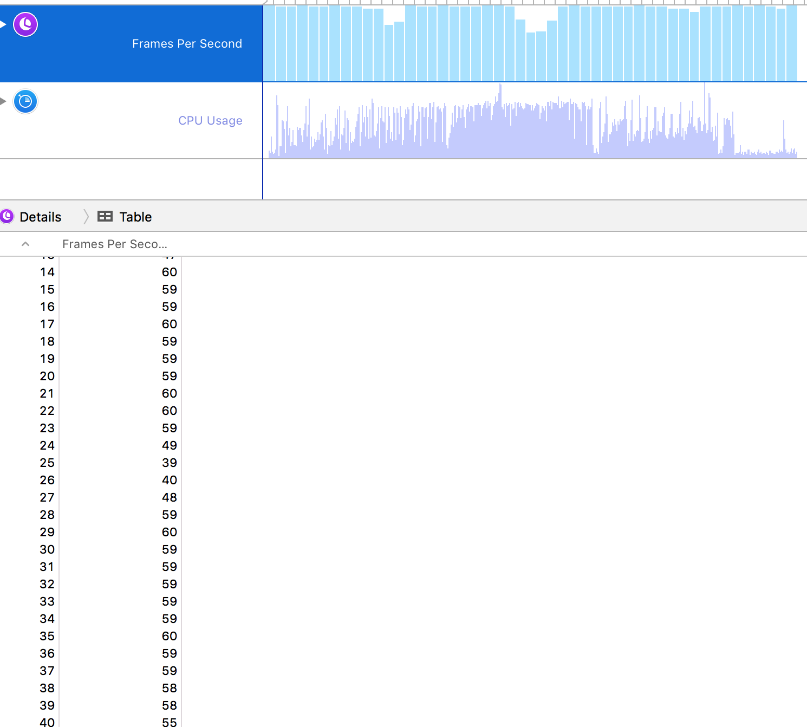

#### Chrome模拟器

用Chrome模拟器也能看出一些端倪。在Scripting方面，Immutable和Lodash.merge的耗时是最少的，约700多ms，而重构后的第一版则需要1220ms。Lodash.merge在rendering和painting上则没占到优势，但Immutable则要比其它两个要少30% - 40%。由于测试的时候是在PC端，PC端的性能又极好，所以不管是肉眼，还是数据，对于不是很复杂的需求，<b>总体</b>的渲染性能看不出非常明显的差距。
- 重构后第一版
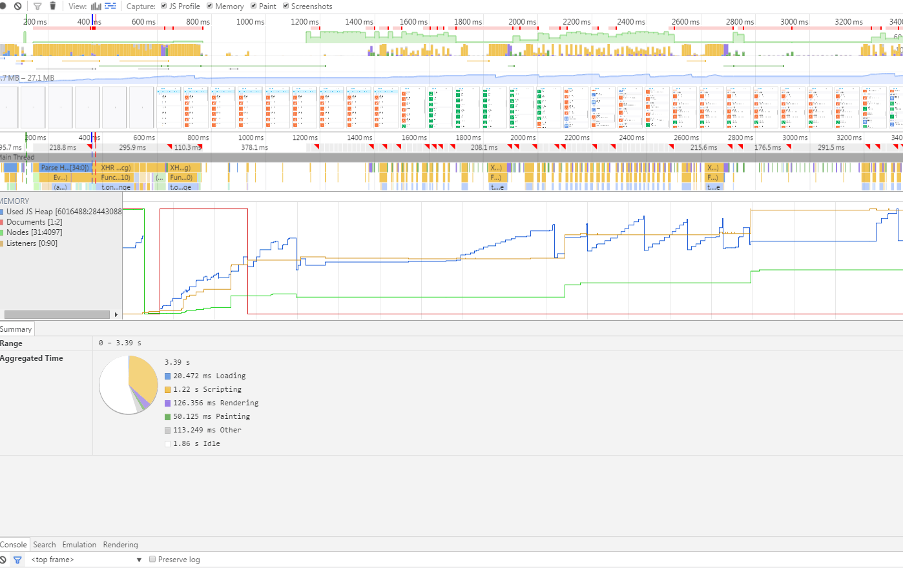

- Immutable
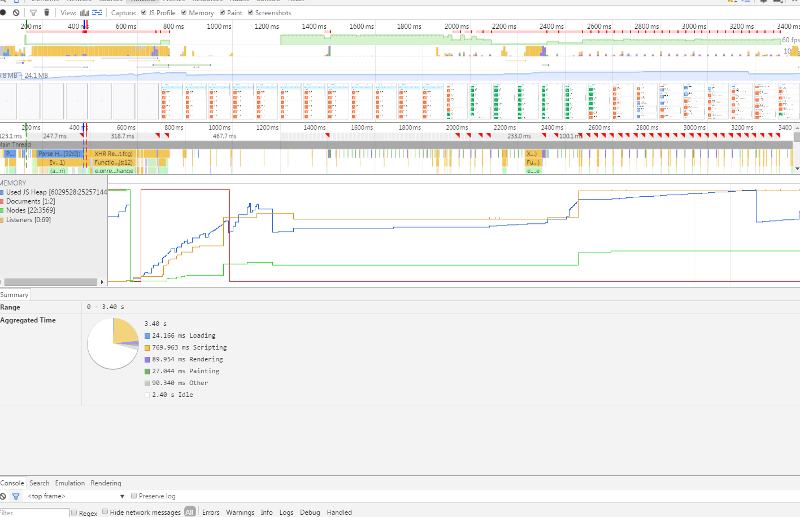

- Lodash.merge
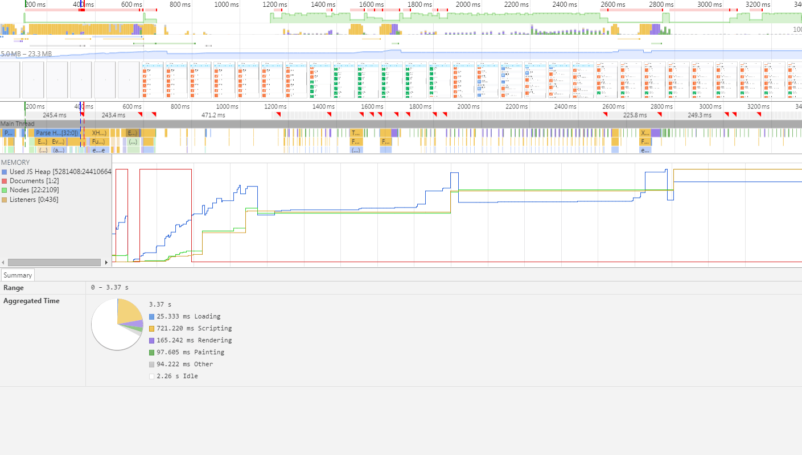

从上面的数据看来，在移动端使用Immutable和Lodash.merge相对于不用，会有较大的性能优势，但Immutable相对于Lodash.merge在我们需求情景下暂时没看出明显的优势，笔者估计可能是由于项目数据规模不大，结构不复杂，因此Immutable的算法优势并没有充分发挥出来。
#### 测试注明

Android端测试FPS是使用了腾讯开发的[GT随身调](http://gt.qq.com/)。而iOS则使用了Macbook里xCode自带的instrument中的animation功能。Chrome模拟器则使用了Chrome的timeline。测试的方式是匀速滚动列表，拉出数据进行渲染。
## React性能优化军规

我们在开发的过程中，将上面所论述的内容，总结成一个基本的军规，铭记于心，就可以保证React应用的性能不至于太差。
### 渲染相关
- 提升级项目性能，请使用immutable(props、state、store)
- 请pure-render-decorator与immutablejs搭配使用
- 请慎用setState，因其容易导致重新渲染
- 谨慎将component当作props传入
- 请将方法的bind一律置于constructor
- 请只传递component需要的props，避免其它props变化导致重新渲染（慎用spread attributes）
- 请在你希望发生重新渲染的dom上设置可被react识别的同级唯一key，否则react在某些情况可能不会重新渲染。
- 请尽量使用const element
### tap事件
- 简单的tap事件，请使用react-tap-event-plugin
  开发环境时，最好引入webpack的环境变量（仅在开发环境中初始化），在container中初始化。生产环境的时候，请将plugin跟react打包到一起（需要打包在一起才能正常使用，因为plugin对react有好多依赖），外链引入。

目前参考了这个项目的打包方案：
https://github.com/hartmamt/react-with-tap-events
Facebook官方issue: https://github.com/facebook/react/blob/bef45b0b1a98ea9b472ba664d955a039cf2f8068/src/renderers/dom/client/eventPlugins/TapEventPlugin.js
React-tap-event-plugin github:
https://github.com/zilverline/react-tap-event-plugin
- 复杂的tap事件，建议使用tap component
  家校群列表页的每个作业的tap交互都比较复杂，出了普通的tap之外，还需要long tap和swipe。因此我们只好自己封装了一个tap component

### Debug相关
- 移动端请慎用redux-devtools，易造成卡顿
- Webpack慎用devtools的inline-source-map模式
  使用此模式会内联一大段便于定位bug的字符串，查错时可以开启，不是查错时建议关闭，否则开发时加载的包会非常大。

### 其它
- 慎用太新的es6语法。
  Object.assign等较新的类库避免在移动端上使用，会报错。
  Object.assign目前使用object-assign包。或者使用babel-plugin-transform-object-assign插件。会转换成一个extends的函数：

```
var _extends = ...;

_extends(a, b);
```
- 注意Object.assign是浅拷贝
  Object.assign是浅拷贝，若数据结构层次较深的时候会拷贝失败，直接回传原本的object reference，此处推荐lodash.merge。

如有错误，请斧正！
