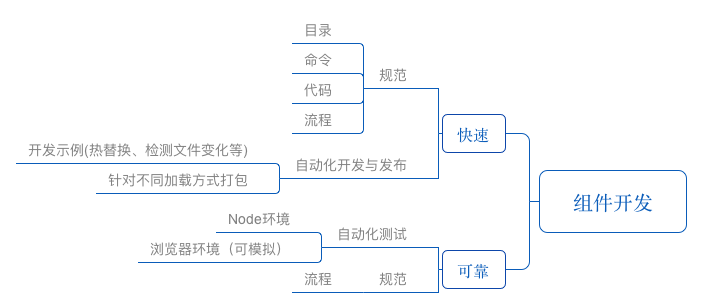

## 前言
React 的开发也已经有2年时间了，先从QQ的家校群，转成做互动直播，主要是花样直播这一块。切换过来的时候，业务非常繁忙，接手过来的业务比较凌乱，也没有任何组件复用可言。

为了提高开发效率，去年10月份也开始有意识地私下封装一些组件，并且于今年年初在项目组里发起了百日效率提升计划，其中就包含组件化开发这一块。

本文并不是要谈如何去写一个 React 组件，这一块已经有不少精彩的文章。例如像这篇[《重新设计 React 组件库》](http://mp.weixin.qq.com/s/8dZV0oKfBKp-jERguNxflw)，里面涉及一个组件设计的各方面，如粒度控制、接口设计、数据处理等等（不排除后续也写一篇介绍组件设计理念哈）。

本文关键词是三个，工程化、快速和可靠。我们是希望利用工程化手段去保障快速地开发可靠的组件，工程化是手段和工具，快速和可靠，是我们希望达到的目标。

前端工程化不外乎两点，规范和自动化。

读文先看此图，能先有个大体概念：



## 规范

### 目录与命令规范
规范，主要就是目录规范和代码规范。跟同事合作，经过将近20个的组件开发后，我们大概形成了一定的目录规范，以下是我们大致的目录约定。哪里放源码，哪里放生产代码，哪里是构建工具，哪里是例子等。有了这些的约定，日后开发和使用并一目了然。

```javascript
__tests__ -- 测试用例
|
example -- 真实demo
|
dist -- 开发者使用代码
|
src -- 源代码
|
config -- 项目配置
|------project.js -- 项目配置，主要被 webpack，gulp 等使用
|      
|   
tools  -- 构建工具
|  
|——————start.js -- 开发环境执行命令
|——————start.code.js -- 开发环境生成编译后代码命令
|
package.json
```

命令我们也进行了规范，如下，

```javascript
// 开发环境，服务器编译
npm start 或者 npm run dev

// 开发环境，生成代码
npm run start.code

// 生产环境
npm run dist

// 测试
npm test

// 测试覆盖率
npm run coverage

// 检查你的代码是否符合规范
npm run lint

```

### 代码规范

代码规范，主要是写 `js`,`css` 和 `html` 的规范，基本我们都是沿用团队之前制定好的规范，如果之前并没有制定，例如 React 的 jsx 的写法，那么我们就参考业界比较优秀的标准，并进行微调，例如 `airbnb` 的 [JavaScript](https://github.com/airbnb/javascript) 规范，是不错的参考。


## 自动化

### 开发与发布自动化
规范是比较人性的东西，凭着人对之的熟悉就可以提高效率了，至于那些工作繁复的流程，单凭人的熟悉也会达到极限，那么我们就需要借助自动化的工具去突破这重极限。

例如代码规范，单凭人的肉眼难以识别所有不合规范的代码，而且效率低下，借助代码检测工具就可让人卸下这个重担。如 css ，我们推荐使用 [stylelint ](https://github.com/stylelint/stylelint)，js 则是 [eslint](http://eslint.org/)。有这种自动化的工具协助开发者进行检查，能更好地保障我们的代码质量。

自动化最为重要的任务是，去保证开发过程良好的体验还有发布生产代码。实际上，开发和发布组件的整个过程跟平时开发一个任务很像，但却又略有差异。

首先是开发过程中，我们希望一边开发的时候，我们开发的功能能够显示出来，这时最好能搭建一个demo，我们把 demo 放到了 example 目录下，这点对 UI 组件（像toast, tips等组件） 尤为重要，逻辑组件（像ajax, utils等组件），可以有 demo，也可以采取测试驱动开发的方式，先制定部份测试用例，然后边开发边进行测试验证。

开发过程中的这个 demo， 跟平时开发项目基本一致，我们就是通过配置，把 `html`,`js`, `css` 都搭建好，而且我们是开发 React 组件，引入热替换的功能令整个开发流程非常流畅。这里分别是 `webpack` 和配合 `webpack 开发的静态资源服务器的两份配置： [webpack](https://github.com/SteamerTeam/steamer-react-component/blob/master/tools/webpack.example.js) & [server](https://github.com/SteamerTeam/steamer-react-component/blob/master/tools/webpack.server.js)。

但是发布组件的这个过程跟开发项目却又很不同。开发项目，我们需要把所有的依赖都打包好，然后一并发布。但对于组件来说，我们只需要单独将它的功能发布就好了，它的相关依赖可以在实际开发项目中引用时一并再打包。因此这里的 `package.json` 写的时候也要有所区分。跟只跟开发流程、构建、测试相关的，我们一律放在 `devDependencies` 中，组件实际依赖的库，则主要放在 `dependencies` 中。

鉴于我们项目一般采用 webpack 打包，因此我们一般只需要 es6 import 的引入方式，那我们直接用 babel 帮我们的项目进行生产代码的编译打包就可以了，这样能有效减少冗余代码。配置好 .babelrc，然后配置 `package.json` 的打包命令即可。要注意的是，你的组件可能含有样式文件，配置命令的时候要记得将样式文件也复制过去，像下面的命令，--copy-files 参数就是为了将样式文件直接拷贝到 dist 目录下。

```javascript
babel src --out-dir dist --copy-files
```

但有时候，你也想组件能兼容多种引用方式，即 `umd`，那 `babel` 的这种打包就不够了。这时你可以借助 `webpack` 打包 `library` 的能力。可参考此 [配置](https://github.com/SteamerTeam/steamer-react-component/blob/master/tools/webpack.babel.js)。主要是配置 `output.library` 和 `output.libraryTarget`。

```javascript
output: {
       // other config
        library: "lib",   // 表示以什么名字输出，这里，会输出为如 exports["lib"]
        libraryTarget: "umd", // 表示打包的方式
},
```
另一点要注意的是，我们只需打包组件的逻辑就好了，那些依赖，可以等实际生产项目的时候再进行解析。但 `webpack` 默认会将依赖也打包进行，为了避免这点，你需要将这些依赖一一配置成为 `external`，这就告诉了 `webpack` 它们是外部引用的，可以不用打包进来。

打包完成之后，根据指引进行 `npm publish` 就可以了。这里大体总结了一下我们开发组件的一些[流程和注意事项](https://github.com/SteamerTeam/steamer-react-component#开发组件规范)。


### 测试自动化

上述讲的都跟如何提升开发效率有关的，即满足 “快速” 这个目标，对 ”可靠“ 有一定帮助，如稳定的流程和良好的代码规范，但并没有非常好地保证组件地稳定可靠。需要 ”可靠“的组件，还需要测试来保证。

不少开发者做测试会使用 `mocha`，如果是 UI 组件可能会配置上 `karma`。而 React 组件测试还有一个更好的选择，就是官方推荐的 [jest](https://facebook.github.io/jest/) + [enzyme](http://airbnb.io/enzyme/)。

`jest` 跟 `jasmine` 有点类似，将一个测试库的功能大部份集成好了（如断言等工具），一键安装 `babel-jest` 可以用 es6 直接写测试用例，搭配 `jest-environment-jsdom` 和 `jsdom` 能够模拟浏览器环境，结合 `airbnb` 写的 react 测试库 `enzyme`， 基本能满足大部份的 React 测试需求。确实符合官方的宣传语 `painless`，这是一个无痛的测试工具。

测试逻辑组件问题倒不大，UI组件对于大部份的情况都可以，许多事件都可以通过` enzyme` 模拟事件进行测试。但这里举的例子， `react-list-scroll` 组件，一个 React 的滚动列表组件，碰巧遇到一种比较难模拟的情况，就是对 `scroll` 事件的模拟。这里想展开说一下。

对于 `React` 的 `scroll` 事件而言，必须要绑定在某个元素里才能进行模拟，不巧，对于安卓手机来说，大部份 `scroll` 事件都是绑定在 `window` 对象下的。这就非常尴尬了，需要借助到 `jsdom` 的功能。通过 `jest-environment-jsdom`，它能够将 `jsdom` 注入到 `node` 运行环境中，因此你可以在测试文件中直接使用 `window` 对象进行模拟。例如下面代码，模拟滚动到最底部：

```javascript
test('scroll to bottom', (done) => {

	const wrapper = mount(<Wrapper />);

	window.addEventListener('scroll', function(e) {
		setTimeout(() => {
			try {
				// expect 逻辑
				done();
			}
			catch(err) {
				done.fail(err);
			}
		}, 100);
		jest.runAllTimers();

	});

	let scrollTop = 768;
	window.document.body.scrollTop = scrollTop; // 指明当前 scrollTop到了哪个位置
	window.dispatchEvent(new window.Event('scroll', {
		scrollTop: scrollTop
	}));

});
```

细心的你会发现，上图还有一些定时器的逻辑。原因是在组件中会有一些截流的逻辑，滚动时间隔一段时间才去检测滚动的位置，避免性能问题，因此加一个定时器，等待数据的返回，而 `jest.runAllTimers();` 则是用于告诉定时器马上跑完。

除此之外，定时器里还有个 ` try catch` 的逻辑，主要是如果 `expect` 验证不通过，`jest` 会报告错误，这时需用错误捕获的办法将错误传给 `done` （异步测试的回调），这样才能正常退出这一个测试用例，否则会返回超时错误。

安卓测完了，那iPhone呢？iPhone 的 `scroll` 事件是绑定在具体某个元素里的，但我这里又不是通过 React 的 `onScroll` 来绑定。首先我们得通过 `window.navigator.userAgent` 来区分手机类型。但由于 `userAgent` 只有 `getter` 函数，直接设置值会报错，因此我们要添加一个 `setter` 函数给它，用这段示例代码：

```javascript
Object.defineProperty(window.navigator, "userAgent", (function(_value){
  return {
    get: function _get() {
      return _value;
    },
    set: function _set(v) {
        _value = v;
    }
  };
})(window.navigator.userAgent));

let str = "Mozilla/5.0 (iPhone; CPU iPhone OS 9_1 like Mac OS X) AppleWebKit/601.1.46 (KHTML, like Gecko) Version/9.0 Mobile/13B143 Safari/601.1";
window.navigator.userAgent = str;
```

然后，去找到这个绑定的元素，进行事件监听和分发就好了：
```javascript
const wrapper = mount(<Wrapper />),
	  scrollComp = wrapper.find(Scroll),
	  scrollContainer = scrollComp.nodes[0].scrollContainer;

scrollContainer.addEventListener('scroll', function(e) { //... });

scrollContainer.dispatchEvent(// ... );
```


## 总结

本文主要是提取了开发组件工程化的一些关键要点，具体的开发脚手架可以参考 [steamer-react-component](https://github.com/SteamerTeam/steamer-react-component)，里面主要举了[pure-render-deepCompare-decorator](https://github.com/SteamerTeam/pure-render-deepCompare-decorator) 和 [react-list-scroll](https://github.com/SteamerTeam/react-list-scroll)，一个逻辑组件，一个UI组件，共两个示例，对照着脚手架的文档，从目录规范、开发流程、发布都写得较为清楚，大家开发组件的时候，可以根据情况做些调整。

如有谬误，恳请斧正。
