> 李成熙，Shopee Airpay 前端 Leader。2014年毕业加入腾讯AlloyTeam，先后负责过QQ群、花样直播、腾讯文档等项目。后于2018年加入腾讯云云开发团队。专注于性能优化、工程化和小程序服务。[微博](https://weibo.com/leehkfs/) | [知乎](https://www.zhihu.com/people/leehey/) | [Github](https://github.com/lcxfs1991)

到了新公司之后，发现居然也是用企业微信。但可惜的是，外部的企业微信居然没有机器人。这对以前在鹅厂里习惯用企业微信做提醒的我觉得很不方便。终于，7月一开始企业微信终于上线机器人功能。

右击群聊天卡片，可以添加群机器人。
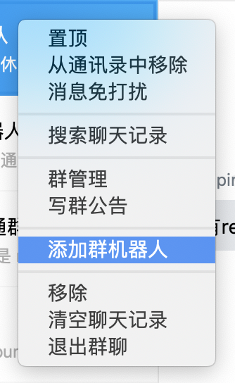

悬浮在机器人的头像上，会显示出 Webhook 地址。点击这个地址，会跳到机器人的开发文档。
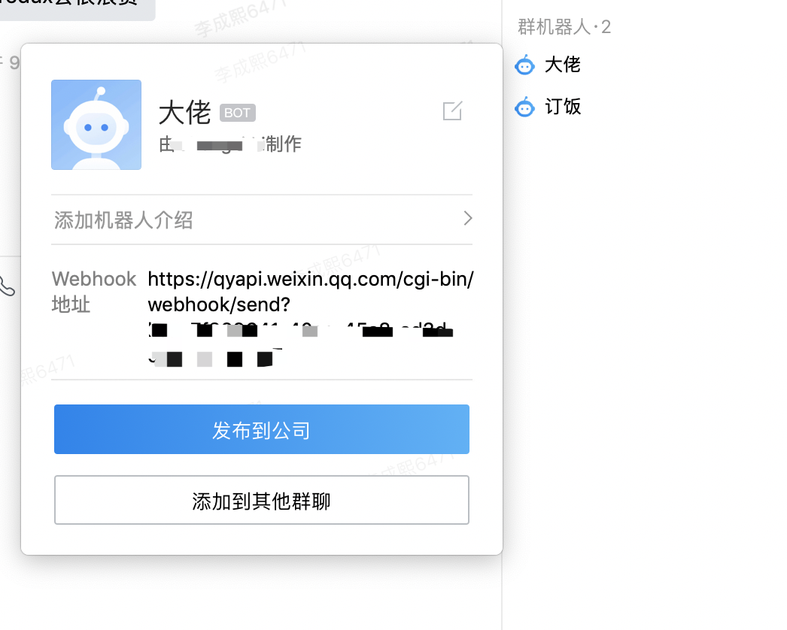

提醒机器人的开发其实很简单，其实就是向这个webhook地址，按文档提供的格式发送请求，就可以实现消息推送了。最简单的示例，可以用 `Node.js` 的 `axios` 类库：

```
const axios = require('axios')

async function bookLunch() {
    let result = await axios.post(baseUrl, {
        msgtype: 'text',
        text: {
            content: '大佬，订午餐啦！',
            mentioned_list: ['@all'] // 可以使用邮箱或者手机号码
        }
    })

    return result.data
}

bookLunch.then((res) => {
    console.log(res)
})
```

以上是最简单的例子。除了普通文本内容，还可以发送 `markdown`，图文等内容，大家可以自行去看文档。

但问题来了：一般来说提醒，都是需要定时的，比如说每早提醒大家写计划，每周五傍晚提醒大家写周报，怎么可以让机器人在这些时间点出现提醒大家呢？你可能会想到买一台服务器，然后在上面部署 `cronjob` 服务，定时去调度服务。没错，这固然是最通俗的做法。但是买一台服务器要花钱呀，便宜的也得几十块钱一台虚拟机，而且只在上面跑一个这么简单的服务显然是不值的。有没有性价比高的做法呢？有，用云函数！

我个人的理解，云函数跟传统的服务主要的区别有几点，一个是它是一种事件型的服务，由不同的事件触发（HTTP、数据更改、对象存储的变更等），第二个它是非长驻的，运行一定时间后会冷却或者销毁，第三个由于以上两种特性，对于一些负载不是很高的服务，用云函数比较省钱。而对于这种提醒机器人，正正是一种负载不是很高的服务，非常合适。对小型团队的这种提醒服务，在最近各大厂商都在推广的时期，真的可以做到不要钱。

这里我对腾讯云的云函数最为熟悉，因此就用它来做实践。

首先为了方便，我们可以用腾讯云提供的 SCF CLI 来初始化我们的云函数和配置文件。我用的电脑是 Macbook，可以直接安装以下的命令进行安装：

```
pip install scf
```

如果不是Macbook可以先自行安装  `python` 和 `pip`

然后就是进行配置：

```
scf configure set --region ap-guangzhou --appid 1253970223 --secret-id AKIxxxxxxxxxx --secret-key uxxlxxxxxxxx
```

`appid`, `secret-id` 和 `secret-key` 可以在[访问密钥](https://console.cloud.tencent.com/cam/capi)页面里拿到。至于 `region`，则是你想部署云函数的区域，比方说在云函数的控制台首页，就能看到顶部的区域。选广州就是 `ap-guangzhou`，选香港的就是 `ap-hongkong`。基本上是 `ap-` 加上国内市场的拼音或国外城市的英文。
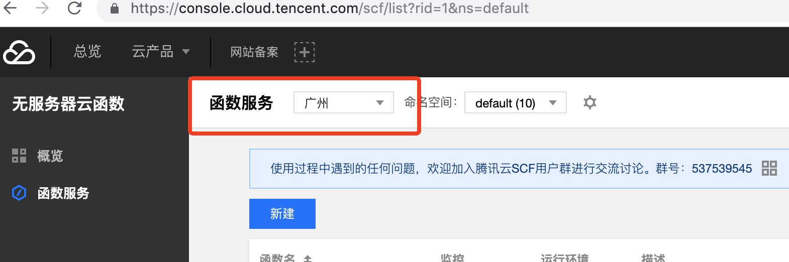

然后咱们初始化好项目（用node.js 8.9版本写云函数）：

```
# 初始化云函数
scf init --runtime nodejs8.9 --name wework-robot

cd wework-robot

# 初始化 node 项目
npm init -y
```

然后就能得到该云函数：
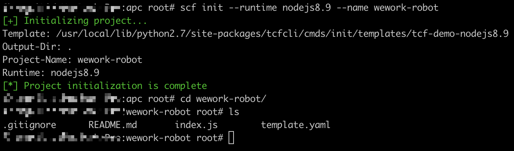

这次要用到 axios，那我们就安装这个依赖：

```
npm i --save axios
```

打开 `index.js` 是如下一段代码，`async` 表示该函数可以用 `Node.js` 的新特性 `async/await`。

```
'use strict';
exports.main_handler = async (event, context, callback) => {
    console.log("%j", event);
    return "hello shopee!"
};
```

我进行一些删减后，成这样。将函数名字改为 `main`，而且由于用 `async/await` 就可以不用 `callback` 处理异步了。但改了名字也要改 `template.yaml`，将 `main_handler` 改为 `main`

```
exports.main = async (event, context) => {
    return "hello shopee!"
};
```
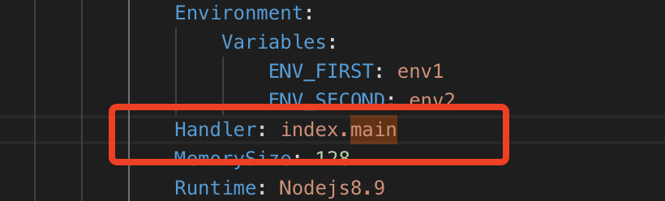

好了。是时候来写提醒逻辑了。逻辑并不难，但主要注意的一点是时间。经过试验，云函数这里的时间统一使用了标准的国际时间，也就是北京时间要比它晚8小时，详细逻辑可以看以下代码的注释：

```
const axios = require('axios')
const baseUrl =
    'https://qyapi.weixin.qq.com/cgi-bin/webhook/send?key=7f399641-40aa-45c8-ad3d-c46e1ee085a7'

async function bookLunch() {
    let result = await axios.post(baseUrl, {
        msgtype: 'text',
        text: {
            content: '大佬，订午餐啦！',
            mentioned_list: ['@all'] // 提醒所有人
        }
    })

    return result.data
}

async function bookTaxi() {
    let result = await axios.post(baseUrl, {
        msgtype: 'text',
        text: {
            content: '辛苦了，早点回家休息吧。9点打车可以报销哦。',
            mentioned_list: ['@all']
        }
    })

    return result.data
}

async function remindWeeklyReport() {
    let result = await axios.post(baseUrl, {
        msgtype: 'text',
        text: {
            content: '周五了，记得写周报看看你这周有没偷懒！',
            mentioned_list: ['@all']
        }
    })

    return result.data
}

async function remindGoHome() {
    let result = await axios.post(baseUrl, {
        msgtype: 'text',
        text: {
            content: '11点半了，早点休息吧！'
        }
    })

    return result.data
}

// 是否周五
function isFriday(day) {
    return day === 5
}

// 是否工作日
function isWeekDay(day) {
    return day > 0 && day < 6
}

// 是否30分，多预留1分钟以防云函数延迟启动或执行
function isHalfHour(min) {
    return min >= 30 && min <= 31
}

// 是否正点，多预留1分钟以防云函数延迟启动或执行
function isSharp(min) {
    return min >= 0 && min <= 1
}

exports.main = async (event, context) => {
    let d = new Date() // js 时间对象
    let day = d.getDay() // 获取今天是星期几，0 表示周日
    let hour = d.getHours() // 获取当前的 时
    let min = d.getMinutes() // 获取当前的 分

    let hourGap = 8 // 咱们在东8区
    hour += hourGap // 获取当前准确的时间数

   // 打一下 log 看看具体时间
    console.log(`day: ${day} hour: ${hour} min: ${min} hourGap: ${hourGap}`)

    // 每周五4点到4点半通知写周报
    if (isFriday(day) && hour === 4 && isHalfHour(min)) {
        return await remindWeeklyReport()
    }

    // 工作日每天11点提醒订餐
    if (isWeekDay(day) && hour === 11 && isSharp(min)) {
        return await bookLunch()
    }

    // 工作日每天晚上9点提醒打车可以报销
    if (isWeekDay(day) && hour === 21 && isSharp(min)) {
        return await bookTaxi()
    }

    // 工作日每天晚上11点半提醒休息
    if (isWeekDay(day) && hour === 23 && isHalfHour(min)) {
        return await remindGoHome()
    }

    return 'hi shopee!'
}
```

逻辑都写好了，但是，我们需要让它定时执行，比如每30分钟执行一次。这个时候，我们就需要添加“定时触发器” 了。定时触发我们可以在 `template.yaml` 里面添加，可以把注释去掉，然后修改得到：
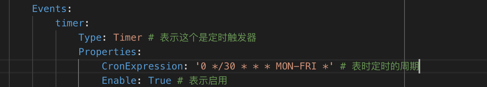

`CronExpression` 具体可以参考这个文档：[https://cloud.tencent.com/document/product/583/9708](https://cloud.tencent.com/document/product/583/9708)

请使用推荐的写法：
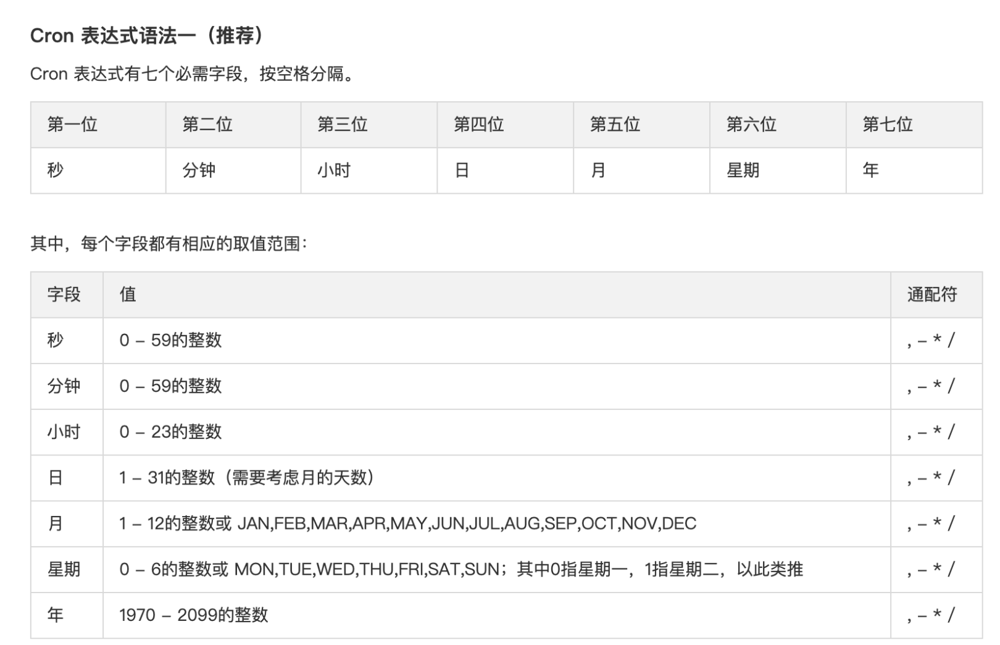

这里有些参考的示例，直接套用即可：
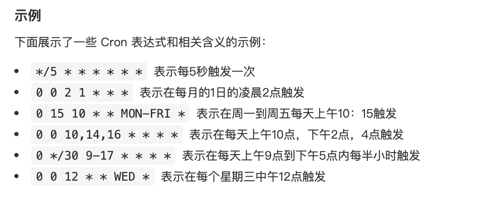

我这里写的：`0 */30 * * * MON-FRI *`，表示每周一到周五，每30分钟会触发一次云函数的调用。

当然，我们还想开启一下 HTTP 触发器，来用地址直接访问该云函数进行一些逻辑的调试，看看是否真的能成功发消息。

我们可以再到 `template.yaml` 里添加这样的 `HTTP` 触发器：
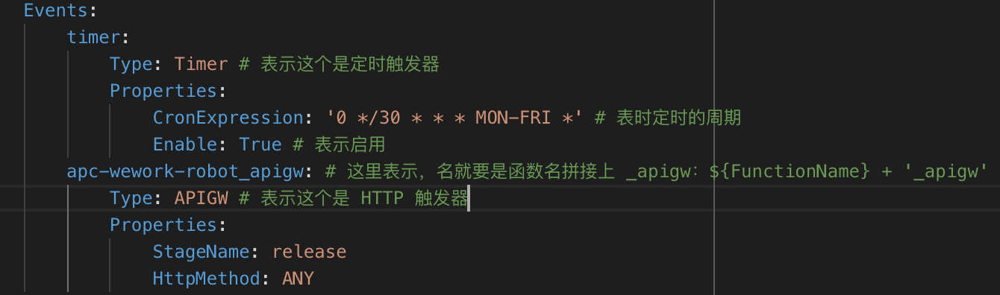

好了，万事俱备，我们只需要再用 `SCF CLI` 发布即可。

```
# 打包
scf package -t template.yaml 
Generate deploy file 'deploy.yaml' success

# 发布
scf deploy -t deploy.yaml 
Deploy function 'wework-robot' success
```

发布完成后，我们可以到腾讯云的控制台看下，已经存在了：
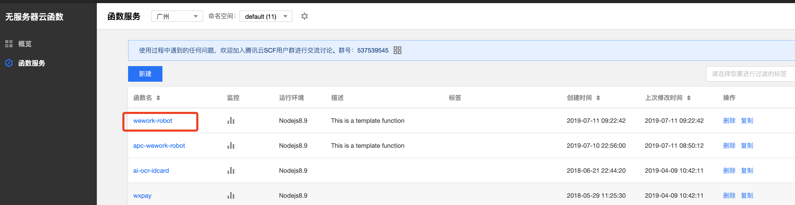

点进去看看触发方式，发现分别有一个定时触发器，一个API网关触发器（HTTP触发）
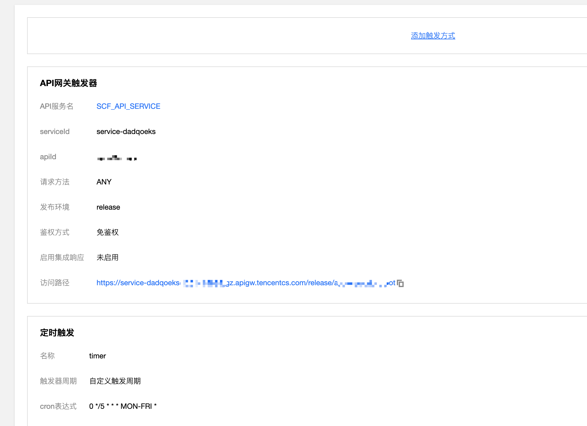

​

如此，便大功告成了！看看效果：
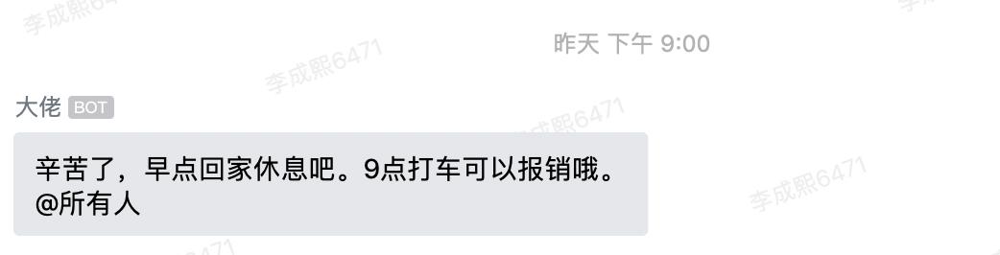

​