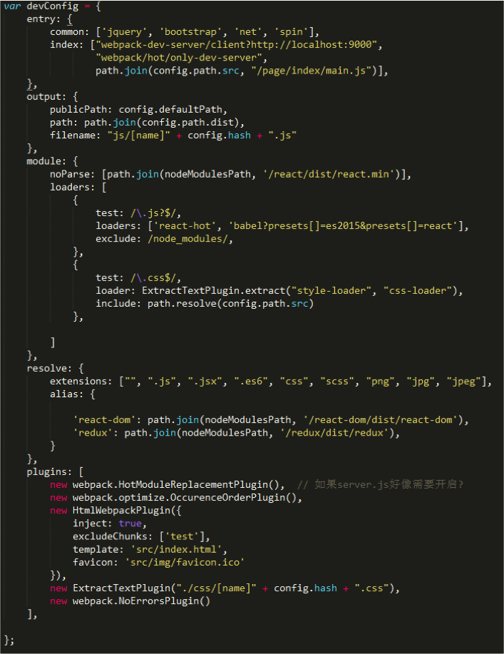
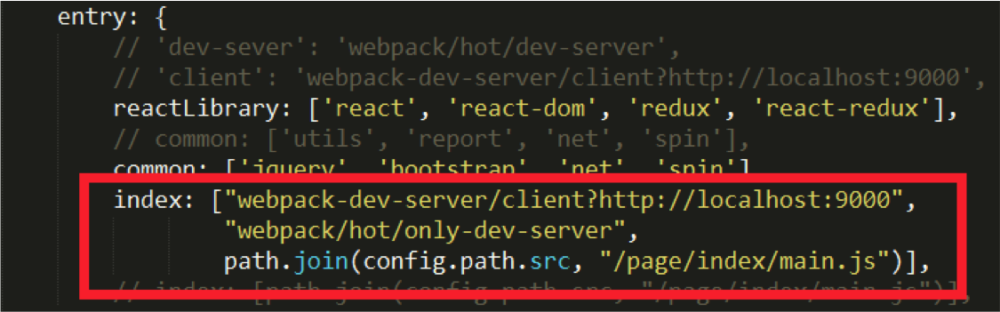
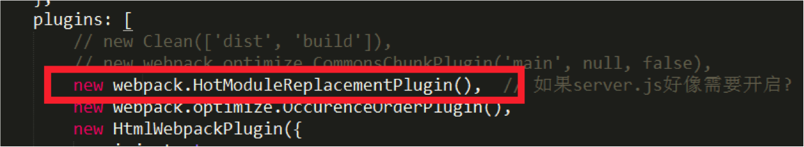
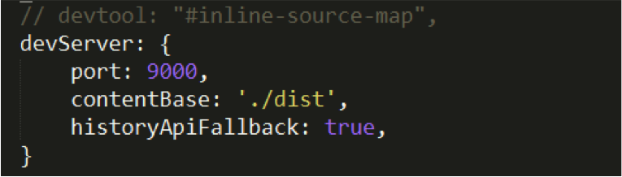
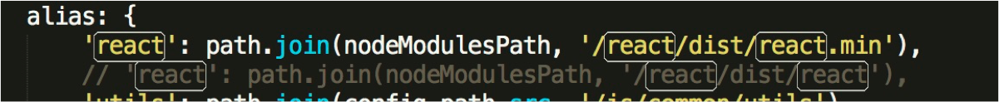
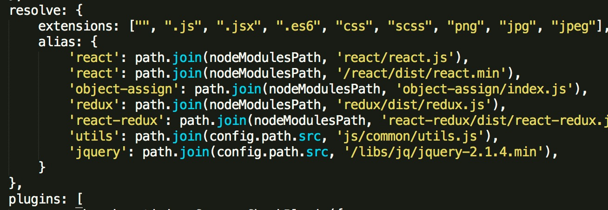
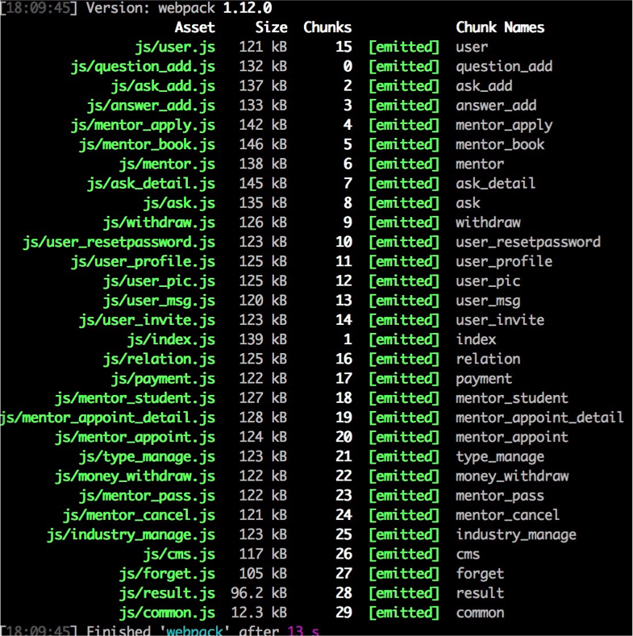
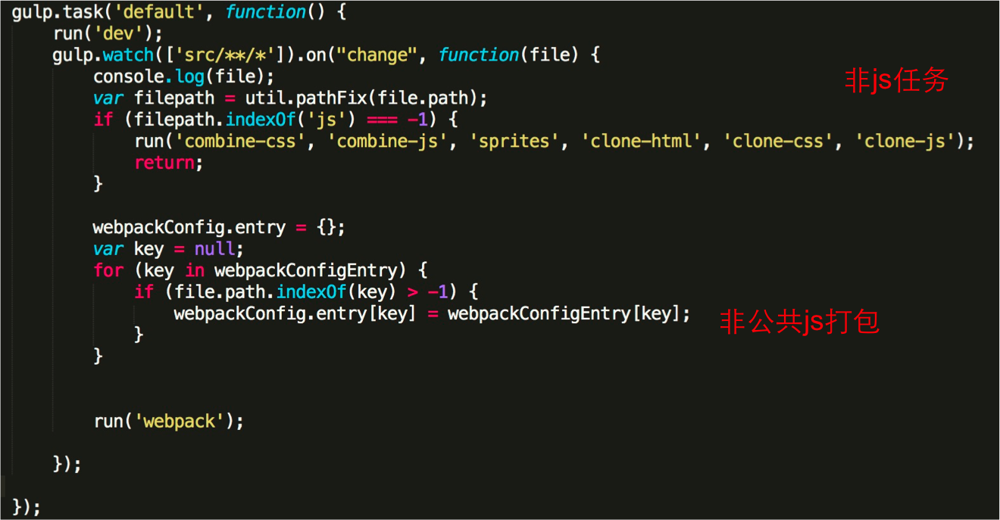
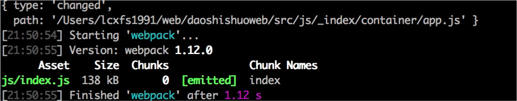

## 前言

本文不是webpack入门文章，如果对webpack还不了解，请前往题叶的[Webpack入门](http://segmentfault.com/a/1190000002551952)，或者阮老师的[Webpack-Demos](https://github.com/ruanyf/webpack-demos)。
## 为什么要使用Webpack
1. 与react一类模块化开发的框架搭配着用比较好。
2. 属于配置型的构建工具，比较用容易上手，160行代码可大致实现gulp400行才能实现的功能。 
3. webpack使用内存来对构建内容进行缓存，构建过程中会比较快。

第3点我想稍微论述一下，如果看过我之前写的[《如何写一个webpack插件（一）》](https://github.com/lcxfs1991/blog/issues/1)，会发现，webpack会将文件内容存在compilation这个大的object里面，方便各种插件，loader间的调用。虽然gulp也用到了流(pipe)这样的内存处理方式，但感觉webpack更进一步。gulp是每一个任务(task)用一个流，而webpack是共享一个流。
## 简要回顾Webpack的配置



Webpack的配置主要为了这几大项目：
- entry：js入口源文件
- output：生成文件
- module：进行字符串的处理
- resolve：文件路径的指向
- plugins：插件，比loader更强大，能使用更多webpack的api
## 常用Loaders介绍
- 处理样式，转成css，如：less-loader, sass-loader
- 图片处理，如: url-loader, file-loader。两个都必须用上。否则超过大小限制的图片无法生成到目标文件夹中
- 处理js，将es6或更高级的代码转成es5的代码。如：
  babel-loader，babel-preset-es2015，babel-preset-react
- 将js模块暴露到全局，如果expose-loader
## 常用Plugins介绍
- 代码热替换, HotModuleReplacementPlugin
- 生成html文件，HtmlWebpackPlugin
- 将css成生文件，而非内联，ExtractTextPlugin
- 报错但不退出webpack进程，NoErrorsPlugin
- 代码丑化，UglifyJsPlugin，开发过程中不建议打开
- 多个 html共用一个js文件(chunk)，可用CommonsChunkPlugin
- 清理文件夹，Clean
- 调用模块的别名ProvidePlugin，例如想在js中用$，如果通过webpack加载，需要将$与jQuery对应起来
## 使用优化

了解了以上介绍的Loaders和Plugins之后，基本就可以搭建一整套基于Webpack的构建（不需要gulp与grunt，合图除外）。下面让我来介绍一下在使用过程中的一些优化点。
### 优化点一.如何区分开发及生产环境
1. 在package.json里面的script设置环境变量，注意mac与windows的设置方式不一样

```
"scripts": {
    "publish-mac": "export NODE_ENV=prod&&webpack -p --progress --colors",
    "publish-win":  "set NODE_ENV=prod&&webpack -p --progress --colors"
}
```
1. 在webpack.config.js使用process.env.NODE_ENV进行判断
### 优化点二.使用代码热替换

使用代码热替换在开发的时候无需刷新页面即可看到更新，而且，它将构建的内容放入内在中，能够获得更快的构建编译性能，因此是官方非常推荐的一种构建方式。
#### 方法一：

1.将代码内联到入口js文件里 


2.启动代码热替换的plugins

#### 方法二：

直接实现一个server.js，启动服务器（需要启动热替换plugin)，下面是我在业务中用到的一个范例。具体的一些参数可以

```
var webpack = require('webpack');
var webpackDevMiddleware = require("webpack-dev-middleware");
var webpackDevServer = require('webpack-dev-server');
var config = require("./webpack.config.js");

config.entry.index.unshift("webpack-dev-server/client?http://localhost:9000");  // 将执替换js内联进去
config.entry.index.unshift("webpack/hot/only-dev-server");
var compiler = webpack(config);
var server = new webpackDevServer(compiler, {
    hot: true,
    historyApiFallback: false,
    // noInfo: true,
    stats: { 
        colors: true  // 用颜色标识
    },
    proxy: {
        "*": "http://localhost:9000" // 用于转发api数据，但webpack自己提供的并不太好用
    },
});
server.listen(9000);
```
#### 方法三：

直接在webpack.config.js上配置。这个办法最简单，当然灵活性没有自己实现一个服务器好。

### 优化点三.import react导致文件变大，编译速度变慢，乍办?
1. 如果你想将react分离，不打包到一起，可以使用externals。然后用`<script>`单独将react引入
   
2. 如果不介意将react打包到一起，请在alias中直接指向react的文件。可以提高webpack搜索的速度。准备部署上线时记得将换成react.min，能减少文件大小(减少约600kb)
   
3. 使用module.noParse针对单独的react.min.js这类没有依赖的模块，速度会更快。
### 优化点四.将模块暴露到全局

如果想将report数据上报组件放到全局，有两种办法：
#### 方法一：

在loader里使expose将report暴露到全局，然后就可以直接使用report进行上报

```
{
    test: path.join(config.path.src, '/js/common/report'),
    loader: 'expose?report'
},
```
#### 方法二：

如果想用R直接代表report，除了要用expose loader之外，还需要用ProvidePlugin帮助，指向report，这样在代码中直接用R.tdw， R.monitor这样就可以

```
new webpack.ProvidePlugin({
    "R": "report",
}),
```
### 优化点五. 合并公共代码

有些类库如utils, bootstrap之类的可能被多个页面共享，最好是可以合并成一个js，而非每个js单独去引用。这样能够节省一些空间。这时我们可以用到CommonsChunkPlugin，我们指定好生成文件的名字，以及想抽取哪些入口js文件的公共代码，webpack就会自动帮我们合并好。

```
new webpack.optimize.CommonsChunkPlugin({
            name: "common",
            filename: "js/common.js",
            chunks: ['index', 'detail]
        }),
```
### 优化点六. 善用alias。

resolve里面有一个alias的配置项目，能够让开发者指定一些模块的引用路径。对一些经常要被import或者require的库，如react,我们最好可以直接指定它们的位置，这样webpack可以省下不少搜索硬盘的时间。

### 优化点七. alias的索引路径。

有时候你的node_modules包可能会放在上层父文件夹中，这时你可以使用resolve.moduledirectories来扩张你的索引路径，例如我们给redux做一个alias：

```
 resolve: {
        moduledirectories:['node_modules', config.path.src],
        extensions: [".js", ".jsx",],
        alias: {
            'redux': 'redux/dist/redux',
        }
    },
```

这样的话，它的索引路径会如下：

```
/a/b/node_module/redux/dist/redux
/a/node_module/redux/dist/redux
/node_module/redux/dist/redux
```

要注意的是多加索引路径可能会导致性能下降，所以除非项目复杂，否则慎用这个功能。
### 优化点八.多个html怎么办
1. 使用HtmlWebpackPlugin，有多少个html，就排列多少个，记得不要用inject，否则全部js都会注入到html。如果真的要用inject模式，请务必将不需要的js用exclude chunk去掉或者用chunk参数填上你需要入口文件。

仅使用app作为注入的文件：

```
plugins: [
  new HtmlWebpackPlugin({
    chunks: ['app']
  })
]
```

不使用dev-helper作为注入文件：

```
plugins: [
  new HtmlWebpackPlugin({
    excludeChunks: ['dev-helper']
  })
]
```

如果你不想用inject模式，但又想使用html-webpack-plugin，那你需要在html里用`<script>`标签放入对应的js，以及用 `<link>` 入对应的css。记住，这些资源的路径是在生成目录下的，写路径的时候请写生成目录下的相对路径。
### 优化点九. html-webpack-plugin不用使inject模式没又md5，而且不支持文件内联怎么破？

当时我就给维护者提了一个issue--[Add inline feature to the plugin](https://github.com/ampedandwired/html-webpack-plugin/issues/157)。

然后维护者在[开发的分支](https://github.com/ampedandwired/html-webpack-plugin/tree/feature/loaders)上加了这么一个特性（证明维护者不想在插件里加内联功能了，想让我来弄）：

事件
允许其它插件去使用执行事件
html-webpack-plugin-before-html-processing
html-webpack-plugin-after-html-processing
html-webpack-plugin-after-emit

使用办法：

```
  compilation.plugin('html-webpack-plugin-before-html-processing', function(htmlPluginData, callback) {
    htmlPluginData.html += 'The magic footer';
    callback();
  });
```

不过我还是决定自己开发一个了一个插件
[html-res-webpack-plugin](https://github.com/lcxfs1991/html-res-webpack-plugin)，有中英文文档可以参考。其实html-webpack-plugin以js作为入口可能跟webpack的理念更为一致，但其实直接在html上放link和`script`更加方便直白一些。而且html-webpack-plugin局限性太多，如果我想在`script`上加attribute也是比较麻烦的事儿。所以我干脆开发一个可以允许在html上直接放link和script而且支持内联及md5的插件。

但相信我之后也会针对html-webpack-plugin再写一个内联及md5的插件，适配一直在用这个插件的人。
### 优化点十.用gulp-webpack速度慢乍办



上图是初始化构建30个文件的用时，一共用了`13`秒。用了externals优化后，还有100多kb，比用纯webpack优化要大50多kb。而且，由于你用的是gulp-webpack，每次有文件改动，都必须全部重新编译一次。因此，跟react搭配建议还是不要用gulp-webpack。因为如果你使用webpack的话，即使初次启动时速度也并不快，但开发过程中，webpack会自动识别，只会重新编译有修改的文件，这大大加快了编译构建速度。

没办法，老项目改造，真的要用，乍办？我提供以下思路
（1）当非js文件改变的时候，不要去跑js打包的任务
（2）非公共的js发生改变的时候，只执行这个js的打包任务



下图是优化了之后，在开发过程中非公共文件修改后的编译速度。我的娘，纯webpack只需要100多200ms。建议还是用webpack吧。

### 优化点十一.如果在通过webpack在项目中使用bootstrap, jquery以及fontawesome

这一点对于创业公司来说可能比较有用，它们的初期产品都需要快速上线，用一些比较成熟的UI框架会比较好。

这样，首先我们需要jquery文件，并且安装bootstrap(3.3.5) ,font-awesome(4.4.0),以及imports-loader(0.6.3)。还需要sass-loader(3.1.2)及less-loader(2.5.3)。

然后，在主要入口文件要这么引用下面的样式文件：

```
require('bootstrap/less/bootstrap.less');
require('font-awesome/scss/font-awesome.scss');
require('./index.scss');
```

在webpack.config.js的entry项目里，可以加上这个vendor:

```
common: ['jquery', 'bootstrap'],
```

在loaders里加入以下loader，将jQuery暴露到全局:

```
{
    test: path.join(config.path.src, '/libs/jq/jquery-2.1.4.min'),
    loader: 'expose?jQuery'
},
```

再添加以下loader，让webpack帮助复制font文件

```
{ 
        test: /\.(woff|woff2|eot|ttf|svg)(\?.*$|$)/,  
        loader: 'url-loader?importLoaders=1&limit=1000&name=/fonts/[name].[ext]' 
},
```

在plugins里添加ProvidePlugin，让$指向jQuery

```
new webpack.ProvidePlugin({
    $: "jquery",
    jQuery: "jquery"
}),
```

这样，就可以同时使用jQuery, Bootstrap和Fontawesome了。
## webpack会取代gulp吗
- 未必，但在开发环境，以及不需要一些功能如合图的情况下，webpack可以完全取代gulp，至少现在我有三个项目完全用webpack进行开发和部署上线
- 要取代gulp,还需要不断发展它的loader以及plugin生态，至少，完善一下开发者文档啊。
## 有样版boilerplate项目吗

目前有一个还没有成型的，我先放在这里，目前可以通过查看gulpfile.js和webpack.config.js文件进行学习
[steamer_branch_v2](https://github.com/lcxfs1991/steamer/tree/v2)。要成为boilerplate还待我花一周时间整理。
## 推荐文章

[开发工具心得：如何 10 倍提高你的 Webpack 构建效率](https://segmentfault.com/a/1190000005770042)
