[Shared from](https://github.com/lcxfs1991/blog/issues/15)
# Introduction

For beginners, webpack building performance is sometimes annoying. However, this will not stop webpack from becoming the best web building tool in the world.  Once you master the following skills, you can soon boost the building performance and save your team a lot of time.

For one thing before kickoff, [webpack.js.org](http://webpack.js.org) is now the official site for webpack. I browsed the documentation and soon found out that this one is much better than the old doc. Though it is not yet finished, it deserves half an hour reading.
# Overall config for webpack

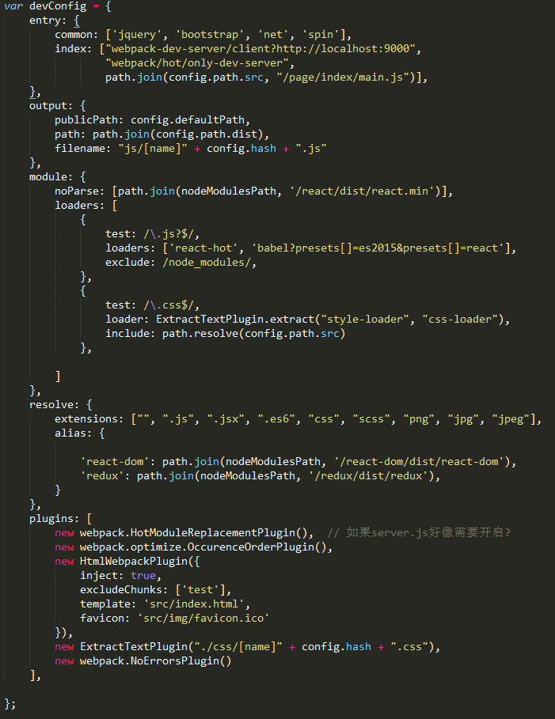

Here is the overall configuration for webpack.
- `entry` is for setting up source code file.
- `output` is for setting up output cdn, destination and filename.
- `loader` is the config for loaders to compile files from certain format to the format which can be recognized by the browser.
- `plugins`: via plugin, developer can utilize more webpack apis. 
- `resolve` is the guide for webpack to search files before real compilation
# Architecture Design For webpack Config

As `gulp` fans, many developers highly rely on the work flow of gulp. So they tend to use gulp as the core to control the building flow, and only use webpack to pack js files. Based on this habbit， they usually use [webpack-stream](https://github.com/shama/webpack-stream) which I think, is a bad idea at most cases.

Since they usually use `gulp.watch` at developing mode, once they modify a file, the whole gulp building process will rerun which takes time. Of course, you can write some building logic to prevent some building process from being invoked, however, it is far from good.

I used to test this idea using a big project with, it takes 13 seconds for incremental build under developing mode.

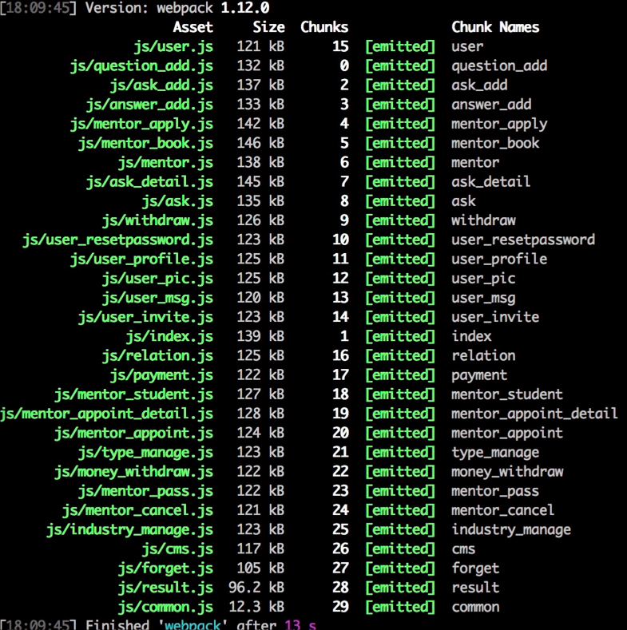

Based on my experience, webpack is more than just a packing tool, as the community grows and the number of plugins and loaders flourishes, it becomes a solid competitor agains `gulp` and `grunt`.

I intend to use webpack as the core of the whold building tool for the project. `gulp` or `grunt` is used only for some tasks which webpack is still not good at, like multiple sprites. For flow control, you can use `package.json` to manage.
- `&` is for serial
- `&&` is for parallel
- `export` is used in Mac or Linux for injecting environment variable
- `set` is used in Windows for injecting environment variable

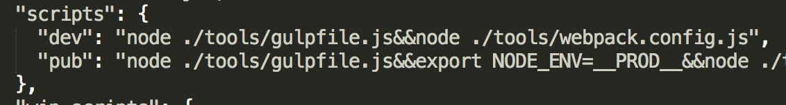

# Comprehensive Guide  of webpack Performance for Big-scale Project

I use a **`react`** project of 10 js files as an example.  I run the test in a machine with 2 CPU cores and 8G ram.  For a very basic configuration (without file uglification), it takes **26seconds**.

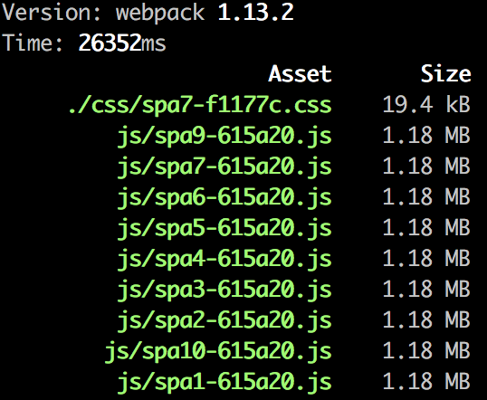

Let me summarize the tips first.
1. Externalize big libraries
2. Pre-build files
3. Reduce searching time
4. Cache
5. Parallel working
## Externalize big libraries

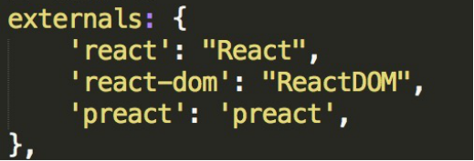

Put the big libraries like `react`, `zepto` in script tag directly, and use `external` config to tell webpack, it is fine to use the external link as the source, don't build it.  It saves **8 seconds**.

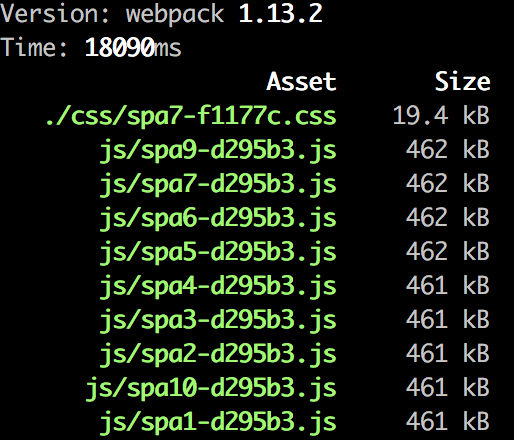

## Pre-build files

In this case, we are trying to pre-build some files before we really start the main building flow.
1. DllPlugin and DllReferencePlugin
   First, we create a new config file, `webpack.dll.js` in which we use DllPlugin. Please see the following pic, we use `DllPlugin` to pre-build `react`, `react-dom`, `redux`, `react-redux`, `redux-thunk` and `loadash.merge` as a new vendor called `lib.js`. At the same time, a dependencies file `./tool/manifest.json` is created for next-step usage.

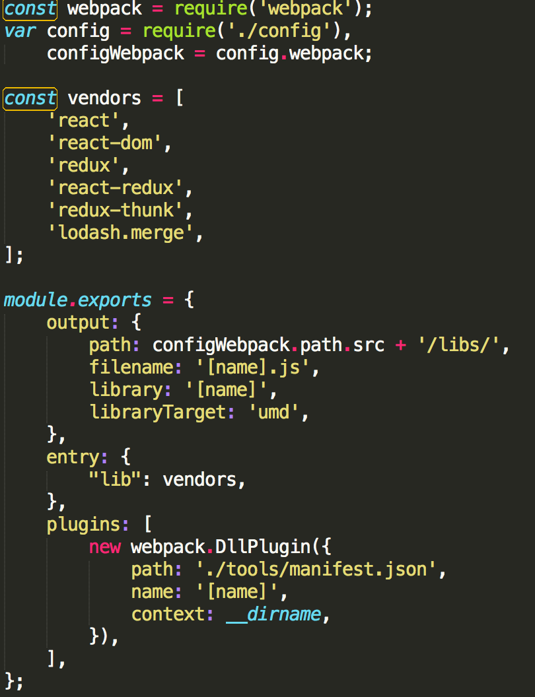

In main webpack config, we now use `DllReferencePlugn` to reference the dependencies.

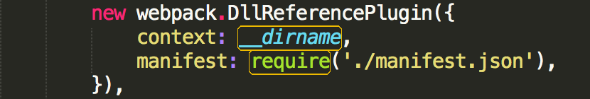

1. noParse
   Once you have some files which are in ES5 format, you don't have to parse it.
   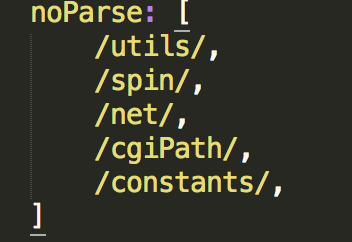

2. PrefetchPlugin
   This plugin maybe strange to most developers. I do not completely master it either. For this plugin, it cost extra analysis since it varies from project to project.

Firstly, [stats-webpack-plugin](https://github.com/FormidableLabs/webpack-stats-plugin) is used for generating a work flow file, `stats.json`.

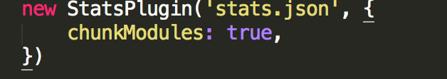

Secondly, enter this site http://webpack.github.io/analyse/ and upload `stats.json`. If you concern about code security, you can checkout this project to your local machine and do the analysis work in local environment. 

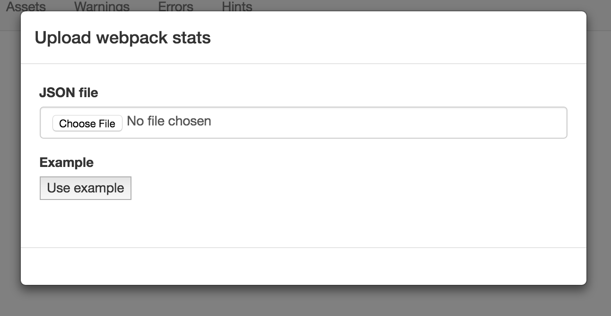

Thirdly, click `hint` and locate `long module build chains` part. If this part exists, you can `prefetch` part of the long building chain like the following:

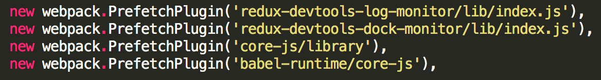

Due to conflict of `external` and `dll`, I don't use `external` config this time. However it also saves much time. Reduce from **26 seconds** to **16.8 seconds**.

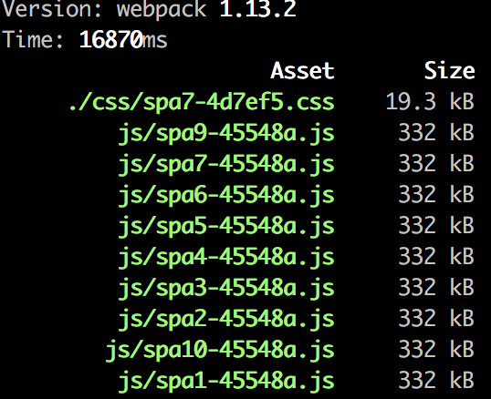
## Reduce searching time

Before webpack compiles files, it needs to locate each file.  Searching files is also a time-consuming job. Please cut it when necessary.
1. loader exclude
   Some times, loader can skip some folders to avoid unnecessary searching. For example, `babel-loader` can skip `node_modules`.

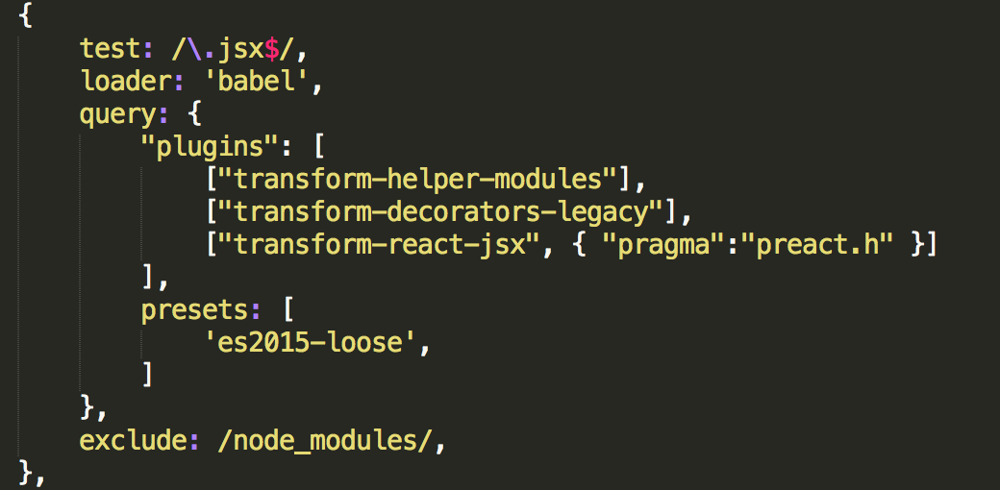

1. `resolve.alias`
   You can also directly tell webpack where the library is via `resolve.alias`.

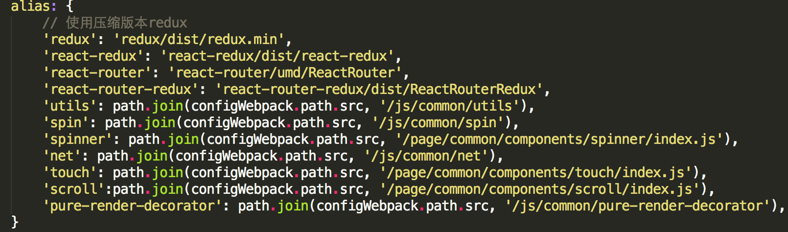

1. `resolve.unsafeCache`
   If the libraries are stable, you can use `resolve.unsafeCache` to save the file location in webpack so that next time, webpack does not need to search again. Set it as `true`. Once the a library changes its location, please disable it and make webpack search agagin.
2. Be careful when you use `resolve.root`, `resolve.modulesDirectory` and `resolve.fallback`
   When you encounters these three config, please be careful. If you set the wrong searching path or if you set to many, it increases down the compilation time.

After these optimization, it further reduce the building time from **18 seconds** to **15 seconds**.

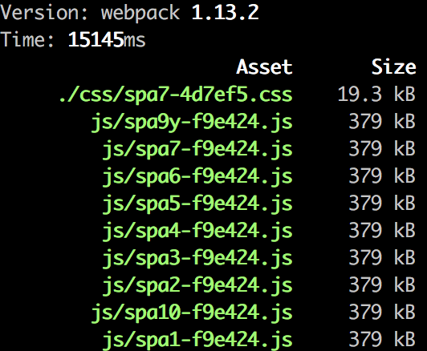

## Cache

We can make a big progress using cache. For example, `babel-loader` has a cache option. As JavaScript  takes up the majority of compilation time when we enable it, it nearly reduces half of the compilation time, from **15 seconds** to **8 seconds**.

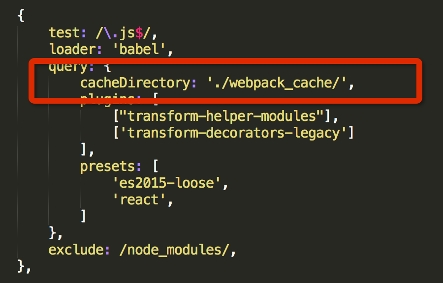

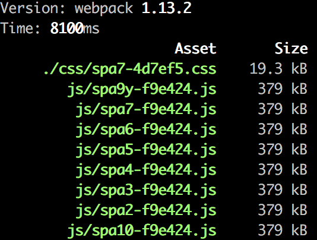

## Parallel Working

In this section, I introduce a famous parallel packing tool, [happypack](https://github.com/amireh/happypack) for webpack.

For js, please just directly copy the options from loader config.

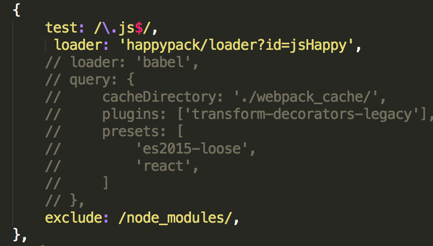

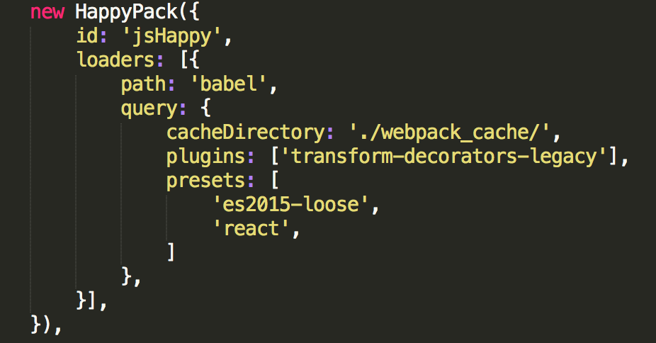

For css, you can use it only in developing mode since it does not support `extract-text-webpack-plugin`.

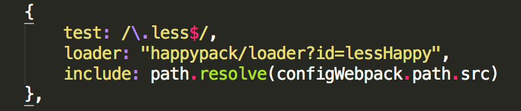

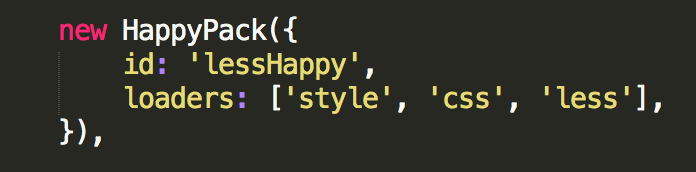

**3 more seconds** are decreased.

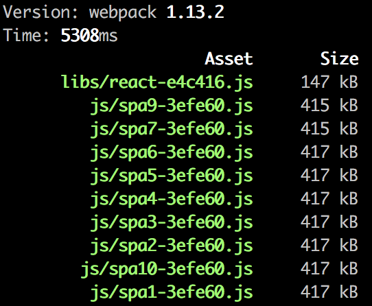

# Conclusion

So far, we have reduce the total compilation time from 26 seconds to 5 seconds, a remarkable result.

What about the compilation time after uglification?

If we use the basic config with `webpack.optimize.UglifyJsPlugin`, it takes **66 seconds** to finish the whole process. However, if we use `webpack-uglify-parallel`, another parallel uglification tool and combine suitable optimazation tips introduced above, it takes only **19.5 seconds**.

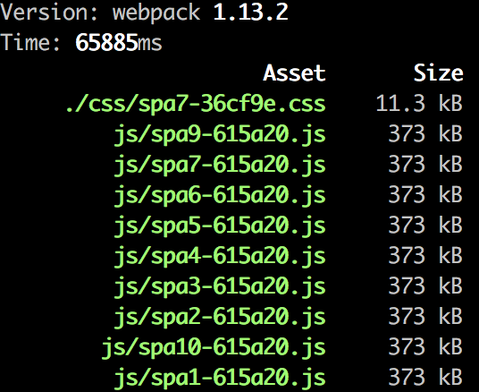

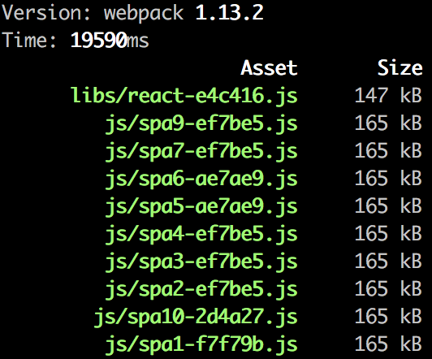
