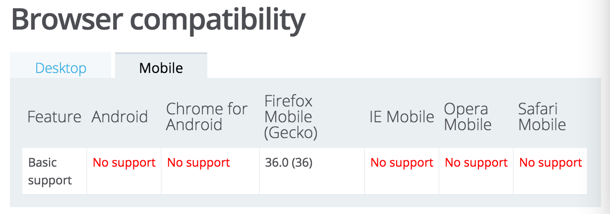

[原文链接](https://github.com/lcxfs1991/blog/issues/9)
## 前言

将babel捧作前端一个划时代的工具一定也不为过，它的出现让许多程序员幸福地用上了es6新语法。但你就这么放心地让babel跑在外网？反正我是不放心，我就曾经过被坑过，于是萌生了研究babel代码转换的想法。本文不是分析babel源码，仅仅是看看babel转换的最终产物。

es6在babel中又称为es2015。由于es2015语法众多，本文仅挑选了较为常用的一些语法点，而且主要是分析babel-preset-2015这个插件（react开发的时候，常在webpack中用到这个preset）。
## babel-preset-2015

打开babel-preset2015插件一看，一共20个插件。熟悉es2015语法的同志一看，多多少少能从字面意思知道某个插件是用于哪种语法的转换
- babel-plugin-transform-es2015-template-literals  => es2015模板
- babel-plugin-transform-es2015-literals
- babel-plugin-transform-es2015-function-name => 函数name属性
- babel-plugin-transform-es2015-arrow-functions => 箭头函数
- babel-plugin-transform-es2015-block-scoped-functions => 函数块级作用域
- babel-plugin-transform-es2015-classes => class类
- babel-plugin-transform-es2015-object-super => super提供了调用prototype的方式
- babel-plugin-transform-es2015-shorthand-properties => 对象属性的快捷定义，如 `obj = { x, y }`
- babel-plugin-transform-es2015-computed-properties => 对象中括号属性，如 `obj = {['x']: 1}`
- babel-plugin-transform-es2015-for-of => 对象for of遍历
- babel-plugin-transform-es2015-sticky-regex
- babel-plugin-transform-es2015-unicode-regex
- babel-plugin-check-es2015-constants => const常量
- babel-plugin-transform-es2015-spread => 对象扩展运算符属性，如...foobar
- babel-plugin-transform-es2015-parameters => 函数参数默认值及扩展运算符
- babel-plugin-transform-es2015-destructuring => 赋值解构
- babel-plugin-transform-es2015-block-scoping => let和const块级作用域
- babel-plugin-transform-es2015-typeof-symbol => symbol特性
- babel-plugin-transform-es2015-modules-commonjs => commonjs模块加载
- babel-plugin-transform-regenerator => generator特性
## var, const and let

const和let现在一律转换成var。那const到底如何保证不变呢？如果你在源码中第二次修改const常量的值，babel编译会直接报错。
转换前

```
var a = 1;
let b = 2;
const c = 3;
```

转换后：

```
var a = 1;
var b = 2;
var c = 3;
```

那let的块级作用怎么体现呢？来看看下面例子，实质就是在块级作用改变一下变量名，使之与外层不同。
转换前：

```
let a1 = 1;
let a2 = 6;

{
    let a1 = 2;
    let a2 = 5;

    {
        let a1 = 4;
        let a2 = 5;
    }
}
a1 = 3;
```

转换后：

```
var a1 = 1;
var a2 = 6;

{
    var _a = 2;
    var _a2 = 5;

    {
        var _a3 = 4;
        var _a4 = 5;
    }
}
a1 = 3;
```
## 赋值解构

写react的时候，我们使用负值解构去取对象的值，用起来非常爽，像这样：

```
var props = {
    name: "heyli",
    getName: function() {

    },
    setName: function() {

    }
};

let { name, getName, setName } = this.props;
```

我们来看看转换的结果：

```
var props = {
    name: "heyli",
    getName: function getName() {},
    setName: function setName() {}
};

var name = props.name;
var getName = props.getName;
var setName = props.setName;
```

至于数组呢？如果是一个匿名数组，则babel会帮你先定义一个变量存放这个数组，然后再对需要赋值的变量进行赋值。
转换前：

```
var [ a1, a2 ] = [1, 2, 3];
```

转换后：

```
var _ref = [1, 2, 3];
var a1 = _ref[0];
var a2 = _ref[1];
```

看到这个，感觉转换结果跟我们想的还蛮一致。哈哈，使用的噩梦还没开始。

如果使用匿名对象直接进行赋值解构会怎样呢？如下。babel为了使接收的变量唯一，直接就将匿名对象里的属性拼在一起，组成接收这个匿名对象的变量，吓得我赶紧检查一下项目里有没有这种写法。
转换前：

```
var { abc, bcd, cde, def } = { "abc": "abc", "bcd": "bcd", "cde": "cde", "def": "def", "efg": "efg", "fgh": "fgh" };
```

转换后：

```
var _abc$bcd$cde$def$efg$ = { "abc": "abc", "bcd": "bcd", "cde": "cde", "def": "def", "efg": "efg", "fgh": "fgh" };
var abc = _abc$bcd$cde$def$efg$.abc;
var bcd = _abc$bcd$cde$def$efg$.bcd;
var cde = _abc$bcd$cde$def$efg$.cde;
var def = _abc$bcd$cde$def$efg$.def;
```

还有一种对象深层次的解构赋值：
转换前：

```
var obj = {
    p1: [
        "Hello",
        { p2: "World" }
    ]
};

var { p1: [s1, { p2 }] } = obj;
```

转换后：

```
// 为解释本人将代码美化了
var _slicedToArray = (function() {
    function sliceIterator(arr, i) {
        var _arr = [];
        var _n = true;
        var _d = false;
        var _e = undefined;
        try {
           // 用Symbol.iterator造了一个可遍历对象，然后进去遍历。
            for (var _i = arr[Symbol.iterator](), _s; !(_n = (_s = _i.next()).done); _n = true) {
                _arr.push(_s.value);
                if (i && _arr.length === i) break;
            }
        } catch (err) {
            _d = true;
            _e = err;
        } finally {
            try {
                if (!_n && _i["return"]) _i["return"]();
            } finally {
                if (_d) throw _e;
            }
        }
        return _arr;
    }
    return function(arr, i) {
        if (Array.isArray(arr)) {
            return arr;
        } else if (Symbol.iterator in Object(arr)) {
            return sliceIterator(arr, i);
        } else {
            throw new TypeError("Invalid attempt to destructure non-iterable instance");
        }
    };
})();

var obj = {
   p1: ["Hello", { p2: "World" }]
};

var _obj$p = _slicedToArray(obj.p1, 2);

var s1 = _obj$p[0];
var p2 = _obj$p[1].p2;
```

babel在代码顶部生产了一个公共的代码_slicedToArray。大概就是将对象里面的一些属性转换成数组，方便解构赋值的进行。但Symbol.iterator的兼容性并不好（如下图），还是谨慎使用为妙。


另外，下面这种对字符串进行赋值解构也同样使用到_slicedToArray方法：

```
const [a, b, c, d, e] = 'hello';
```
## 函数参数默认值及扩展运算符

在es5的年代，一般我们写参数的默认值都会这么写：

```
function func(x, y) {
    var x = x || 1;
    var y = y || 2;
}
```

我们来看看babel的转换办法:

```
function func({x, y} = { x: 0, y: 0 }) {
  return [x, y];
}

function func1(x = 1, y = 2) {
    return [x, y];
}
```

```
function func() {
  var _ref = arguments.length <= 0 || arguments[0] === undefined ? { x: 0, y: 0 } : arguments[0];

  var x = _ref.x;
  var y = _ref.y;

  return [x, y];
}

function func1() {
  var x = arguments.length <= 0 || arguments[0] === undefined ? 1 : arguments[0];
  var y = arguments.length <= 1 || arguments[1] === undefined ? 2 : arguments[1];

  return [x, y];
}
```

babel这里使有了arguments来做判。第一种情况涉及解构赋值，因此x和y的值还是有可能是undefined的。至于第二种情况，则会保证2个参数的默认值分别是1和2.

再来看一种。...y代表它接收了剩下的参数。也就是arguments除了第一个标号的参数之外剩余的参数。
转换前：

```
function func(x, ...y) {
    console.log(x);
    console.log(y);
    return x * y.length;
}
```

转换后：

```
function func(x) {
    console.log(x);

    for (var _len = arguments.length, y = Array(_len > 1 ? _len - 1 : 0), _key = 1; _key < _len; _key++) {
        y[_key - 1] = arguments[_key];
    }

    console.log(y);
    return x * y.length;
}
```
## 箭头函数

剪头函数其实主要是省了写函数的代码，同时能够直接用使外层的this而不用担心context切换的问题。以前我们一般都要在外层多写一个_this/self直向this。babel的转换办法其实跟我们的处理无异。
转换前：

```
var obj = {
    prop: 1,
    func: function() {
        var _this = this;

        var innerFunc = () => {
            this.prop = 1;
        };

        var innerFunc1 = function() {
            this.prop = 1;
        };
    },

};
```

转换后：

```
var obj = {
    prop: 1,
    func: function func() {
        var _this2 = this;

        var _this = this;

        var innerFunc = function innerFunc() {
            _this2.prop = 1;
        };

        var innerFunc1 = function innerFunc1() {
            this.prop = 1;
        };
    }

};
```
## 对象的能力增强
### 对象属性的快捷定义

转换前：

```
var a = 1,
    b = "2",
    c = function() {
        console.log('c');
    };

var obj = {a, b, c};
```

转换后：

```
var a = 1,
    b = "2",
    c = function c() {
    console.log('c');
};

var obj = { a: a, b: b, c: c };
```
### 对象中括号属性

es2015开始新增了在对象中用中括号解释属性的功能，这对变量、常量等当对象属性尤其有用。
转换前：

```
const prop2 = "PROP2";
var obj = {
    ['prop']: 1,
    ['func']: function() {
        console.log('func');
    },
        [prop2]: 3
};
```

转换后：

```
var _obj;
// 已美化
function _defineProperty(obj, key, value) {
    if (key in obj) {
        Object.defineProperty(obj, key, {
            value: value,
            enumerable: true,
            configurable: true,
            writable: true
        });
    } else {
        obj[key] = value;
    }
    return obj;
}

var prop2 = "PROP2";
var obj = (_obj = {}, _defineProperty(_obj, 'prop', 1), _defineProperty(_obj, 'func', function func() {
    console.log('func');
}), _defineProperty(_obj, prop2, 3), _obj);
```

看似简单的属性，babel却大动干戈。新增了一个_defineProperty函数，给新建的_obj = {}进行属性定义。除此之外使用小括号包住一系列从左到右的运算使整个定义更简洁。
### 使用super去调用prototype

以前我们一般都用obj.prototype或者尝试用this去往上寻找prototype上面的方法。而babel则自己写了一套在prototype链上寻找方法/属性的算法。
转换前

```
var obj = {
    toString() {
     // Super calls
     return "d " + super.toString();
    },
};
```

转换后：

```
var _obj;
// 已美化
var _get = function get(object, property, receiver) {
   // 如果prototype为空，则往Function的prototype上寻找
    if (object === null) object = Function.prototype;
    var desc = Object.getOwnPropertyDescriptor(object, property);
    if (desc === undefined) {
        var parent = Object.getPrototypeOf(object);
        // 如果在本层prototype找不到，再往更深层的prototype上找
        if (parent === null) {
            return undefined;
        } else {
            return get(parent, property, receiver);
        }
    }
    // 如果是属性，则直接返回
    else if ("value" in desc) {
        return desc.value;
    }
    // 如果是方法，则用call来调用，receiver是调用的对象 
    else {
        var getter = desc.get;  // getOwnPropertyDescriptor返回的getter方法
        if (getter === undefined) {
            return undefined;
        }
        return getter.call(receiver);
    }
};

var obj = _obj = {
  toString: function toString() {
    // Super calls
    return "d " + _get(Object.getPrototypeOf(_obj), "toString", this).call(this);
  }
};
```
### Object.assign 和 Object.is

es6新增的Object.assign极大方便了对象的克隆复制。但babel的es2015 preset并不支持，所以没对其进入转换，这会使得一些移动端机子遇到这种写法会报错。所以一般开发者都会使用object-assign这个npm的库做兼容。

Object.is用于比较对象的值与类型，es2015 preset同样不支持编译。
## es6模板
### 多行字符串

转换前：

```
console.log(`string text line 1
string text line 2`);
```

转换后：

```
console.log("string text line 1\nstring text line 2");
```
### 字符中变量运算

转换前：

```
var a = 5;
var b = 10;
console.log(`Fifteen is ${a + b} and not ${2 * a + b}.`);
```

转换后：

```
var a = 5;
var b = 10;
console.log("Fifteen is " + (a + b) + " and not " + (2 * a + b) + ".");
```
### 标签模板

es6的这种新特性给模板处理赋予更强大的功能，一改以往对模板进行各种replace的处理办法，用一个统一的handler去处理。babel的转换主要是添加了2个属性，因此看起来也并不算比较工程浩大的编译。
转换前：

```
var a = 5;
var b = 10;

function tag(strings, ...values) {
  console.log(strings[0]); // "Hello "
  console.log(strings[1]); // " world "
  console.log(values[0]);  // 15
  console.log(values[1]);  // 50

  return "Bazinga!";
}

tag`Hello ${ a + b } world ${ a * b }`;
```

转换后：

```
var _templateObject = _taggedTemplateLiteral(["Hello ", " world ", ""], ["Hello ", " world ", ""]);
// 已美化
function _taggedTemplateLiteral(strings, raw) {
    return Object.freeze(Object.defineProperties(strings, {
        raw: {
            value: Object.freeze(raw)
        }
    }));
}
// 给传入的object定义strings和raw两个不可变的属性。

var a = 5;
var b = 10;

function tag(strings) {
  console.log(strings[0]); // "Hello "
  console.log(strings[1]); // " world "
  console.log(arguments.length <= 1 ? undefined : arguments[1]); // 15
  console.log(arguments.length <= 2 ? undefined : arguments[2]); // 50

  return "Bazinga!";
}

tag(_templateObject, a + b, a * b);
```
## 模块化与类
### 类class

javascript实现oo一直是非常热门的话题。从最原始时代需要手动维护在构造函数里调用父类构造函数,到后来封装好函数进行extend继承，再到babel出现之后可以像其它面向对象的语言一样直接写class。es2015的类方案仍然算是过渡方案，它所支持的特性仍然没有涵盖类的所有特性。目前主要支持的有：
- constructor
- static方法
- get 方法
- set 方法
- 类继承
- super调用父类方法。

转换前：

```
class Animal {

    constructor(name, type) {
        this.name = name;
        this.type = type;
    }

    walk() {
        console.log('walk');
    }

    run() {
        console.log('run')
    }

    static getType() {
        return this.type;
    }

    get getName() {
        return this.name;
    }

    set setName(name) {
        this.name = name;
    }


}

class Dog extends Animal {
    constructor(name, type) {
        super(name, type);
    }

    get getName() {
        return super.getName();
    }
}
```

转换后（由于代码太长，先省略辅助的方法）：

```
/**
......一堆辅助方法，后文详述
**/
var Animal = (function () {
    function Animal(name, type) {
                // 此处是constructor的实现，用_classCallCheck来判定constructor正确与否
        _classCallCheck(this, Animal);

        this.name = name;
        this.type = type;
    }
        // _creatClass用于创建类及其对应的方法
    _createClass(Animal, [{
        key: 'walk',
        value: function walk() {
            console.log('walk');
        }
    }, {
        key: 'run',
        value: function run() {
            console.log('run');
        }
    }, {
        key: 'getName',
        get: function get() {
            return this.name;
        }
    }, {
        key: 'setName',
        set: function set(name) {
            this.name = name;
        }
    }], [{
        key: 'getType',
        value: function getType() {
            return this.type;
        }
    }]);

    return Animal;
})();

var Dog = (function (_Animal) {
        // 子类继承父类
    _inherits(Dog, _Animal);

    function Dog(name, type) {
        _classCallCheck(this, Dog);
                // 子类实现constructor
                // babel会强制子类在constructor中使用super，否则编译会报错
        return _possibleConstructorReturn(this, Object.getPrototypeOf(Dog).call(this, name, type));
    }

    _createClass(Dog, [{
        key: 'getName',
        get: function get() {
                       // 跟上文使用super调用原型链的super编译解析的方法一致，
                       // 也是自己写了一个回溯prototype原型链
            return _get(Object.getPrototypeOf(Dog.prototype), 'getName', this).call(this);
        }
    }]);

    return Dog;
})(Animal);
```

```
// 检测constructor正确与否
function _classCallCheck(instance, Constructor) {
    if (!(instance instanceof Constructor)) {
        throw new TypeError("Cannot call a class as a function");
    }
}
```

```
// 创建类
var _createClass = (function() {
    function defineProperties(target, props) {
        for (var i = 0; i < props.length; i++) {
            var descriptor = props[i];
            // es6规范要求类方法为non-enumerable
            descriptor.enumerable = descriptor.enumerable || false;
            descriptor.configurable = true;
            // 对于setter和getter方法，writable为false
            if ("value" in descriptor) descriptor.writable = true;
            Object.defineProperty(target, descriptor.key, descriptor);
        }
    }
    return function(Constructor, protoProps, staticProps) {
        // 非静态方法定义在原型链上
        if (protoProps) defineProperties(Constructor.prototype, protoProps);
        // 静态方法直接定义在constructor函数上
        if (staticProps) defineProperties(Constructor, staticProps);
        return Constructor;
    };
})();
```

```
// 继承类
function _inherits(subClass, superClass) {
   // 父类一定要是function类型
    if (typeof superClass !== "function" && superClass !== null) {
        throw new TypeError("Super expression must either be null or a function, not " + typeof superClass);
    }
    // 使原型链subClass.prototype.__proto__指向父类superClass，同时保证constructor是subClass自己
    subClass.prototype = Object.create(superClass && superClass.prototype, {
        constructor: {
            value: subClass,
            enumerable: false,
            writable: true,
            configurable: true
        }
    });
    // 保证subClass.__proto__指向父类superClass
    if (superClass) 
        Object.setPrototypeOf ? 
        Object.setPrototypeOf(subClass, superClass) :    subClass.__proto__ = superClass;
}
```

```
// 子类实现constructor
function _possibleConstructorReturn(self, call) {
    if (!self) {
        throw new ReferenceError("this hasn't been initialised - super() hasn't been called");
    }
    // 若call是函数/对象则返回
    return call && (typeof call === "object" || typeof call === "function") ? call : self;
}
```

先前在用react重构项目的时候，所有的react组件都已经摒弃了es5的写法，一律采用了es6。用类的好处写继续更加方便，但无法用mixin，需要借助更新的es7语法中的decorator才能够实现类mixin的功能(例如pureRender）。但这次分析完babel源码之后，才发现原来babel在实现class特性的时候，定义了许多方法，尽管看起来并不太优雅。
### 模块化

在开发react的时候，我们往往用webpack搭配babel的es2015和react两个preset进行构建。之前看了一篇文章对babel此处的模块加载有些启发（《分析 Babel 转换 ES6 module 的原理》）。

示例：

```
// test.js
import { Animal as Ani, catwalk } from "./t1";
import * as All from "./t2";


class Cat extends Ani {

    constructor() {
        super();
    }
}

class Dog extends Ani {
    constructor() {
        super();
    }
}
```

```
// t1.js
export class Animal {

    constructor() {

    }

}

export function catwal() {
    console.log('cat walk');
};
```

```
// t2.js
export class Person {
    constructor() {

    }

}

export class Plane {
    constructor() {

    }

}
```

通过webpack与babel编译后：

```
// t1.js的模块
Object.defineProperty(exports, "__esModule", {
    value: true
});
exports.catwal = catwal;

// 省略一些类继承的方法

var Animal = exports.Animal = function Animal() {
    _classCallCheck(this, Animal);
};

function catwal() {
    console.log('cat walk');
};

// t2.js的模块
Object.defineProperty(exports, "__esModule", {
    value: true
});

// 省略一些类继承的方法

var Person = exports.Person = function Person() {
    _classCallCheck(this, Person);
};

var Plane = exports.Plane = function Plane() {
    _classCallCheck(this, Plane);
};

// test.js的模块
var _t = __webpack_require__(1);

var _t2 = __webpack_require__(3); // 返回的都是exports上返回的对象属性

var All = _interopRequireWildcard(_t2);

function _interopRequireWildcard(obj) {
    // 发现是babel编译的， 直接返回
    if (obj && obj.__esModule) {
        return obj;
    }
   // 非babel编译， 猜测可能是第三方模块，为了不报错，让default指向它自己
    else {
        var newObj = {};
        if (obj != null) {
            for (var key in obj) {
                if (Object.prototype.hasOwnProperty.call(obj, key)) newObj[key] = obj[key];
            }
        }
        newObj.default = obj;
        return newObj;
    }
}

// 省略一些类继承的方法

var Cat = (function (_Ani) {
    _inherits(Cat, _Ani);

    function Cat() {
        _classCallCheck(this, Cat);

        return _possibleConstructorReturn(this, Object.getPrototypeOf(Cat).call(this));
    }

    return Cat;
})(_t.Animal);

var Dog = (function (_Ani2) {
    _inherits(Dog, _Ani2);

    function Dog() {
        _classCallCheck(this, Dog);

        return _possibleConstructorReturn(this, Object.getPrototypeOf(Dog).call(this));
    }

    return Dog;
})(_t.Animal);
```

es6的模块加载是属于多对象多加载，而commonjs则属于单对象单加载。babel需要做一些手脚才能将es6的模块写法写成commonjs的写法。主要是通过定义__esModule这个属性来判断这个模块是否经过babel的编译。然后通过_interopRequireWildcard对各个模块的引用进行相应的处理。

另一个发现是，通过webpack打包babel编译后的代码，每一个模块里面都包含了相同的类继承帮助方法，这是开发时忽略的。由此可看，在开发react的时候用es5的语法可能会比使用es6的class能使js bundle更小。
## babel es2015 loose mode

开发家校群的时候，在android4.0下面报esModule错误的问题，如下：

```
Uncaught TypeError: Cannot assign to read only property '__esModule' of #<Object>。
```

经查证，发现是构建中babel-es2015 loader的模式问题，会导致Android4.0的用户有报错。只需要使用loose mode就可以解决问题。下面是相关的stackoverflow issue以及对应解决问题的npm包。
- [stackoverflow](http://stackoverflow.com/questions/33446318/is-there-a-way-to-use-loose-modules-when-using-es2015-preset-in-babel-6)
- [babel-preset-est2015-loose npm package](https://www.npmjs.com/package/babel-preset-es2015-loose)

那么es2015和normal mode和loose mode有什么区别呢，这个出名的博客略有介绍:[Babel 6: loose mode](http://www.2ality.com/2015/12/babel6-loose-mode.html)。

实质就是（作者总结）normal mode的转换更贴近es6的写法，许多的property都是通过Object.defineProperty进行的。而loose mode则更贴近es5的写法，性能更好一些，兼容性更好一些，但将这部份代码再转换成native es6的话会比较麻烦一些（感觉这一点并不是缺点，有源码就可以了）。

上面esModule解决的办法，实质就是将

```
Object.defineProperty(exports, "__esModule", {
    value: true
});
```

改成 
`exports.__esModule = true;`

再举个例子，如下面的Cat类定义：

```
class Cat extends Ani {

    constructor() {
        super();
    }

    miao() {
        console.log('miao');
    }
}
```

正常模式会编译为：

```
var Cat = (function (_Ani) {
    _inherits(Cat, _Ani);

    function Cat() {
        _classCallCheck(this, Cat);

        return _possibleConstructorReturn(this, Object.getPrototypeOf(Cat).call(this));
    }

    _createClass(Cat, [{
        key: "miao",
        value: function miao() {
            console.log('miao');
        }
    }]);

    return Cat;
})(_t.Animal);
```

loose mode模式会编译为：

```
var Cat = (function (_Ani) {
    _inherits(Cat, _Ani);

    function Cat() {
        _classCallCheck(this, Cat);

        return _possibleConstructorReturn(this, _Ani.call(this));
    }

    Cat.prototype.miao = function miao() {
        console.log('miao');
    };

    return Cat;
})(_t.Animal);
```

babel es2015中loose模式主要是针对下面几个plugin：
- transform-es2015-template-literals
- transform-es2015-classes
- transform-es2015-computed-properties
- transform-es2015-for-of
- transform-es2015-spread
- transform-es2015-destructuring
- transform-es2015-modules-commonjs

每一种的转换方式在此就不再赘述了，大家可以回家自己试。

如有错误，恳请斧正！
## 参考文章：
#### babel try out
- https://babeljs.io/repl/
#### template literals
- https://developer.mozilla.org/en-US/docs/Web/JavaScript/Reference/Template_literals
#### block-scoped functions
- https://blogs.msdn.microsoft.com/cdndevs/2015/09/16/future-of-javascript-ecmascript-6-es2015-block-scoping/
- http://www.programmerinterview.com/index.php/javascript/javascript-block-scope/
- http://www.2ality.com/2015/02/es6-scoping.html
#### classes
- http://purplebamboo.github.io/2014/07/13/javascript-oo-class/
- http://blog.rainy.im/2015/07/20/prototype-chain-in-js/
#### objects
- http://fourkitchens.com/blog/article/practical-introduction-es2015-objects
#### commonjs and es6 module
- http://ryerh.com/javascript/2016/03/27/babel-module-implementation.html
- http://www.2ality.com/2015/12/babel6-loose-mode.html
- http://www.2ality.com/2015/02/es6-classes-final.html
