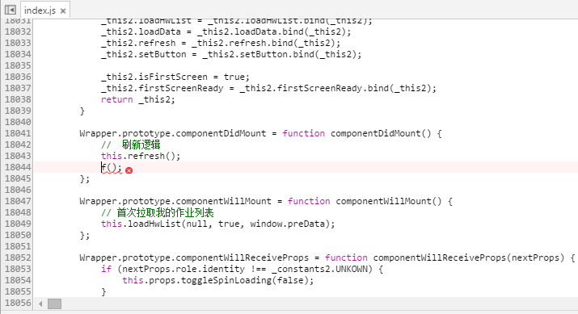

## 前言

[《React移动web极致优化》](https://github.com/lcxfs1991/blog/issues/8)也提到了，构建工具是前端优化的重要一环。而React的推荐构建工具则是Webpack。这篇文章我们就来聊聊如何在Webpack构建的过程中如何针对React的应用做一些优化。

如果还没看过[《webpack使用优化（基本篇）》](https://github.com/lcxfs1991/blog/issues/2)这篇文章，建议去看看，因为针对React的优化往往也离不开Webpack那些最基本的优化点。此外，在这里将Webpack视作构建可能招来一些人的反对，他们会将Webpack定位成打包的工具。但实际项目中，除了合图以外，家校群项目已将Webpack将为最核心的构建工具。

本篇文章的成果最终都会转化成一个开源的boilerplate, [steamer-react](https://github.com/lcxfs1991/steamer-react)(暂时设为私有项目)。
## 目录结构


构建工具离不开目录的设计，我们需要安排号文件存放的位置才便于构建工程的开展。在src目录下一级的文件，除了page文件夹是react的主体逻辑文件之外，其它的像img, js, css, libs，都属于各个页面都会用到的公共文件，如utils, 上报等。

page目录下，common文件夹主要旋转跟React相关的一些公共的文件，如公共的component，中间件等。而其它的文件夹就是每个页面的主体逻辑和资源，另外就是页面对应的html文件。

由于家校群采用的是React+ Redux这套方案，我们文件夹的名字也很能体现这套方案的特色。首先组件Component方面，我们比较认同Redux推崇的smart component(container)和dump component，因此它们分别放置在container和component文件夹下。那container和component文件夹下面放在什么呢？我们放置了组件相关的逻辑js和样式scss文件。我们暂时没将图片放在组件这一层，而是放在页面这一层，是因为我们业务不同组件间共用了不少图片，因此放在更上一层更为合适。

而store, reducer, action, connect都是跟Redux这个数据处理框架相关。像root这样的文件夹则是项目的主入口，里面有root.dev.js和root.prod.js，用于区分开发环境与生产环境对应需要引入的组件。

如果你还用到React-Router，可能你还需要多加一个route的文件夹，里面用存放项目route的配置文件。

这套文件架构比较传统的gulp和grunt复杂，但却更符合React + Redux这套方案的开发思路。
## 针对React的优化点
### 需要维护两套构建配置

Webpack跟Gulp和Grunt不同，前者属于配置型构建（当然也可以通过插件去做一些流程），后两者属于任务型的构建。以前在用Gulp开发的时候，也会写一些任务专门针对开发或者生产的环境，分别再建两条任务流，分别去处理开发与生产环境的构建。同理Webpack也需要去处理开发与生产环境的构建，因此也需要两套配置去实现。

如果搞不清楚什么任务应该放在开发环境，什么应该放在生产环境，可以参考[《性能优化三部曲之一——构建篇》](https://github.com/lcxfs1991/blog/issues/4)，里有有详情参考；如果不知道如何去区分开发与生产环境，可以参考《webpack使用优化（基本篇）》(https://github.com/lcxfs1991/blog/issues/2)。

这里想提出来说的有2点：
- 第一，是建议开发环境的配置是生产环境的子集。
  这样顺着写下来比较流畅，毕竟我们是先考虑开发，等开发完之后才会去构思生产环境的部署。这时我们可以直接用Object.assign去复制开发环境写好的配置，进行修改便是。也可以添加一些方法方便处理更新配置，例如生产环境想去添加新的插件，我参考了之前看过的一个boilerplate：

```
devConfig.addPlugins = function(plugin, opt) {
    devConfig.plugins.push(new plugin(opt));
};
```
- 第二，是React是否使用外链问题。在开发环境下，建议直接引入node_modules包的，因为里面有许多有用的报错和提示，方便开发时快速发现问题。而生产环境自然是建议外链，否则Webpack就会自作主线地把React和你的业务逻辑打包到一起，比分开打包要大得多。
### React的ES2015编译

ES2015近2年很火热，我们也来尝尝鲜。用ES2015的最大好处就是可以使用许多方便的特性，但有一个小小的坏处就是，你可能忽略ES5的写法，而ES5的写法很多时候能够清楚地表示出React的实现方式，对理解框架和原理更有帮助。

另外就是，用这些新的特性，会有一些不稳定的因素，就是不知道转换之后会成什么样子，转换后的代码兼容性如何（具体可参[《babel到底将代码转换成什么鸟样？》](https://github.com/lcxfs1991/blog/issues/9)]）。果不其然，我们发布列表页之后发现一个报错：

```
Uncaught TypeError: Cannot assign to read only property '__esModule' of #<Object>。
```

解决办法，就是babel编译使用ES2015-Loose而不是ES2015的preset。具体转换的代码如下：


具体在Webpack的loaders里可以这样写你的编译配置

```
{ 
    test: /\.js?$/,
    loader: 'babel',
    query: {
        plugins: ['transform-decorators-legacy'],   /// 使用decorator写法
        presets: [
            'es2015-loose',    // ES2015 loose mode
            'react',
        ]
    },
    exclude: /node_modules/,
}
```

除此之外，我们也发现每个Webpack打包的模块，最终编译都会生成一堆类似的代码：

```

    function _interopRequireDefault(obj) { return obj && obj.__esModule ? obj : { default: obj }; }

    function _classCallCheck(instance, Constructor) { if (!(instance instanceof Constructor)) { throw new TypeError("Cannot call a class as a function"); } }

    ......
```

这些是Babel对ES2015转义生成的代码片段。多的时候，每个模块生成的这些代码都接近1kb。如果你的component多，例如像家校群有超过20组件，后面的详情页的组件可能更多，这么多组件合起来重复的代码可能就近20kb。在PC端20kb没有所谓，但到移动端却对bundle的大小锱铢必较。建议写一个Webpack plugin/loader对这些代码进行去重（反正没看到Webpack有插件，机会就留给你们了）。
### 如何热替换css

打包css的时候，我们习惯使用ExtractTextPlugin让css单独生成一个文件。但如果你想让css也能够热替换，在开发环境的时候请去掉这个插件让样式内联。
### Webpack慎用devtools的inline-source-map模式

使用此模式会内联一大段便于定位bug的字符串，查错时可以开启，不是查错时建议
关闭，否则开发时加载的包会非常大。

如果不使用devtools查错，你看到的会是合成之后的bundle，上万行代码，也不知道是哪个文件：
。

使用了之后，你就很很清晰是在哪个文件，哪一行了：

### 如果无法使用服务器构建，开发时请让小伙伴统一开发路径

webpack的bug导致如果本地开发目录路径不一致，编译出来的md5会不一致。所以推荐使用服务器构建。
## React项目的合图

在搭项目构建的时候，曾经尝试过用Webpack一个合图插件，但因不够成熟而弃用，转而考虑转投向gulp的合图插件的怀抱。由于家校群功能页面是一个多页项目，每个页面都会有合图，因此我们选用了[gulp.spritesmith-multi](https://www.npmjs.com/package/gulp.spritesmith-multi)。

以前使用gulp的构建项目，css都同一放在一层，引用图片的路径都放在一个css里面。但面对React的项目，我们每一个component都有自己对应的index.js（处理逻辑）和index.scss（处理样式），由于这个合图插件只能标出一个图片路径，因此如果合图的引用发生在不同层次的component，绝对会发生找不到文件的报错，因此我们统一将引用放在container的样式文件中，权宜地解决这个问题，以下是大致gulpfile写法：

```
gulp.task('sprites', function (cb) {
    var spriteData = gulp.src(Config.filePath.src + 'img/sprites/**/*.png')
                        .pipe(spritesmith({
                            spritesmith: function(options) {
                                options.imgPath = Config.sprites.imgPath + options.imgName;

                                options.cssName = options.cssName.replace('.css', '.scss');
                                // customized generated css template
                                options.cssTemplate = './config/scss.template.handlebars';
                            }
                        }));

    // Pipe image stream through image optimizer and onto disk
    var imgStream = spriteData.img
    // DEV: We must buffer our stream into a Buffer for `imagemin`
    .pipe(gulp.dest(Config.sprites.imgDest));

    // Pipe CSS stream through CSS optimizer and onto disk
    var cssStream = spriteData.css
    .pipe(gulp.dest(Config.sprites.cssDest));

    // Return a merged stream to handle both `end` events
    return merge(imgStream, cssStream);
});
```

以下是样式引用办法：

```
@import"../../../css/sprites/list_s";

......

.info-right.tiku-status3 {
    @include sprite($remark);
}
```

如有错误，恳请斧正!
