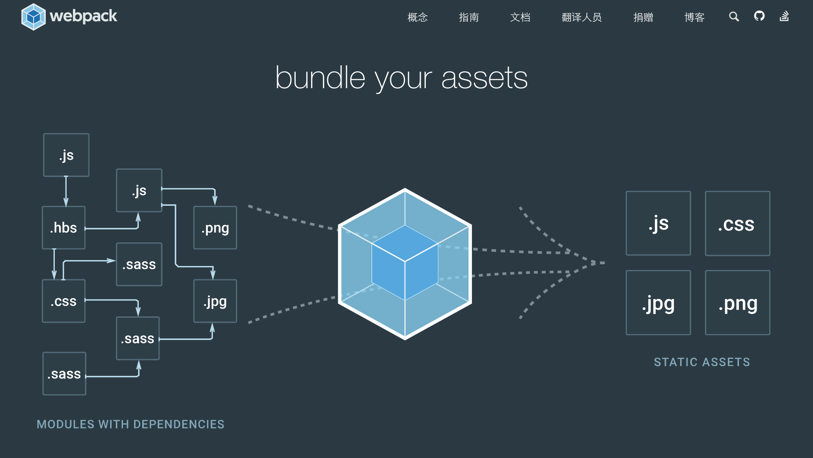

经过一个多月的奋战，[webpack2的中文文档](https://doc.webpack-china.org/)已经翻译好大部份，并且完成了核心内容“概念”和“指南”部份的校对。

这份文档比react, vue之类的文档都要庞大而且复杂。本文带你如何快速读懂这份文档。

首先是[“概念”](https://doc.webpack-china.org/concepts/)。这部份对于菜鸟或者老司机来说，都是值得一读的，由于webpack跟之前的grunt, gulp都有所不同，它是基于模块的配置型构建工具，许多理念对于前端玩家来说都是全新的，例如，什么是[入口(entry)](https://doc.webpack-china.org/concepts/entry-points/)，它有几种配置的方式，如何配置我们需要[输出(output)](https://doc.webpack-china.org/concepts/output/)的位置、文件名，[加载器(loaders)](https://doc.webpack-china.org/concepts/loaders/)，和[插件(plugins)](https://doc.webpack-china.org/concepts/plugins/)是如何帮助我们编译文件和处理各种自动化任务的，webpack要打包的[模块(module)](https://doc.webpack-china.org/concepts/modules/)到底是什么，它去哪里[解析(resolve)](https://doc.webpack-china.org/concepts/module-resolution/)文件等等，这里都会帮你一一解答。

在你了解了webpack的概念之后，接下来，可以看看[“指南”](https://doc.webpack-china.org/guides/)。这里的内容都是实践经验之谈，例如前四篇文章主要是介绍怎么用webpack去初始化一个项目，并进行发布；《从v1迁移到v2》帮助你顺利从webpack1升级至webpack2。其它的文档，主要是介绍webpack一些比较精彩的特性，例如拆包、热替换等等，还有一些比较有趣的，像怎么用typescript写webpack配置，怎么用虚拟机跑webpack等等。

如果你对前两部份都了如指掌，那么恭喜你，你已经具备能力进入webpack的深水区了--更为细致的["文档"](https://doc.webpack-china.org/configuration/)了。

点击”文档“，首先进入的是["配置"](https://doc.webpack-china.org/configuration/)，这里算是完整配置的介绍，要搭建一个更为完善的脚手架或者构建工具，需要仔细阅读这里的配置文档。

[“API”](https://doc.webpack-china.org/api/)主要介绍了像webpack命令行的使用、如何在Node.js中结合webpack来搭建构建工具。对比起webpack1，webpack2的命令行工具变得更为强大，而且可以对你的构建耗时进行分析。

API中另外的两部份，[“加载器API”](https://doc.webpack-china.org/api/loaders/)和[“插件API”](https://doc.webpack-china.org/api/plugins/)，可以结合[“开发”](https://doc.webpack-china.org/development/)部份来看，主要是帮助开发者更好地开发webpack的加载器和插件，借助webpack的能力去解决自身项目中遇到的构建问题。对比webpack1，这是一份更好的加载器和插件开发文档，因为它不仅介绍了推荐的写法，还把内部的事件、内部可调用的一些方法，都展现了出来，赋予了开发者更多的能力。

webpack2的文档，耗费了许多人大量的心血，尤其要感谢最开始启动这个翻译项目的[dear-lizhihua](https://github.com/dear-lizhihua) 还有 [dingyiming](https://github.com/dingyiming)，webpack中文社区的几位筹办成员，还有许多[贡献本项目的热心技术同仁](https://doc.webpack-china.org/about)。

如果想参与我们的翻译项目，请关注我们的[官方文档翻译计划](https://github.com/webpack-china/webpack.js.org)。

如果有webpack相关的技术文章，可以在[awesome-webpack-cn](https://github.com/webpack-china/awesome-webpack-cn)给我们提pull request。

如果有兴趣参与社区筹办，请关注我们的[harpers](https://github.com/webpack-china/harpers)项目。

我们会持续关注webpack，关注前端工程化发展的方方面面。

By AlloyTeam LeeHey, 

webpack-china首席打杂

于2017.2.25，一个寒冷的春夜
