## 简介

印记中文的成立主要是为了协助社区更好地翻译与部署文档。最近联合腾讯云一起设计了一套有效提升访问速度及降低流量消耗成本的方案，即 cos 对象存储服务 及 cdn 加速方案。本文主要描述方案大体的实现过程，如果你是技术文档的管理者，苦于没有优秀的文档部署方案，可以联系印记中文(docschina)，我们会提供接入服务。如果你遇到性能问题，我们也可以提供免费的技术咨询服务

** QQ群：492361223 **

也可以关注我们的公众号：


## 代码存放及CI构建

一般而言，对公有代码，一般采用 Github + Travis-CI 存放及构建方式。而对于私有代码来说，则会直接使用 Bitbucket + Pipeline (Bitbucket自有的构建服务)。（点击以下标题展开详细内容）

<details>
<summary>Github + Travis-CI</summary>
自动构建与部署服务的架构如下图：

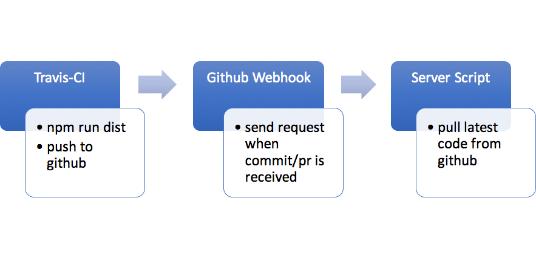

在代码仓库方面，我们需要两个分支，一个是 `master` 分支，用于存放文档源码，另一个是 `gh-pages` 分支，用于存放生成的文档文件。

然后，我们需要配置 `.travis.yml` 文件，用于 Travis-CI 构建和部署我们的项目，下面是求全配置，表示仅在在 `master` 分支有 `push` 或者 `pull request` 事件的时候，才会触发构建，使用语言是 `node.js`，版本是 `6.x`，首先运行完安装依赖的 `npm install` 之后，再运行 `bash ./scripts/deploy.sh`。

```javascript
branches:
  only:
    - master
language: node_js
node_js:
  - "6"
script:
  - bash ./scripts/deploy.sh
sudo: required
install:
  - npm install
```

那么  `./scripts/deploy.sh` 脚本中，主要就是承担构建、鉴权，以及代码推送的功能。

```javascript
// deploy.sh 第一部份，用于构建代码
npm run dist
```

```javascript
// deploy.sh 第二部份，用于与github鉴权
REPO=`git config remote.origin.url`
SSH_REPO=${REPO}
git config --global user.name "Travis CI"
git config --global user.email "ci@travis-ci.org"
git remote set-url origin "${SSH_REPO}"

openssl aes-256-cbc -K $encrypted_7562052d3e34_key -iv $encrypted_7562052d3e34_iv -in scripts/deploy_key.enc -out scripts/deploy_key -d
chmod 600 scripts/deploy_key
eval `ssh-agent -s`
ssh-add scripts/deploy_key

```

```javascript
// deploy.sh 第三部份，用于向github推送代码
chmod -R 777 node_modules/gh-pages/
npm run deploy // dist是生产代码目录，deploy 所跑脚本是 gh-pages -d dist，最终将代码推送到gh-pages 分支
```

那第二部份的 ssh key 怎么生成呢？其实整个 github 的鉴权原理不难，用工具成生 ssh key 公钥与私钥，然后将公钥存放到 github 的 repository 中，将私钥存放到代码库中，在Travis-CI 推送代码之前添加私钥，那么推送的时候就可以顺利鉴权成功。

那具体怎么生成 ssh key呢，具体可以参考这个文档[Generating a new SSH key to generate SSH Key](https://help.github.com/articles/generating-a-new-ssh-key-and-adding-it-to-the-ssh-agent/#platform-mac)。

然后，到你的文档本地代码仓库键入以下示例命令：

```javascript
ssh-keygen -t rsa -b 4096 -C ci@travis-ci.org

Enter file in which to save the key (/var/root/.ssh/id_rsa): deploy_key
```

当有以下问题的时候，可 `enter` 跳过。

```
Enter passphrase (empty for no passphrase):
```

打开 `deploy_key.pub` 文件，将内容复制，然后到线上代码仓库`https://github.com/<your name>/<your repo>/settings/keys`中，添加 ssh public key。

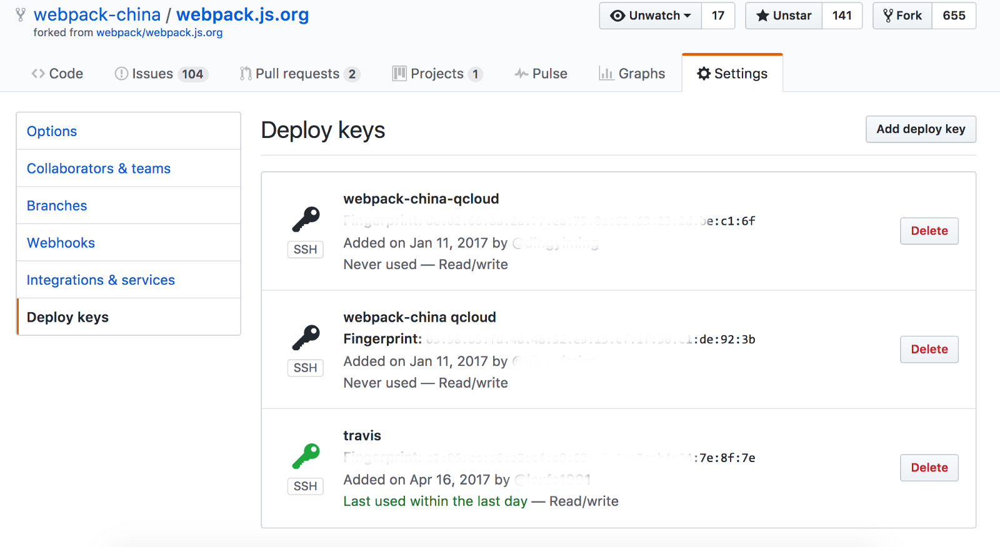

然后安装 [travis client tool](https://github.com/travis-ci/travis.rb#installation)，用于上传 SSH Key 信息到 Travis-CI 服务器。上传完后，运行以下命令：

```javascript
travis encrypt-file deploy_key
```

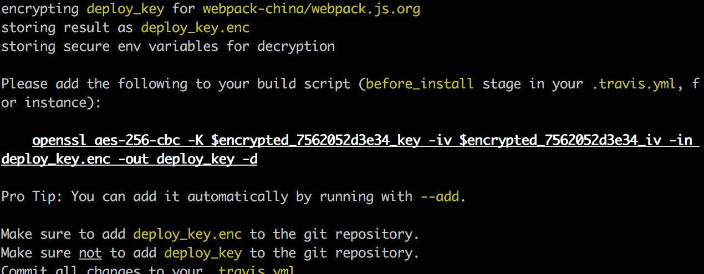

使用，将以下代码复制到 `deploy.sh` 中，并且将 `deploy_key.enc` 文件复制到 `scripts` 目录下。记得千万不要上传 `deploy_key.pub` 文件。

```javascript
openssl aes-256-cbc -K $encrypted_7562052d3e34_key -iv $encrypted_7562052d3e34_iv -in scripts/deploy_key.enc -out scripts/deploy_key -d
```

然后使用以下命令进行登陆:

```javascript
travis login
```
</details>


<details>
<summary>Bitbucket + Pipeline</summary>

Bitbucket + Pipeline 与 Github + Travis-CI 的流程是大体相似的，你可以稍微参考一下上一节的架构图。只是个别流程有细微出入。

生成 SSH Key 与 Github 的办法一样，可参考[Generating a new SSH key](https://help.github.com/articles/generating-a-new-ssh-key-and-adding-it-to-the-ssh-agent/#generating-a-new-ssh-key)。

然后前往 `https://bitbucket.org/account/user/username/ssh-keys/`，或者点击网站左下角头像，进入 **Bitbucket Setting**，**Security**，**SSH keys**，进行公钥添加。

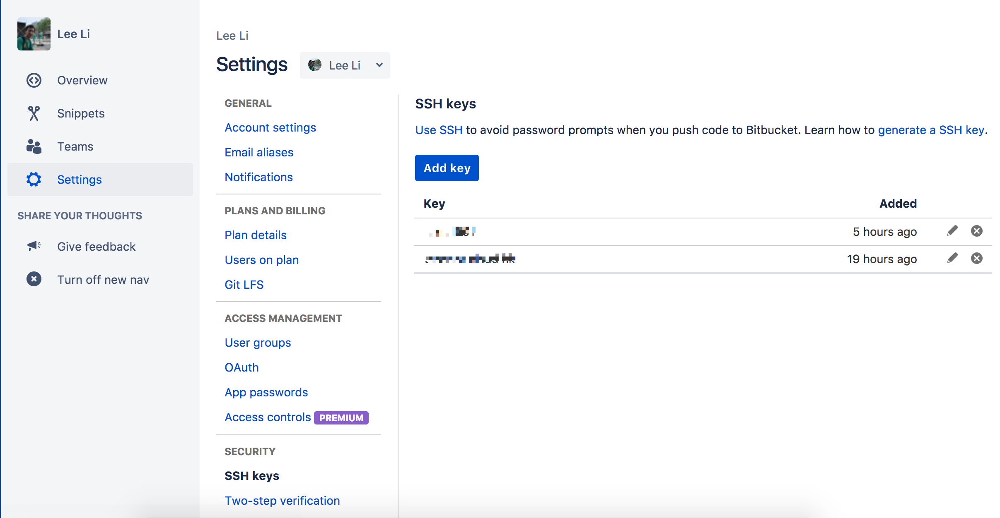


至于 `deploy.sh` 脚本，也略有一些出入。

```javascript
// deploy.sh 第一部份，用于构建代码
npm run dist
```

```javascript
// deploy.sh 第二部份，用于与github鉴权
REPO=`git config remote.origin.url`
SSH_REPO=${REPO}
git config --global --replace-all user.name "xxxxxx"
git config --global --replace-all user.email "xxxxxx@gmail.com"
git remote set-url origin "${SSH_REPO}"

chmod 600 scripts/id_rsa
eval `ssh-agent -s`
ssh-add scripts/id_rsa

ssh -T git@bitbucket.org
```

```javascript
// deploy.sh 第三部份，用于向github推送代码
chmod -R 777 node_modules/gh-pages/
npm run deploy // dist是生产代码目录，deploy 所跑脚本是 gh-pages -d dist，最终将代码推送到gh-pages 分支
```

</details>

## Webhook
设置 Webhook，是用于在构建完毕后，向部署服务器发起请求，触发自动部署的脚本。只要跟部署服务器约定好 `url` 路径，然后根据需要配置好 `webhook` 即可。

<details>
<summary>Github Webhook</summary>
以下是 `Github` `Webhook` 设置的截图。

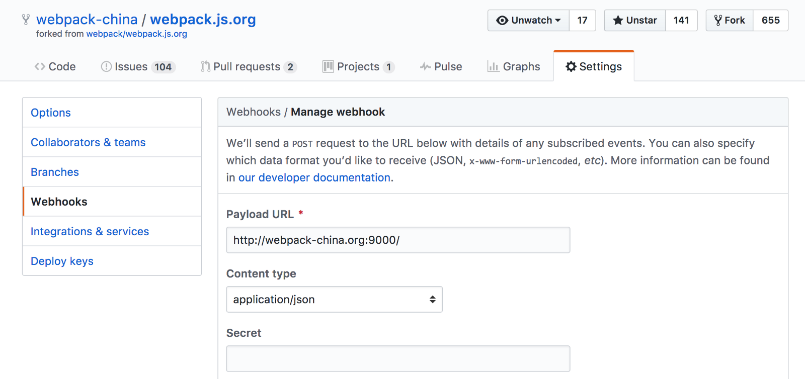

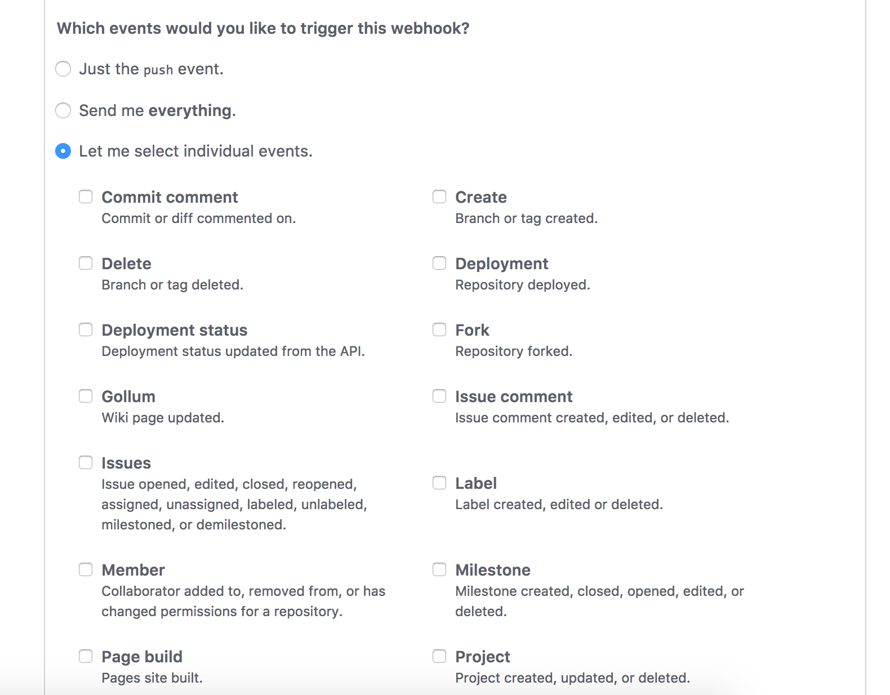
</details>

<details>
<summary>Bitbucket Webhook</summary>
以下是 `Bitbucket` 的 `Webhook` 设置截图。

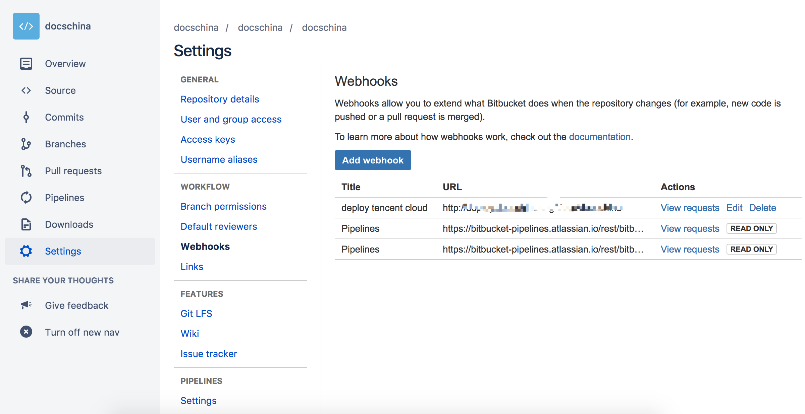
</details>

## 部署服务
<details>
<summary>腾讯云 COS</summary>
COS，即对象存储（Cloud Object Storage，是面向企业和个人开发者提供的高可用，高稳定，强安全的云端存储服务。您可以将任意数量和形式的非结构化数据放入COS，并在其中实现数据的管理和处理。COS支持标准的Restful API接口，是非常适合作为静态文件部署存储服务。

首先，创建一个 Bucket，没有备案的域名请选择海外的节点，同时选择 CDN 加速（后面需要用）：

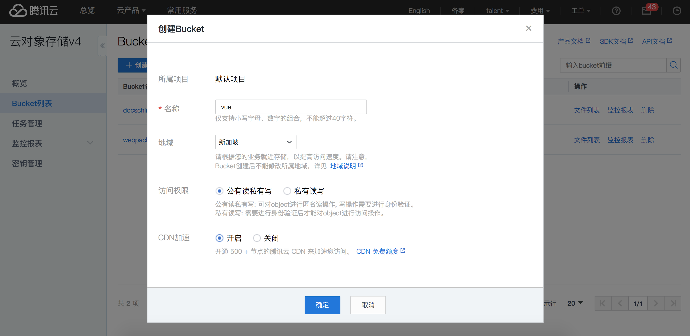

创建后，会进入 `Vue Bucket` 的文件列表页面，目前是空的。到 **基础配置**，中开启***静态网站*配置。

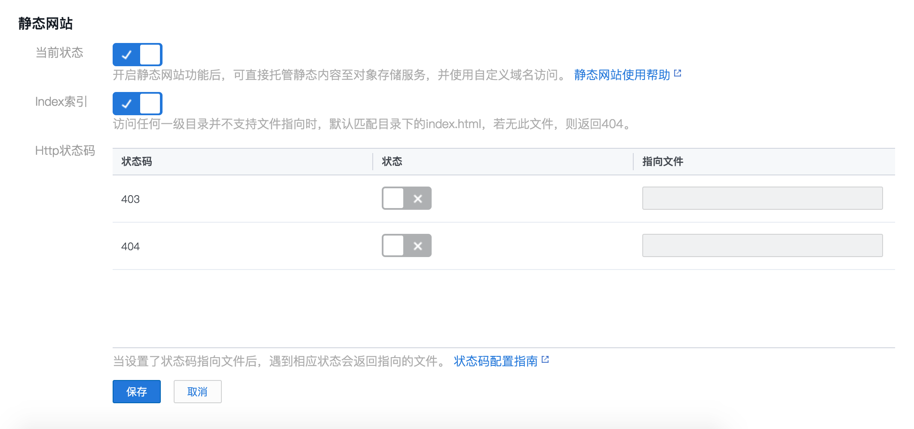

然后进入**域名管理**，添加域名。

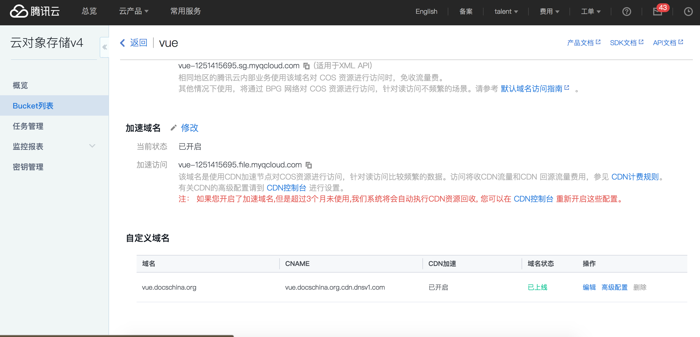


然后到你的域名管理提供商，配置一下 `CNAME` 解析。直接用上图的域名和 `CNAME` 值。

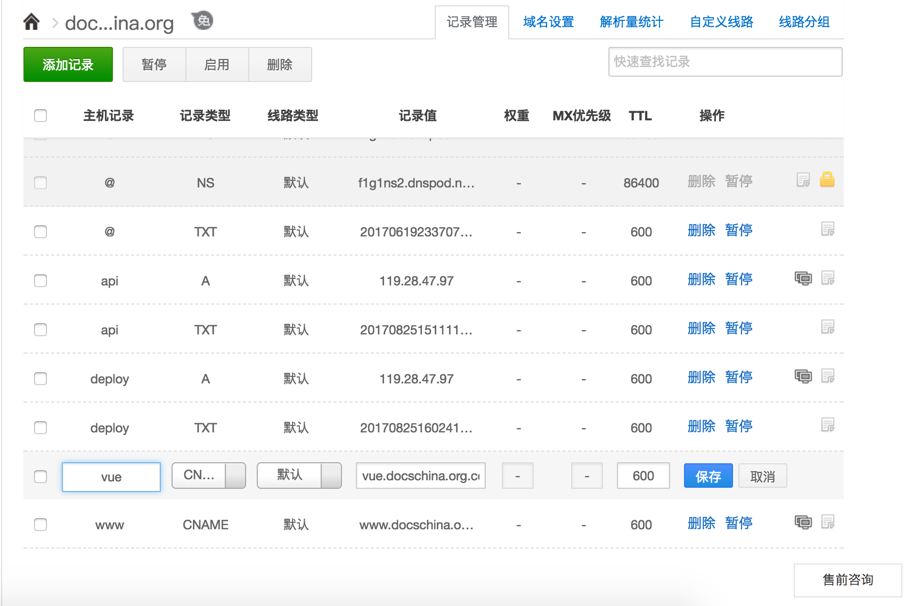


如果需要开启 `HTTP2`，还可以去申请 `HTTPS` 证书，腾讯云可以申请免费的 `HTTPS` 证书。
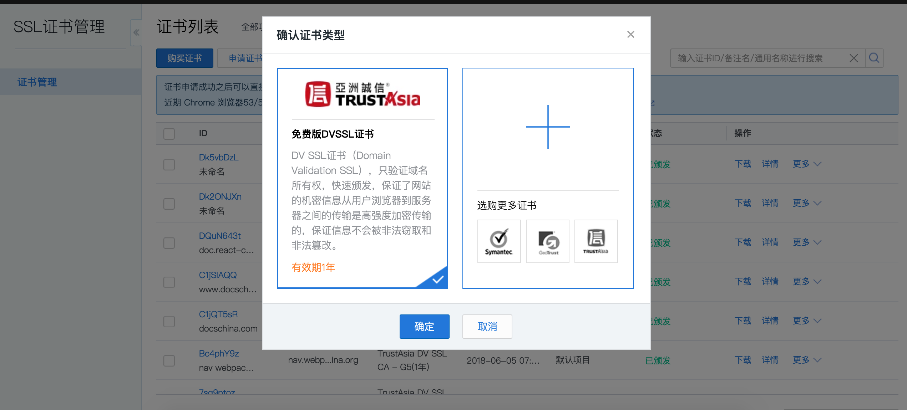

</details>

<details>
<summary>腾讯云 CDN</summary>
等域名CDN加速部署好后，可以点击 COS **域名配置** 中，具体域名的 **高级配置**，进入 **CDN** 管理界面。

进入 **缓存配置**，添加一些缓存规则，如 `js, css, png, jpg` 等带有 `md5` 的资源可以长久缓存，而 `html` 等资源则不宜缓存。

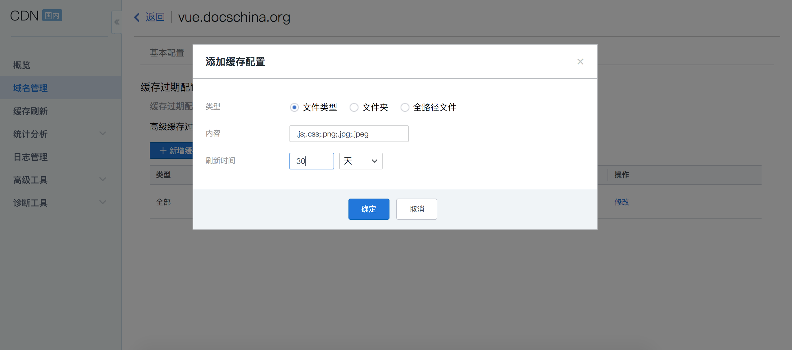

然后进入 **高级配置**，在当中配置 `HTTPS` 证书 和 开启 `HTTP2`。

</details>

<details>
<summary>部署服务器</summary>
在部署服务器中，需要部署一个服务，用于监听 `Github` 或者 `Bitbucket` 发出来 `Webhook` 请求，然后根据请求参数，去运行脚本自动将文件部署到腾讯云 COS 存储服务当中。

技术方案可大体如下实行。

监听请求方面， `koa + pm2` 部署一个小型服务，根据参考运行腾讯云 `COS` 文件上传脚本，然后用 `nginx` 反向代理技术将请求代理到此小型服务中。

至于 `腾讯云 COS` 文件上传脚本，本人推荐 Java 与 Python 版本的，尤其是 Python 版本的比较容易安装部署。
1. [COSCMD 工具](https://www.qcloud.com/document/product/436/10976)
2. [本地同步工具](https://www.qcloud.com/document/product/436/7133)

小型服务根据请求参考，先到本地部署好的文档 `gh-pages` 分支代码处，先行更新代码，然后再运行文件上传工具，将文件依次上传到 `COS` 服务中。

以下是使用 `COSCMD` 工具的一个简单示例：

```javascript
const execSync = require("child_process").execSync,
	  moment = require("moment"),
	  fs = require("fs-extra"),
	  path = require("path");

// COSCMD 基本配置
const config = {
	"appid": "xxx",
	"secret_id": "xxx",
	"secret_key": "xxx",
	"timeout": 60,
	"max_thread": 20,
};

// 执行命令方法
function exeCmd(cmd) {
	var result = execSync(cmd);

	console.log(`[${moment().format('YYYY-MM-DD HH:mm:ss')}]${result}`);
}

exports.index = function* () {
       // 从请求 url 参数中获得  project 和 cos 部署节点区域的值
	const project = this.params.project || '',
		  region = this.params.region || 'cn-east';

	console.log(`[${moment().format('YYYY-MM-DD HH:mm:ss')}]，${project} is starting to update. The region is ${region}！`);
        // gh-pages 分支代码存放位置
	const codePath = path.join(`/docs/files/${project}`);

	if (!fs.existsSync(codePath)) {
		this.response.status = 400;
		console.log(`${codePath} does not exist`);
		return;
	}
       // 更新 gh-pages 文件
	const updateCommand = `cd ${codePath};sudo git pull origin gh-pages;sudo git reset --hard gh-pages;`;
	exeCmd(updateCommand);
       
       // 更新 COSCMD 配置 
	const configCommand = `coscmd config -a ${config.secret_id} -s ${config.secret_key} -u ${config.appid} -b ${project} -r ${region} -m ${config.max_thread}`;
	exeCmd(configCommand);

        // 筛选要上传的文件或文件夹
	let info = fs.readdirSync(`/docs/files/${project}`, 'utf-8');
	info = info.filter((item) => {
		if (item.indexOf('.') === 0) {
			return false;
		}

		return true;
	});
        
       // COSCMD 上传文件
	info.forEach((item) => {
		let syncCommand = '';
		let stat = fs.statSync(path.join(`/docs/files/${project}/${item}`));

		if (stat.isDirectory()) {
			syncCommand = `sudo coscmd upload -r /docs/files/${project}/${item} ${item}/`;
		}
		else {
			syncCommand = `sudo coscmd upload /docs/files/${project}/${item} ${item}`;
		}

		exeCmd(syncCommand);
	});

    this.body = "success";
```


</details>