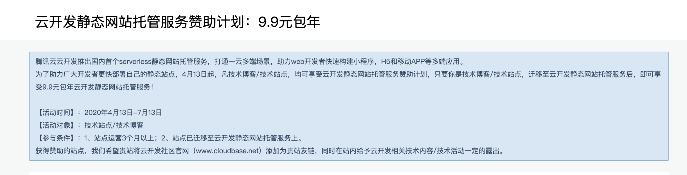
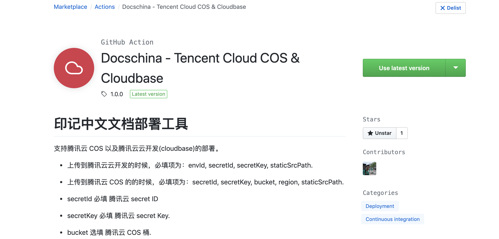
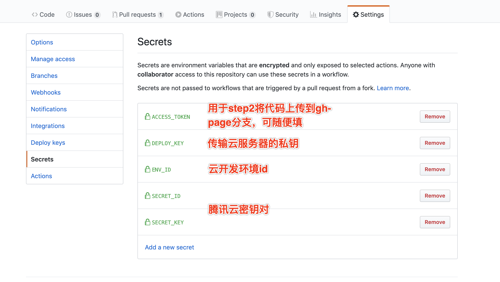
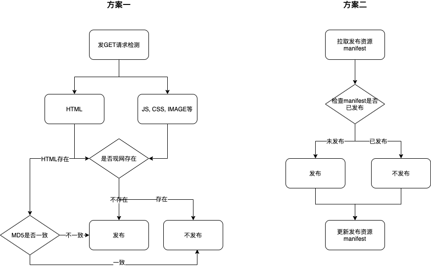

# 如何通过 Github Action 薅腾讯云云开发的羊毛

印记中文一直致力于为国内前端开发者提供技术文档的翻译服务，比如 React, Webpack, Node.js 等技术文档，都能有看到印记中文参与的影子。为了让文档的加载速度更好，我们都把文档全数部署在腾讯云国内的 CDN 服务上。不过这也带来了比较大的成本压力，做部署服务买的机器、每几个月要买 TB 级别的 CDN 流量包。

直到最近，腾讯云云开发推出的静态资源部署服务，对于许多文档站、静态个人官网，无论是在部署上，还是价格上，都非常的友好亲民。经过计算发现，比将站点部署在云服务器以及传统的 CDN 更加实惠。这么好的羊毛，不薅天理难容啊！



不过由于印记中文的文档种类多，情况各不相同，经过一番的研究之后，梳理出以下的需求，并且输出了对应的解决方案，希望开放出来给大家针对自身的情况使用。

## 印记中文的部署需求

- 需求一：文档个数多，希望可以统一发布方案

由于印记中文的文档不少，至少有 10 个以上，部署的方案需要比较整齐划一才比较好地做维护。之前我们是通过 `Node.js` 写了一个部署服务，一定程度上减轻了部署的负担，但还是需要在每个文档里，新加入脚本做构建和触发部署。而 `Github Action` 推出后，完美解决了 `Github` 项目构建与部署问题，因此基于 `Github Action` 做一个部署方案是比较好的解决方案。

- 需求二：文档的资源量大，需要增量发布能力

印记中文的文档是部署在子域下面的，之前是部署在腾讯云的 COS 和 CDN 服务上。有的文档的文件量非常大，像 react, webpack 的文档文件数，动辄上千，腾讯云平台的工具都只是提供全量的上传，这样不仅上传的速度慢，而且平台是会针对上传次数计费的，因此，我们要尽量减少每次发布的上传量，将性能提升并将成本降低。作为有追求的开发者，怎么可能在发布这个事情让云平台赚到我们的钱呢！

- 需求三：主站的 HTML 需要部署在云服务器

主站由于备案要求以及产品策略的关系，一般都需要部署在云服务器。因此印记中文的主站采取的策略是 HTML 文件部署在云服务器，其它的静态资源部署在云开发作为加速。

## 印记中文的 Github Action 解决方案

基于印记中文上述的需求，开放出一套解决方案，基本可以满足上述的需求。

首先我们要解决的是一个统一的发布方案，对代码入侵比较少的主要就是使用 `Github Action`。印记中文的部署 `Github Action` 同时能支持腾讯云对象存储(COS)还有云开发(Cloudbase)，地址在：https://github.com/docschina/docschina-actions



下面代码是截取了印记中文主站部署的前半部份，主要的流程就是构建+部署。关于 Github Action 的语法推荐到技术社区搜索相关的帖子，本文主要是讲述部署的方案。

第一个 `step`（步骤）是 `Checkout`，主要就是拉取代码。

第二个 `step` 是 `Build and Deploy`，用于运行 `npm run build` 命令构建，并将构建到 `build` 目录的代码都上传到 `gh-pages` 分支做存档。

第三个 `step` 是 `Check Build`，用于检查 `build` 目录是否存在以及给它赋予可读写的权限。

第四个 `step` 是 `Docschina Github Action`，就是印记中文的核心部署 `Github Action`，在`Setting`的 `Secrets`里填写了腾讯云的密钥对 `SECRET_ID`, `SECRET_KEY` 和云开发发`ENV_ID`



```yaml
name: Build CI For CloudBase

on:
  push:
    branches: [master]

jobs:
  build:
    runs-on: ubuntu-latest

    strategy:
      matrix:
        node-version: [12.x]

    steps:
      - name: Checkout
        uses: actions/checkout@v2

      - name: Build and Deploy
        uses: JamesIves/github-pages-deploy-action@master
        env:
          ACCESS_TOKEN: ${{ secrets.ACCESS_TOKEN }}
          BRANCH: gh-pages
          FOLDER: build
          BUILD_SCRIPT: npm install --unsafe-perm=true && npm run build

      - name: Check Build
        run: |
          sudo -i
          sudo chown -R $USER build

      - name: Docschina Github Action
        id: deployStatic
        uses: docschina/docschina-actions@master
        with:
          secretId: ${{ secrets.SECRET_ID }}
          secretKey: ${{ secrets.SECRET_KEY }}
          staticSrcPath: ./build
          isForce: ${{ secrets.ISFORCE }}
          envId: ${{ secrets.ENV_ID }}
```

那 `docschina/docschina-actions@master` 这个 `Github Action` 跟腾讯云的官方工具相比，提供了哪些其它的能力呢？官方的工具，主要是提供了全量的文件上传，而印记中文研发的工具，提供了增量发布、强制全量发布、忽略文件、支持 COS 和 Cloudbase 两种发布方式。

忽略文件，是通过 `skipFiles` 填入的数据参数实现的，而全量发布，可以通过给`isForce`传入`true`值达成。那究竟如何实现增量发布的呢？

一般来说，增量发布有两种方式，见下图:



方案一是最精确的做法，就是每次都去检测现网，看看资源是否存在，而对于 Web 入口的 HTML 文件还要多检测一次 MD5——那是为大多数非 HTML 资源，都会在文件名里加上 MD5 串，而 HTML 则不会。但这种求精确的方案会带来 CDN 资源的消耗，因为每次发布的时候都得检测，而且发布的速度也会被拖慢。

方案二则是选择用空间换时间，将已经发布过的文件信息都存在一个 manifest 的文件里，然后每次发布前都拉取一下这个文件，如果在该文件里出现过的就不再发布了，而且还会将本次发布的文件更新到该 manifest 文件中。这种方法的缺点是可能不精确，因为可能由于其它的原因，比如手动删除文件，服务中的文件可能不存在，但 manifest 中已经有该文件的发布信息了。基于这个方案，印记中文做了一些小优化，HTML文件会在 manifest 中记录其内容的 md5 值，非 HTML 文件则会记录是否发布的布尔型值，另外还提供了`isForce`参数，允许用户可以强制全量发布，避免有一些文件丢失的时候，可以全量先发布一次。

上面的方案已经能解决前两个需求了，那第三个需求呢？我们把印记中文主站最后部份的部署代码列出来。这里是使用了`Pendect/action-rsyncer`这个`Github Action`，将 HTML 文件，通过`rsync`命令传输到远端的服务器。

```yaml
 - name: Deploy To Server
        uses: Pendect/action-rsyncer@v1.1.0
        env:
          DEPLOY_KEY: ${{secrets.DEPLOY_KEY}}
        with:
          flags: '-avzr'
          options: ''
          ssh_options: ''
          src: 'build/'
          dest: 'root@129.226.66.15:/data/docs/docschina'
          SSH_PRIVATE_KEY: ${{ secrets.DEPLOY_KEY }}
```

但`Github Action`如何可以连接远端的服务器呢？关键就是在于这个`DEPLOY_KEY`.首先，你得先得生成一个 SSH 私钥，这个生成跟你的 Github SSH 私钥生成的过程类似，可以自行搜索相关的文章。

然后，需要让你的服务器，加载该 SSH 私钥，如下图：

。

然后，打开该私钥文件，拿到内容，给`Github Action`配置`DEPLOY_KEY`内容，这样在使用`rsync`的时候，就能自动连接上远端的服务器。

自此，通过组合自研的和别人的`Github Action`，基本实现了常见的不同情况的静态资源部署。要感谢腾讯云云开发研发团队给予的一些帮助，让我比较顺利地通过调用一些内部的 API 更好地实现定制的部署流程，让我更加任性地薅这波羊毛。这波的 `9.9 元`的包年活动据说截至到 7 月份，如果想把自己的静态站点迁移到云开发静态部署服务，可以尝试使用本文推荐的工具。

如有错误，恳请斧正!
