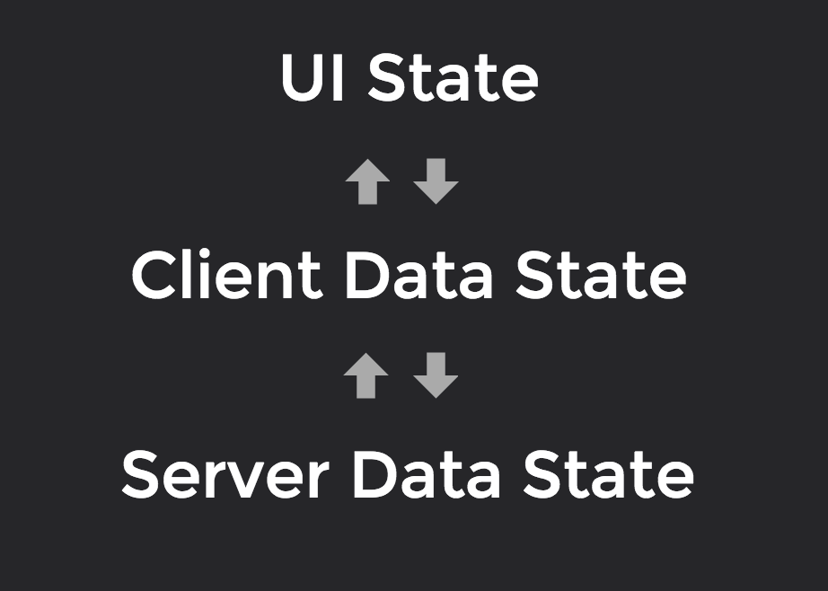
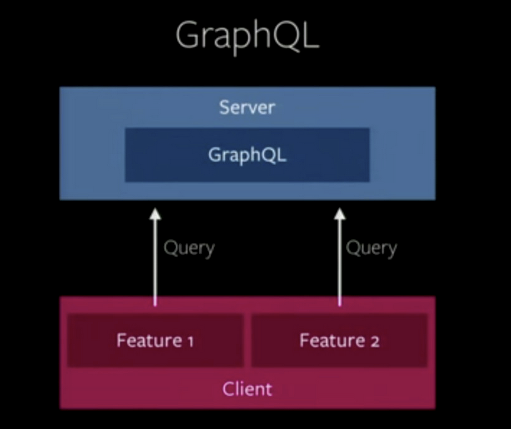

# 这是前端最好的时代——论前端的“三化”建设

原文发表于：[CSDN](http://www.csdn.net/article/2015-07-17/2825243-alloy-team-leehey)

作者： 腾讯AlloyTeam， 李成熙LeeHey

"每18至24个月，前端都会难一倍"（注：2015深JS大会上，赫门在《前端服务化之路》主题演讲中说的一句话）。难，是前端发展史偶然中的必然。但难，也造就着前端当下的繁荣。

Ryan Dah之所以选择用Javascript作为Node.js的基础语言，主要是因为它是单线程的，没有服务器I/O，没有历史包袱，有较低的门槛和比较良好的社区1。这看似是偶然，但实际上正正是Javascript的这些优秀的特性必然被历史选择，承担推动web技术发展的使命。(注：Node.js Interview: 4 Questions with Creator Ryan Dahl, http://bostinno.streetwise.co/2011/01/31/node-js-interview-4-questions-with-creator-ryan-dahl/)

本届的深JS大会，我们看见的是在Node.js的推动下，前端技术大放异彩，逐渐告别"石器时代"，走向"工业时代"。而通过推动前端"工业时代"的离不开"三化"的建设，分别是自动化、实时化与服务化。
## 一、前端自动化

前端的自动化技术已经发展了好几年，之前涌现的grunt, gulp都已经帮助前端很好地解决代码压缩，生成md5，合图等的功能。自动化属于"三化"中的基础，它的发展极大释放了前端的手脚，让前端有更多的时候专注于实时化与服务化的发展。大会带来与前端相关的主题是前端的测试自动化。这相信是前端自动化比较棘手的问题。

马逸清给我们展示了七牛存储在前端测试上的一些尝试。但目前来看成果还是相当有限的。其一，他们的做法主要是针对于Javascript的逻辑，或者是一些基本的UI交互的测试，浏览器兼容性的测试、前端页面与设计稿的对齐方面的测试，基本都是空白。其二，即使他们现在可以对Javascript的逻辑进行测试，但比较好的切入条件是对DOM的隔离，所以，如果业务使用的是View与Model的框架如Angular的话，测试是比较友好的。但如果使用到的是web component这种将Javascript, CSS和HTML模块化地放在一起的元素，则比较麻烦。

对于前端页面与设计稿对齐的测试，我们团队AlloyTeam也有一些尝试，曾开发过一个AlloyDesigner的工具。而对于浏览器兼容性测试，在IE流行的时代，为了兼容IE，很多人喜欢用一个叫IE Tester的工具。但这些都只属于测试的工具化，离自动化还有很长的距离。

另外，马逸清还提到，写这些测试代码要增加约20%至30%的工作时间。这对于人手不足、业务时间急、需求迭代快的团队，是一个不少的挑战。而且这个幅度的时间增加，对这些团队来说，可能有违自动化的核心理念——效率的提高。

因此，前端的自动化下一步需要关注的是，拓展测试可覆盖的场景，以及减少额外的时间开销。
## 二、 前端服务化

所谓服务化，即使用者只需调用，而毋须知道内部的实现，说白了就是标准化（注：《前端服务化之路》赫门, 2015深JS）。Node.js的出现使前端服务化成为可能。Node.js开发的系统可以作为接入层，调用Java, C++等提供的基础功能，处理数据库，然后将数据吐给浏览器进行渲染。简易言之，就是用Node.js代替Java, C++这一层。最后造就的成果是，不仅Java, C++可以放弃业务逻辑，更专注于数据处理的基础服务，而且Node.js能更专注于业务逻辑，挺供API服务给浏览器端的代码进行调用。

用Node.js作为接入层，让前端涉足"后台"的业务成为可能，而且能提高开发效率，还能更方便地使用最新Web技术，如Big Pipe, WebSocket等对页面进行优化。早前淘宝进行的前后端分离，腾讯AlloyTeam正在进行的玄武框架，都是在推动前端服务化做出努力。

除了Node.js作为 接入层提供服务以外，淘宝的赫门还提出了将前端Web Component作为一种服务，提供给后台使用。Javascript的AMD与CommonJS规范的订立使Javascript的模块化开发成为可能，也就自然而然地推动了前端的组件化。但赫门认为组件化的web component是散乱的，并没有办法一统江湖（如果Angular, React这类框架），而他的理念就是希望帮助Web Component重新定位，也就是将其标准化。他在演讲中举出一个应用场景：使用React开发了一个组件，给前端用直接使用React，而给后端用的时候则先用Flipper输出成web component再用。赫门的这个Flipper在技术上并没有太大的新意，有创新之处在于，他基于Flipper提出的服务化理念。

AlloyTeam内部其实有类似的更完善的方案—— MVVM框架Q.js 及Ques组件方案。赫门的Flipper只管将代码转成标准化Web Component，而Ques组件方案不仅在开发过程中可以用标准化Web Component，而且建基于构建，开发的过程中就已经可以将HTML, CSS及JS模块化，更好地组织代码。而Q.js则一个类Vue.js的的MVVM框架，它可以使用Ques组件方案，结合MVVM框架的特性，能够轻松驾驭一个项目的开发(注：Q.js, https://github.com/imweb/Q.js; Ques, https://github.com/miniflycn/Ques)。
## 三、 前端实时化

我不确定用实时化这个词形容是否恰当，但不可否认的是，web技术的发展使网页获得更好的响应。目前比较流行的方案就是前端SPA（单页应用）技术结合后台的API服务，他们的桥梁是诞生刚满10年的Ajax。 未来，这种趋势会得到强化，而且web的体验会越来越贴近应用。

会上，前Googler尤雨溪带来的Meteor正致力于完善这件事。一般的单页应用都如下图，UI、客户端数据、和服务器数据相互沟通，达到状态的更新。而Meteor则希望将客户端数据这一层变薄甚至直接去掉，以减少性能的损耗，因此他们引入一种叫Minimongo的数据库驱动，它遵守DDP(分布式数据协议)，根据Meteor的说法，是一种简易的结构化数据获取及数据更新协议。它的特色是，可以在客户端直接定制想要订阅的数据格式，服务器根据请求对订阅者进行推送。Meteor的另一个特色是使用了WebSocket技术。如果你打开TeleScope（使用Meteor技术的一个BBS应用），你能发现它是通过WebSocket获取数据的实时应用。也正因为Meteor使用WebSocket这个HTML5新特性，Meteor将DDP亲切地称为WebSocket的REST。

（图片来源：Database Everywhere: a Reactive Data Architecture for JavaScript Frontends, 尤雨溪， 深JS， [http://slides.com/evanyou/shenjs#/）][3]

另一个讲者，Strikingly的CTO郭达峰提到Facebook最近打算开源的一种新技术，GraphQL，结合Relay和Reactive，是最新比较热门的web开发方案。这种方案跟Meteor相比其实有异曲同工之妙。在通信结构方案，这种方案遵循上图，React负责UI状态，Relay负责客户端数据状态，而GraphQL则负责服务器数据状态。在通信协议方案，与Meteor不同，它并不限于使用WebSocket，它其实更着眼于解决REST的问题。GraphQL在服务器端发布一个类型系统，Relay通过客户端发送一些比较结构化的查询请求来获取数据，如下图。这套解决方案简化了服务器端，以统一的GraphQL接口提供给Relay这一层，Relay会自动获取数据并统一进行数据变更的处理，使数据获取和处理更加高效。

（图片来源：郭达峰，GraphQL and Relay https://speakerdeck.com/dfguo/lightning-talk-at-jsconf-2015）

在实时化应用方面，业界前10年（Ajax诞生10周年）的发展是致力于前端的交互与设计方面的优化，例如Ajax的诞生，Angular, React一类框架使单页应用更为普及。又如AlloyTeam的AlloyKit离线包系统(注：《AK（AlloyKit）——手机QQ Hybrid app 优化新思路》陈桂鸿，http://www.infoq.com/cn/presentations/alloykit-qq-hybrid-app-optimizing-ideas)，使HybridApp体验更为完美。而看这次大会，站在10年这个分水岭上发表的演讲，像Facebook这样的巨头和Meteor这样的创新型公司正开始着眼于使前后端的数据通信更快更好。
## 结语

前端的自动化、服务化和实时化是前端开发中正在发生的变化，是一系列深刻的变革。这些变革使前端的能务更加丰富、创造的应用更加完美。在深圳举办的这次中国Javascript大会上的讲座，都相当精彩，有意无意地反应出业界的这些变化。希望下一届的大会能够少一点安利，少一点使用性的介绍，多一点实用的干货。
