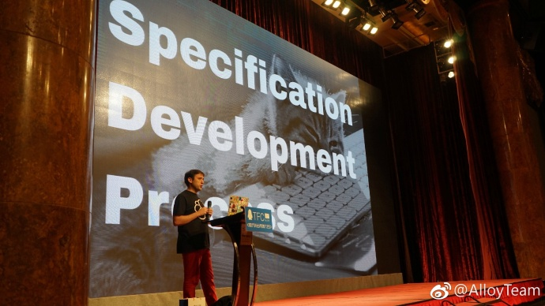
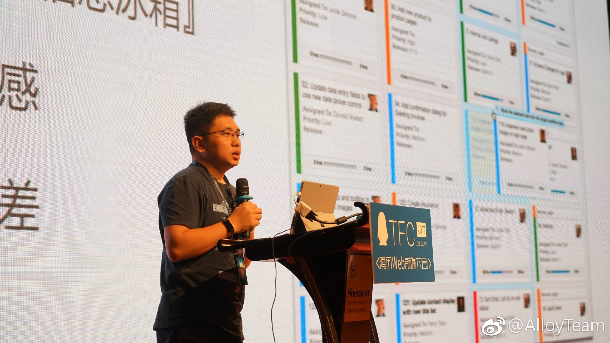
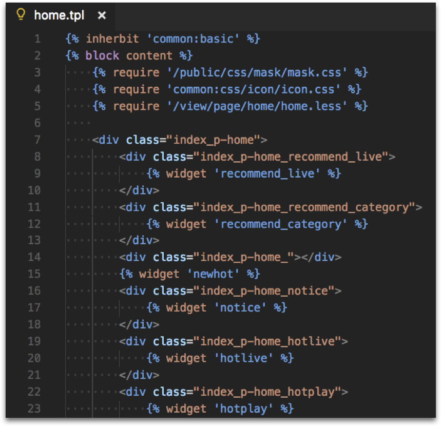
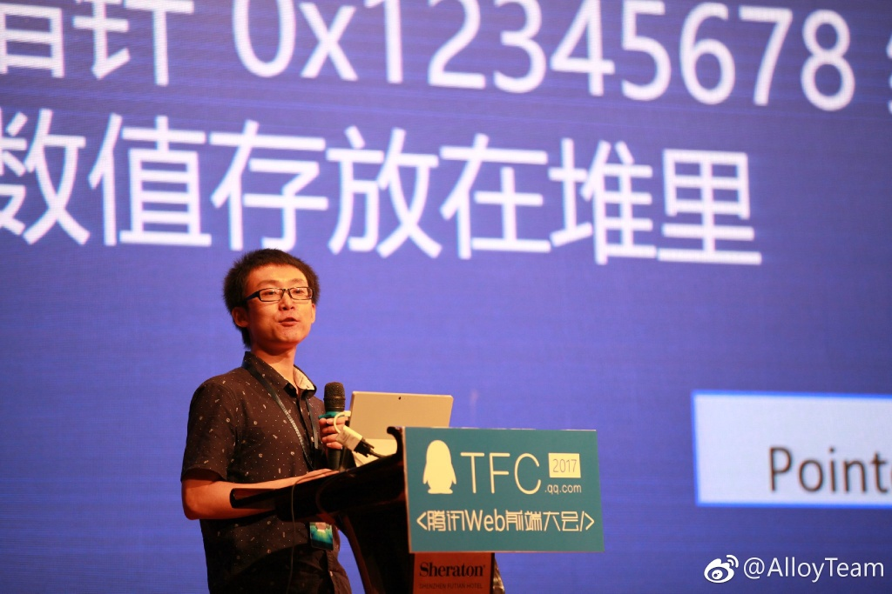

腾讯 Web 前端大会完美落幕。希望大家能收获满满干货。博主负责大会部份的讲师的遴选。虽然我全程都没怎么听（基本都在安排展位和发微博），但我希望通过选题的角度，以及PPT的内容，给大家分享一点思路和分享的导读。

## TC39, ECMAScript, and the Future of JavaScript

第一位讲师是在 Elastic Search 工作的 Nicolas Bevacqua，他同时也是知名书作者和博主。

他所分享的这个主题，是跟W3C的标准制定相关。对于大神们说，这个知识都已经有所涉猎，但对于新入行几年的新人来说，可能相对陌生。Nicolas 出了与 ES6 有关的书籍，是这方面的专家，因此邀请他过来分享非常合适，也考虑到他是做英文分享，因此通过分享W3C标准制定流程、W3C标准的新特性这类知识性的分享，不会太艰涩难懂，但又对引起国内对W3C关注也起到一定的效果。毕竟国人在技术上，太过关注业务，大会还是希望通过引起大家对“标准”的关注，让越来越多的国人能花时间精力投身到“标准”的制定上去，比方说腾讯前端第一人“黄老师” Stone Huang 就是W3C中国信息无障碍社区组的主席。

本分享主要介绍的有，TC39是什么，以及他们制定规范的流程是怎么样的。关于这方面，我曾经阅读过一篇不错的介绍性文章[《JavaScript(ECMAScript) 语言标准历史及标准制定过程介绍》](https://itbilu.com/javascript/js/V1APADgrG.html)，我就不再赘述了。Nicolas 在分享的时候，只点到了TC39是制定标准的委员会，不过没提到的是其实每个开发者都有机会成为一份子。另外，从Stage 0 到 Stage 4，整个标准制定过程从提案、审阅、算法规划、Polyfill到测试用例，这一切保证了整个流程的更加快速可靠。让W3C标准在这两年的进展一下子加快了不少。Nicolas 还提供了比较有趣的故事就是，之前W3C都是用着老旧的Microsoft Word来建设文档，是后来使用了Github之后，让整个流程更公开快捷，由于扭转了W3C标准指定落伍的局面。Nicolas 自己还专门建了个网站，用来监察 W3C 标准制定的进展。[TC39 proposals](prop-tc39.now.sh)。

我觉得最需要理解W3C的时候，是使用 Babel 的时候。因为 Babel 会通过不同的 preset 或者 plugin 帮你去编译不同的新特性。

Babel 的 plugin 通过只支持某一种特性的编译，而 preset 则是指一系列的 plugins 。因此我们常见到 es2015, es2016 这些 preset，而偶尔会见到 transform-decorators-legacy 这一类 plugin。通常来说，进入 stage4 的特性基本笃定能进入标准当中，一般可以通过 Babel 放心使用（不过不排除会有性能的问题），但之前的 stage，随时有可能回炉重做，因此要慎重使用。

分享最后稍微介绍了一些现代的前端工具，

npm，Javascript 包管理工具，打败了 bower
webpack，JavaScript 打包工具，击败了 gulp，require.js
babel，JavaScript 编译工具
rollup，新一代 JavaScript 的打包工具，在类库开发中颇受欢迎
eslint，JavaScript 代码质量检查工具
prettier，JavaScript 新一代代码质量检查工具，大有取代eslint之势
node，JavaScript V8 运行环境

## 初始公司前端工程体系建设

本分享有幸邀请到的是前端业内工程化的大神张云龙，之前是FIS的核心开发者，目前在全民主播担任CTO。办大会的时候，一直就想着要在主会场安排一场工程化的分享，一定要请张云龙过来分享，没想到愿望达成（擦当天太忙还没空跟他合照！！！）。

我一直是想推动业内前端工程化的，让所有程序员都因为工程化让性能优化、持续集成、测试部署、发布监控更为得心应手。我看到的反面教材是当今国内的电影业，拍摄太过随意，完全不讲流程，前期拍不好就由后期来擦屁股（详参[《《择天记》收官在即，“5毛特效”背后的故事你不能不知道》](http://www.sohu.com/a/144872954_114778)）。但反观国外，电影已经是一项成熟工业了，“工程化”做得很好，各方面都控制得相当规范，因此即使我们有时候觉得情节方面有缺陷，但总体来说能达到所谓的6分“工业水准”，不至于强差人意，偶尔情节不错，也能来个8分9分的爆款。而国内电影由于“工程化”缺失，3分4分的脑残片、5毛特效片比比皆是。从国产电影这个反面教材，我深知如果让国内的页面水平也能保持相当好的工业水准，工程化是绕不开的一道槛。

云龙大神选的这个题还是蛮有实用价值的，毕竟在大公司工作的人是少数，不少开发者还是在中小企业里工作的，没有专门的人负责帮你搭建好所有的工具。因此，云龙大神选的这个“初创公司”的切入点，不仅直接与他当前工作的经验相关联，也能引起在座许多开发者的共鸣。

分享开篇就先点出了讲者自身所处的业务环境与团队规模，业务复杂，但团队不大，因此得出来希望工程化提高效率的同时，却面临不少现实问题的尴尬局面。

然后作者开始直接抛出解决问题的方案。我先把总结放上来：
* 前端架构：组件开发 + 子系统拆分
* 持续集成：基于 Gitlab-CI 环境 及 GitFlow 开发规范
* 系统测试：基于 Dom-Diff 的自动回归检查系统。
* 敏捷开发：物理看板

### 前端架构：组件开发 + 子系统拆分

这里提到的与架构相关的是组件化开发，同时点出其背后的核心概念，即“分治”。这部份提到一个有意思的点，便是服务端模板里也用到了组件化的方式。如下图，通过资源表来管理静态资源，require 引入 js/css， widget 引入组件（可能是html加上js/css?）。这是以往不用Node开发后台的方式。而以现在我们常见的 Node + Webpack + React，则是直接在服务器运行JavaScript 生成 HTML 字串再吐出来。有点可惜是的可能由于篇幅和时间关系，具体技术细节并没有展开，还是很希望可以对比一下两种方式在SEO、维护效率、性能（QPS每秒查询率）等方面一些数据的比较。

### 持续集成

持续集成一言以蔽之，就是键帮你将测试部署都跑通，有条件的团队可以弄一下，极大地提高生产效率。云龙大神这里是以Gitlab做例子，我之前也写过一篇文章，是以Github做例子，希望大家在做开源项目的时候也能极大提高效率（[Deploy Using Travis-CI And Github Webhook — webpack doc as an example ](https://github.com/lcxfs1991/blog/issues/19)）。

前端部署多个环境也是蛮有意思的，这个应该在Node开发的时候比较有帮助，而单纯是页面，用Fiddler, Charles一类的代码软件，也可以达到同样的效果。

至于ESlint嘛，我建议如果可以在IDE里集成最好在里面先集成了，然后在commit的时候检测，可以在集成机里省掉这一步。

### 系统测试

分享里的思路，看起来是基于云龙大神之前的一个开源项目[page-monitor](https://github.com/fouber/page-monitor)。还没使用过，希望有人可以写写对比的文章，对比一下这个思路跟基本测试方案的优劣。

### 敏捷开发

云龙大神这里分享的物理看板，是我觉得最有意思的地方。在一直提倡电子化的今天，重新使用物理看板，在外人看来是不可思议的。分享中点出了电子看板的一些问题：
* 信息辐射成本高
* 容易形成『信息冰箱』
* 缺乏仪式感
* 定制性较差

而物理看板有这样一些优势：
*  易于创建、易于变更、易于观察
* 有极强的信息辐射能力，了解彼此工作
* 有一种特别的仪式感，是一种特别的团队社交形式
* 白纸黑字，写下时间的承诺
* 方便追踪进度问题

我觉得其实采用哪种方式没什么问题，但我觉得能够从采纳的方式中，不断优化项目的开发效率，积淀中一套好的牙慧管理方式，才是最好的方案。不过随着公司规模的不断增长，电子化好像是无法逆转的趋势，因为电子化了，以前的数据可以保存下来，后续可用各种数据、算法进行分析。期待云龙后面在团队不断扩张中关于敏捷开快这一块的演进。

## 面向前端开发者的 V8性能优化

谜渡大神这次分享的内容有不少的难度，我特意找他推荐了几篇V8入门级的文章，让大家先读一下。有问题，可以到TFC大会互动群里提问。平时前端开发者主要只是关注写好自己的JavaScript就行了，但对JavaScript背后的引擎好像比较陌生。希望是次分享可以给大家带来有关JavaScript引擎优化的相关知识，使得日后写JavaScript代码的时候，能够更容易让引擎进行优化。

* [JavaScript V8性能小贴士](http://jiongks.name/blog/v8-javascript-performance-tips/)
* [V8专题](http://newhtml.net/category/v8%E4%B8%93%E9%A2%98/)

如有谬误，恳请斧正!