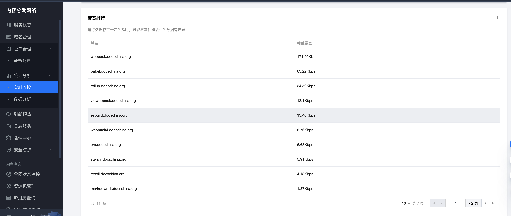
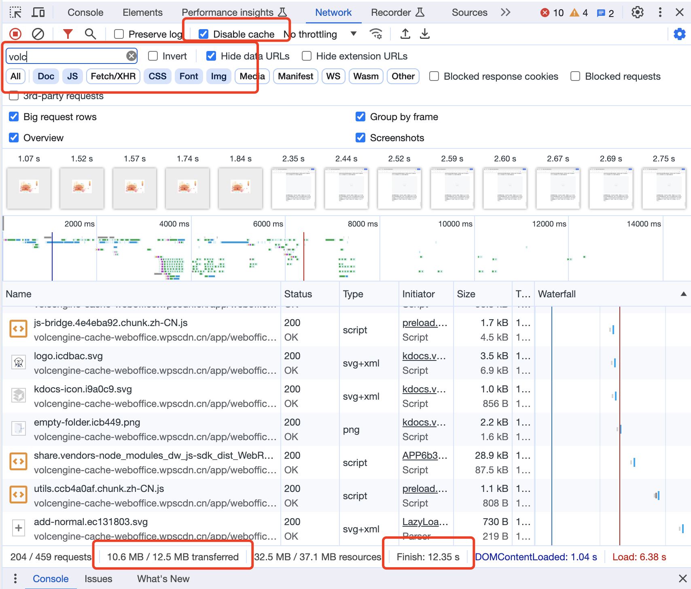

最近公司某业务有个事故，在用户使用高峰的时候页面打开白屏，大概20多分钟才恢复。复盘后发现根本的原因是由于在整个网络链路上云厂商提供的专线网络带宽打满，导致页面静态资源加载过慢或无法加载，进而引发的事故。

有鉴于此，在部门内组织各业务梳理，看看有没有业务有类似的带宽风险。让大家梳理的过程中，发现大家对前端服务中间通过的通路、带宽基本都没什么概念。前端团队如果没人懂网络、懂带宽，感觉是比较危险的，不仅业务的可用性风险无人洞悉，对如何控制成本也没有概念，在现在互联网的大环境来说这是比较难接受的。

# 前端部署架构
一般来说，后台的网络架构论述的较多，实际上前端也有网络的架构，一般的前端网络架构分两种，一种是全部资源部署在服务器，另一种是将部份静态资源放到CDN，架构如下：

上面是常见的两种前端的部署架构，负载均衡到K8S服务的网络要比上面描述的更复杂，这里为了易于理解做了简化。此外，如果没有运维能力或者服务并不需要建设K8S，也可以更换成普通的虚拟机。
你会发现，在K8S和CDN双部署架构中，CDN有可能需要回源。CDN通常将静态资源部署在靠近用户的服务器上，以加快加载速度。但如果靠近用户的服务器尚未缓存这些资源，则这些资源的请求将直接发送到源站，这被称为回源。
源站可以是在云服务厂商处购买的对象存储，也可以是存储在K8s中的资源。至于采用哪种，主要是看诉求和预算。如果预算较低，可以直接部将源站设置到服务的K8S中，与html资源放在一起。如果是预算充足，还需要一些比如鉴黄、自动压缩、自动缩放裁剪等功能，那大可以使用对象存储。

# 带宽会如何影响前端资源
当我们对部署架构有所了解，下一步就需要知道部署架构中所经过的网络带宽的上限是多少了，因为带宽的上限深刻地影响着服务的质量。一般来说，所有的网络通路都会有带宽的限制，但网部的网络由于上限较高，很多时候都会被忽略。
带宽的单位一般用Mbps(每秒Mb)或Gbps（每秒Gb），分为上行与下行，上行会影响资源的上传速度，下行则会影响资源的下载速度，对前端资源来说，下行的带宽影响最为深刻。
那我们在哪里可以获取带宽的信息呢？一种是可以在购买云资源的时候，设备规格的时候获取，比如当你买一台云虚拟机，以下是购买虚拟机时，内网带宽与外网带宽的信息：

也可以在购买的云资源里，找到相应的带宽信息：

# 按带宽还是按流量计费
细心的你会发现，无论是购买云服务器，还是CDN，都会有两种经典的收费模式，一种是按带宽计费，一直是按流量计费。如果您不确定如何选择，可以查看云厂商的说明文档。他们通常会根据不同场景提供推荐。譬如他们会推荐有一定访问量但流量较为稳定的个人博客使用按带宽计费，而那些电商的大促活动有一定的性能要求的，大部份时间用按带宽计费，而重大活动为了保证性能而按流量计费。
选择的模式可能并不是最开始就能够选到最优解，可以在相同业务的反复尝试中发现对业务成本最低的计费方式，最终进行选择即可。

# 如何判断业务带宽瓶颈
对于那些按流量计费的云资源而言，主要的瓶颈就是云资源的预算。而对于那些按下行带宽计费的云资源，主要的瓶颈就是业务下行的带宽峰值远超云资源自身的带宽上限。既然我们能够查询到云资源的带宽上限，那如何判断业务目前是否有瓶颈呢？
第一个办法是可以通过云服务厂商的监控，找到业务带宽的峰值，如下图。如果外网出带宽使用率长时间达到90% - 100%，那表示目前的带宽可能会对业务造成瓶颈，需要适当加大带宽。

如果没有这种监控或者比较难找到，那该怎么办呢？可以通过在Chrome浏览器的Network面板中粗略估算：

首先需要禁用缓存，然后加载一遍页面，筛选出想统一的域名资源，再剔除Fetch/XHR请求，剩下的主要就是静态资源。这里10.6MB就是静态资源Gzip后实际的传输值，12.35s表示目前所显示的资源的加载时间，那平均每秒的传输值就约为 10.6MB / 12.35s  约为 0.86MBps = 0.86 * 8 = 6.88 Mbps 。如果服务的带宽小于 6.88Mbps，那服务器的带宽就会比较有压力了。这个数据实际上可能有一定的高估，因为许多用户访问过站点之后，就会有缓存，因此实际并不会加载这么多网络的资源。

如有谬误，恳请斧正

# 注：
MB和Mb、MB/s和Mb/s是有区别的。 
其中大B代表Byte(字节)，小b代表bit(位)。 
1 Kb = 1024 bit 
1 KB = 1024 Byte 
1 Mb = 1024 Kb 
1 MB = 1024 KB 
1 Byte = 8 bit 

1 MB = 8Mb 