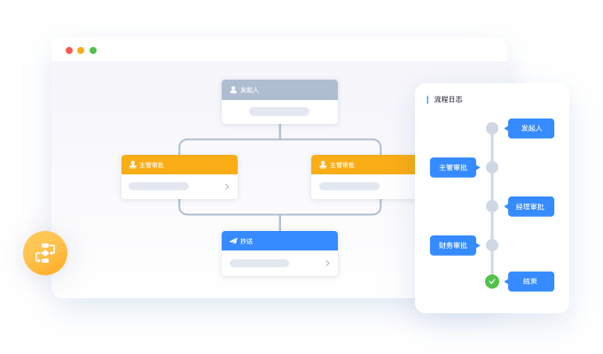

> 李成熙，某大型央企数字化架构师。先后在腾讯文档、腾讯云云开发、Shopee金融团队担任 Leader 和架构师。专注于性能优化、工程化和小程序服务。[微博](https://weibo.com/leehkfs/) | [知乎](https://www.zhihu.com/people/leehey/) | [Github](https://github.com/lcxfs1991)

做数字化转型业务已经有大半年，虽然以前在做智能表格类工具的时候，就有思考过如何通过智能表格类工具解决企业流程的问题，但远不如这大半年深更业务来得更真切。在这过程中也逐步习得了数字化转型的过程，并扫除了以前对数字化转型的一些误区，通过此文给大家分享。

# 第一步：业务线上化

数字化从字面意思看，就是要将业务都数字化，后面基于数据再开展一系列业务的降本增效提质。数据怎么来呢？那必须尽可能将业务线上化了。

初入门者看似很简单，实则深似水。从互联网公司转型过来的从业者会发现以前的经验都失效了，很多时候也难以站在一个用户的角度来审视如何线上化这个问题。譬如以前做社交产品，还能自己站在普通用户的角度，YY出不少看似说得通的需求，到了企业数字化领域，不能一头扎入业务中，多跟业务分析师、一线业务专家沟通，业务这潭深水就可以够呛一肚子水。

业务的线上化并非易事，需要遵循以下的步骤：

## **建立系统之间的关系**

建立系统之间的关系，本质是建立了数据流动的链条。系统主要是承载企业的数据，将系统连接起来即是将他这些数据串联起来，产生1+1>2的价值。

作为数字化专家，比较少见可以在企业成立之初就参与数字化的建设。企业草创阶段更多是企业的负责人担当这一角色。数字化专家半路加入，往往可能是面对一系列外部采购的系统，如：存储员工信息的飞书，存储财务预算的飞书文档和财务经营数据的金蝶，存放客户资料和销售线索的纷享销客等等。如果有研发实力的企业，可能还养着一个小团队，自研搭建了一些简单的业务系统。

企业数字化的过程，就像在下一盘围棋一样，每通过外采/自研建设一个系统，就像在棋盘上下子，并且我们在下子的过程中都会寻求棋子之间的联系，比如每个系统的用户信息，都可以通过飞书获取；生产经营的信息导出成文档，基于这些文档的数据可以在飞书上做财务预算；生产系统可以基于客户资料和销售线索调整生产计划等等。这些系统只有像棋子一样联系起来，整盘棋才能盘货起来，在市场竞争中占据优势。如果所有系统都没有规划，各自为政，一盘散沙，那势必会被竞争对手吞掉。想象一下，如果每建设一个系统的员工信息都需要重新建设，那该多头疼。

至于这些系统是怎么串联起来，一般来说通过数据的导入导出、开放接口等技术手段，采用哪种基于成本考虑，在此就不作赘述。

## **梳理标准作业流程**

在已有信息输入的基础上，我们建立了系统之间的联系，这些系统有的是已经存在的，有的是亟待规划落地的。良好的系统关系的梳理与建立，能够帮助企业高屋建瓴地做好后续信息化的规划，知道系统建设的优先级，毕竟数字化的资源（预算、人力）是有限的。

确认了规划，我们才好知道下一步该建设哪个系统，这时我们便进入了第二阶段，梳理标准作业流程。这一阶段，可能通过翻阅过往标准作业流程文档、与业务专家进行访谈等手段，全面地梳理清楚这些流程。有了标准作业流程，数字化专家才好去对这些流程做归类，形成系统的功能模块，并规划相应的功能模块将这些标准作业流程线上化。

## 自研还是采购？

系统的落地无非是通过自研或者采购。不过这个命题对于那些中小企业来说看来是无需烦恼的，采购只能是唯一划算的出路。

对于有自研能力的公司，这是个头疼的问题。即使自研能较强的互联网公司，也不可能所有的能力都由自己建设。最常见的代码仓库、发布系统等等，往往是“采购”自公司内部的研效团队。选择自研，无非是希望可以更灵活、更可控；选择采购无法是看种成本——资金成本、时间成本。基于这些考虑，公司对那些服务较为核心、战略级业务，且愿意花更多时间等待成长成熟的系统，更多倾向于自研。而那些非核心的，等太久公司会瘫痪的系统（时间成本），也不需要花大价钱（有许多同样采购的客户分摊了成本）购买的，如财税系统、办公软件，则更多倾向于采购。

自研与采购其实也并非一定要二选一。有些提供软件SAAS的厂商，也愿意将源码售卖给客户，更有甚者，越来越多的厂商会提供对自研更友好的PAAS产品。这可以看作是一个先采购后迭代自研的过程。

# 第二步：降本增效的两大利器——体验&标准作业流程优化

数字化过程中有一个常见的误区，就是只要我努力地将标准作业流程搬到线上，就可以一定能帮公司降本增效提质，能让公司发展红红火火。这里的误区其实是有两个重要的误区：

## 误区

**误区一：** 数字化一定能公司降本增效提质，能让公司发展红红火火。再好的数字化建设也只是工具，如果使用者的意识没有跟上，可能达不到效果。比如强推系统而培训不足，那就会导致使用率不足，数据失真严重；有好的数据分析能力却没有很好使用的知识，那就无法帮公司提升做出正确决策的效率。作为数字化专家，有义务跟老板和团队沟通清楚数字化系统的能力范围，并采取相应的措施让人与系统的磨合做得更好。

**误区二：** 将标准作业流程搬到线上即大功告成。要达到降本增效的效果，只“搬”是远远不够的，还需要优化体验和流程。

## 体验优化

优化体验应该是互联网人独有的优势，互联网业务中，多少工程师被设计师毒打，摁在电脑桌前一个个设计稿还原，天生自带好坏体验的滤镜。体验差相信是很多传统行业信息系统的通病，慢，卡，难用基本是一线用户想到的形容词。

如果说互联网产品体验不好用户可以逃走，那公司的系统用户是无法选择的。体验差造成的问题有很多，比如新系统推广难，老系统用户敷衍了事，造假应付导致数据失真。因此在设计产品的时候虽然我们多数侧重功能要先有，但体验也万万不能忽视。

交互体验在传统行业数字化转型中扮演着重要的角色。由于传统行业的一线人员往往对电子设备的使用水平不如IT从业人员，因此需要设计出更符合他们使用习惯的数字化产品，从而提高交互体验，降低使用难度。

以银行业为例，招行银行推出了“一网通”服务，通过简洁的界面设计、便捷的操作流程，大大提高了用户的使用体验。此外，该服务还提供了丰富的数字化工具，如在线客服、手机银行等，使得用户可以随时随地进行业务办理，提高了业务效率。

## （标准）作业流程优化

虽然体验对于互联网人而言驾轻就熟，但流程确实门外汉。往往在跟业务专家梳理和讨教流程的时候，惮于提出质疑和优化，这就损失了一个大好机会进行流程调整优化。

一个业务流程，线下和线上的操作可能大相径庭。以物业行业为例，一个巡逻的检查任务，以前只需要到每个巡逻点通过纸质签到即可，换成线上后，可能是扫码也可能是NFC近场检测，整个流程都会被颠覆、重塑。因此全新的流程理应跟业务专家、一线的代码员工沟通确认清楚再落地，那样对后续的推广都更为便利，反对的声音也自然更少。

细心的你可能还会发现，这里的（标准）被括弧括起来了，这表示流程的标准化是非常重要的，尤其对于上了规模的公司，如果同一性质的业务单元同一个作业流程完全不同，那将流程统一为一套标准就已经是生产效率的极大提升。但标准又不是必须的，如果公司的规模小，那标准化的工作可能并不是必须的，只针对流程做优化也是足够的，毕竟做流程的统一本身就非常费劲，而且在公司规模小、起步早期，过早统一标准也有可能束缚了业务单元自身的想象力。

那应该以什么样的标准来说明流程被优化了呢？目前主要是有两个，一个是能节省多少工时，另一个可以用最近比较流行的是否做到无纸化，前者是大部份老板都关注的可以节约的成本，后者除了成本的节约也可以更体验公司的社会责任与彰显社会形象，突显公司对节能减排方面的贡献。

# 第三步：智能化

如果说前两步的路径还尚算明确、既定，那智能化在大多数企业中还是在探索进行时。关于智能化我想到了个生动的形容：在智能化之前，信息系统是工具人士兵，使用者得思考、得指挥他们执行；在智能化之后，这些系统纷纷跃升为军师，可以给使用者出谋划策。

智能化的根基是数据。如果我们的终极目标是智能化，那么我们需要在智能化之前就要**收集充分**且**质量高**的数据。**收集充分**，首先种类要是充分的，人员数据、销售数据、库存数据、生产数据等等，一切与业务相关的数据都可以收集。其次是对象要充分，一切可以被智能化所斌能的都可以收集数据，人员、设备、流程均可进行收集。**质量高**，可以通过标准化管理，建立数据质量控制体系，确保数据的准确性、完整性和一致性，需要的时候可以对数据进行校验和清洗，确保数据的准确性。

那收集的数据如何存放呢？一般而言，我们需要建立数据中台，整合公司各部门的数据源，实现数据的互联互通，减少重复工作，提高数据共享和利用效率。数据中台除了存储，还可以提供加工、计算等能力，给予业务系统更好的数据能力支撑。

当数据达到充分、标准、高质量的状态，数据便可以在以下这些场景给业务赋能：

1.  数据驱动决策：通过数据分析，为企业的决策提供数据支持。例如，通过分析销售数据，预测未来的销售趋势，为生产、库存等部门提供决策依据。
1.  个性化服务：通过智能化技术，实现服务的个性化定制。例如，通过分析客户的消费习惯和需求，提供定制化的产品和服务方案。
1.  自动化生产：通过引入自动化生产线和机器人等设备，实现生产的自动化和智能化。例如，在汽车制造领域，引入自动化生产线代替传统的人工生产线，提高生产效率和产品质量。
1.  智能化调度与优化：通过引入智能化调度系统，对生产和服务进行实时监控和优化。例如，通过分析生产数据和客户需求，动态调整生产和配送计划，提高效率和减少浪费。

综上所述，智能化需要数据作为基础，在数据之上构建智能化能力，并可以在不同的场景给业务提供数据决策、个性化服务、自动化生产、智能化调度与优化等能力。只有这样，才能让智能化真正成为企业发展的助推器。

# 总结

相信这篇文章能给初入数字化深水区的互联网人有比较清晰的实操脉络，也能避开不少坑。后续也会陆续出一系列关于数字化转型的关于产品思考、技术设计的系列文章，敬请期待！