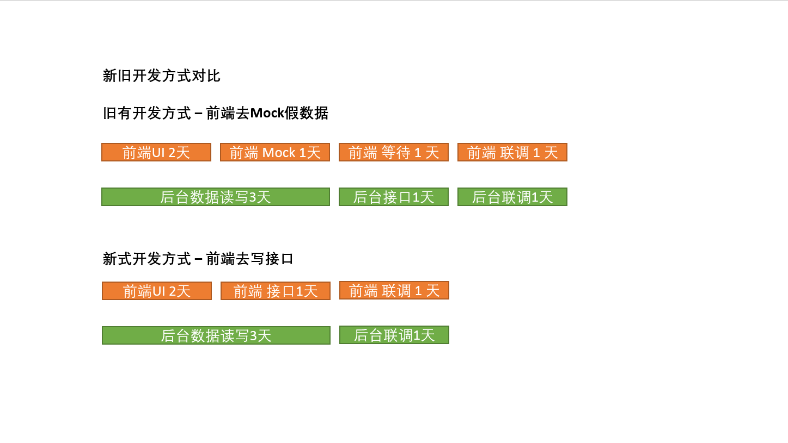

[原文链接](https://github.com/lcxfs1991/blog/issues/24)

最近几个月一直有些事情没有想通，但可幸的是，有些问题的答案逐渐开始明朗起来了。好久没写文章，籍此献上一篇短文。

当初准备毕业的时候，其实并没有想过要当前端工程师，毕竟当时基本都是全栈（PHP + jQuery）。但由于并不是科班出身（大学读Business），自信心不足，以及机缘巧合，就成为了一名前端工程师。

选择这份职业，其实也领略到它所拥有的魅力，更快捷的开发方式，更紧贴时代的发展，跨端的兼容等等，可以算是享受了前端这几年飞速发展的红利。但工作三年之后，也逐渐发现只是围绕前端来发展，有很大的局限性。

大约是有那么两件事触动到我吧。

**第一件事是**， React Native, Weex, Node.js 这事技术的发展，仿佛是给前端铺平了进入客户端和后台的道路。但真正开发过的人才知道，在这些技术里玩得溜的，其实还是从安卓、IOS转过来的客户端开发或者从JAVA, C++转过来的后台工程师。

**第二件事是**，如果未来，需要你带技术团队，只懂前端技术足够吗？其实是不够的，精通前端技术，然后懂点后台、客户端皮毛呢？我觉得也是不够的。就这样，能与后台和客户端达到更良好的技术沟通与理解吗？能在他们给出非最佳方案的时候提出自己的见解吗？万一部门的前端人力富余了，有能力带团队做后台吗？做些客户端的东西呢？能做，但能做得优秀吗？如果没有技术储备，我觉得上述的问题完全解决不了。

所以，未来一两年，希望自己能朝着**软件工程师**方向发展，而不仅仅是将自己局限为**前端工程师**。不过，一个人的精力真的有限，未必能把各方面的技术都学得很透彻。但我对自己的要求是，精通一门端技术和一门后台技术应该是比较好的搭配，这样整个产品的技术开发都基本能 Hold 得住。不过，具体怎么搭配，可能还是跟自己的职业发展和兴趣爱好有关，同时掌握端两门端技术、后台 + AI 技术、等等，我觉得这些搭配也不差。

技术能力拓宽之后，你未必能马上能管理团队、更好地掌握一些跨端技术，尽管如此，你在前端领域的一些想法，可能会有更不一样的转变。

比如说，如果公司内的团队，每个人都至少掌握一门端技术和一门后台技术，好多时候人力都可以动态调配，联调的时候也能减少。某个需求，如果后台人力太紧，导致联调时间滞后，之前前端团队最喜欢的做法是，我们来写个数据Mock平台，自己在上面写一些假数据，调完之后，后台好了，再跟后台调。但如果我本身就会这门技术，我直接把接口写好就行了，在接口传假数据，虽然可能还要跟后台的数据对接，但总体来说，实质上还是少了些Mock的功夫。

由于动态调配带来的好处除了节省开发时间，其实是更有利于技术部门组建 feature team。国内许多大公司主要都是将技术分得很细很细，每个组的成员，几乎就只会一门技术。如果一个部门里缺少了某种技术的组，或者尽管有但人力不足，要孵化的新项目需要这项技术，估计就因找不到合适的人才而难产了。

看完我所说之后，结合自身的发展，不知道是否也有所感触呢？

如有谬误，恳请斧正。

