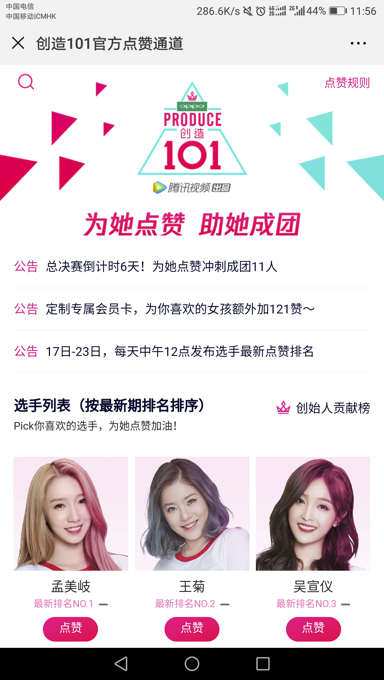
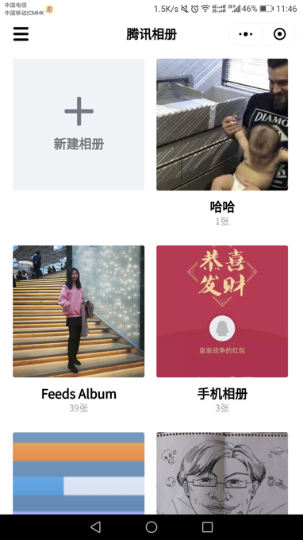
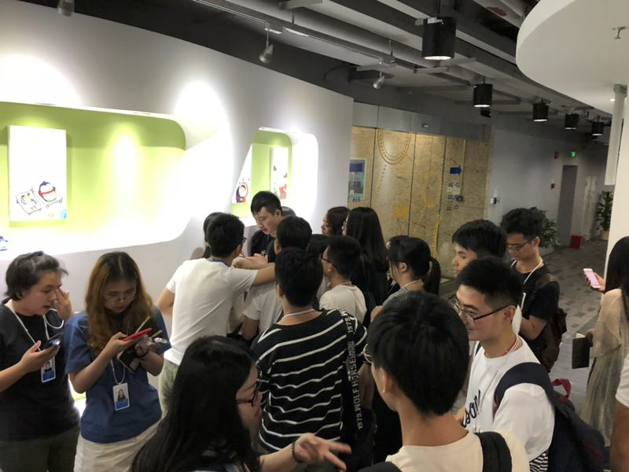
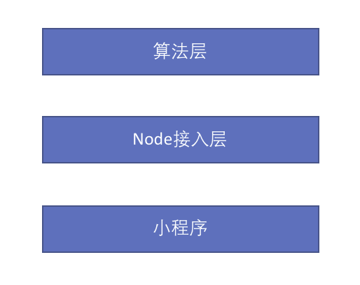

[原文地址](https://github.com/lcxfs1991/blog/issues/27)

2018年暑假，有幸参加了首次腾讯 SNG MINI 项目 的改版试验——导师制 + 定向命题。MINI 项目是在短时间内通过组队、设计并独立完成一个完整产品的培训项目，我觉得除了能通过实习生的实践来验证最近做的技术项目之外，还深感这还是一次独立带队的好机会，于是欣然答应。

## 出题与组队

以往的 MINI 项目都是由新人们自主想题目，这次是由各位导师预先根据自身任务或者项目，让新人来选择。虽然这次参与，有业务压力在身，但考虑到MINI项目本身的性质，以及希望童鞋都是带着兴趣来的，因此还是花了不少心血认真选材出题。

对所选组的要求是使用最近即将推出的与小程序相关的技术，并可以做出一个准上线级别的小程序。除了这点限制，可以在产品方向上做些发挥。

 为了更好地完成任务，必须吸引优秀的人才。吸引人才无非三方面：**钱、理想、兴趣**。MINI项目不谈钱也不谈理想，兴趣便是首要吸引人才的关键。因此产品上，我初步设计了 toB 和 toC 的业务，涵盖两至三个方向的产品。除了可以从不同产品形态检阅腾讯云的技术，也能多给童鞋选择，招揽更多人才。

下图是我制定的两个产品方向，一个是比较实用的家庭相册，一个是紧追热点的偶像粉丝小程序。

 

待所有导师的产品方案都出来之后，发现其他导师大部份的出题是 toB 的或者是技术类项目，我初步估计可能由于我的选题较丰富，能吸引不少人才。

MINI 项目启动会当天，几大选题讲完之后，报名参加我这边命题的人数远超我的预期。一堆人将我团团围住。可能由于出乎意料以及缺乏经验，在选人的环节处理得不太好。我采用了逐个微信加的办法，然后按顺序筛选，这导致后面分组有些混乱。

后来回顾经负责项目的HR提点，应该让所有人通过微信面对面建群，并给出理想的岗位人数搭配，然后组长组好队伍之后再次申请加入我的战队。

虽然组队方式有些不足，但凭借选题的优势，基本垄断了最优秀的产品、设计、前后台工程师，还意外收获一枚算法特厉害的小鲜肉。

## 产品设计

在制定选题的时候，我自己也有策划一些产品的功能点与方向，但我并不想将这些内容强加在组员身上，而是先给些时间发挥他们的主观能动性。毕竟这批刚出校门的实习生，虽然经验不足，但应该还是创意满满的。要是最终他们出不了好的产品方案，我再用我自己的方案兜底。

但是，创意归创意，脑暴归脑暴，太天马行空的想法，是无法落地成产品的。根据游戏规则，产品的完成度会影响整体分数。因此我担心太庞杂的产品，不仅会导致失分，而且可能无法完成业务上的任务。于是，尽管我给各组一定的自由度，但复杂性较高的需求，极容易导致延期又不是必要的功能点，一律砍掉或者优先级调低。

组队结束当天晚上，我就给他们传递我的产品要求与理念：

*  **做MVP就足够， 以功能完备能达到准上线水准为目标**
* **将1 - 2个玩法/功能点吃透做精即可，不求大而全**

具体产品暂时不放，等有机会这些产品能面世的时候再更新到这里。:)

## 技术架构

原计划我只带两组人，但由于报名情况火爆，共有五组人，综合权衡了一下，觉得首次加入MINI项目就带五组人，风险还是蛮大的，但为了照顾更多对项目感兴趣的童鞋，我多带了一组。

三组共17人，负责三条业务线，带队压力还是不小，在腾讯相当于一个小组长的带队人数了。

技上方面，由于是使用咱们组研发的技术，因此事前我和产品先制定了一个支撑MINI项目的迭代计划，从功能完成度、文档等方面列出了一个 checklist。然后跟组内同事并肩作战，在MINI项目启动前将所有 checklist的任务完成。但由于这是技术第一次对外体验，我对稳定性有所担忧，于是跟同事们沟通，争取大家在周末的时候，也能响应一些遇到的 Bug，我也需要驻场，亲自指导或者解决一些疑难杂症，这样才能保障所有业务的顺利完成。**基础技术、疑难诊断解答以及支持支援**，是一个架构师日常需要承担的任务。有时候虽然方法论重要，但可能不如亲自上阵诊断和写code来得实在。

另外一个管理者需要做的就是**培训教育**。事前，我学习了本次MINI项目负责人 Ben 总的方法，针对提供的技术以及小程序开发的一些重点，提前做了培训，虽然并不指望课堂上能马上消化所有内容，但至少给技术们一个概念，回去对照PPT再进行练习。

当我们提供技术的真正下场接受实习生们检验的时候，也要**因应不同产品形态，实施不同的技术架构**。

比如偶像粉丝的小程序，基本上全栈 JavaScript + Node 就可以搞定，用上我亲自写的 [image-node-sdk](https://github.com/tencentyun/image-node-sdk) 便可以实现人脸融合。

又如相册的小程序，其实整体难点不多，只是涉及权限管理方面有一定的复杂度，用全栈 JavaScript + Node 再结合云这边的数据库也可以搞定。实施的时候，我也给后台稍微点拨了一下如何更好地设计数据库结构和做权限管理。

另一组的项目就稍微有些棘手了，他们是做动物小视频识别，算法部份是用python + tensorflow写的。因此，还需要实施一个中台的接口服务来给前台吐数据。这边也采用了Node做中台。虽然 Node 对并发需求并不一定做得非常好，但如果能做好负载均衡应该也能抗住很大部需求，公司的业务也有不少实践。另外异构系统也比较少。我后来评审其它组的时候发现，有的组用django做后台数据读写，用Node又做中台，感觉就增加了系统复杂度了。因此那个组没有部署起上来，而我们组基本部署服务，都相当轻松。

## 进度把握

MINI项目参与的都是初出校门的实习生，处事经验未成熟，工作能力与经验都欠缺，而且并非全职做 MINI项目，自身业务可能也相当繁忙。有了这样的预期，作为导师，从先期的产品设计（上文已提到）到后期的进度把握，我逐步摸索了自己的方法论。

进度把握方面，确实有实习生由于前端组内业务繁忙，早期投入度不够的情况。这时，我并非第一个去做推动，而是先交由产品经理，去锻炼与考察产品经理带队方面的能力。

不过在此过程中，我首先打了助攻：由于我每天都会盯进度，适当的时候，我会把进度跟大家同步，并且会暗示其它部份都完成得很好，并婉转地表达还差某部份功能就能拿到多少分了，以此来激励还没投入的同学也能尽快投入进来。

助攻之后，其中一位产品经理处理得较好，能争取到两位业务繁重同学当下的立即反馈，评估工作量后表示能在周末如期完成。另一位产品经理比较腼腆，正好那位组员也比较腼腆，初次争取并没有得来很快的反馈。后来我发现他们每天都会实习邮件给导师和组长，于是我就发了封鼓励性质的邮件，第二天我就见到那位组员出现，并且当天晚上把90%的任务都完成妥当，效率和质量之高让人吃惊（组团组到厉害的人意味着成功了一半）。

## 产品验收与细节收敛

来到了最后一个周末，产品验收环节，主要的得分点在产品完成度、架构性能以及代码规范与错误三大块。各组都围绕这些得分点不断去迭代优化。

对基层管理比较高的要求就在于执行力与细节把控上面。我也以这样的准则来要求自己，为了让三组的得分都尽量高，初期的进度把握需要比较精准，遇到一些差错影响进度了，也需要自己上阵，或者想办法调动资源来让进度赶上。到了冲刺前两天，主要是求稳，尽量不要加太多太重的功能了，否则容易出BUG，即使是业务上的产品，基本也是这么管理。

这里有点特殊的是，三组的产品要同时上线，所以较早完成的组，当天我就放少些时间，差临门一脚就完成但遇到难题的组，我投入精力尽力扶一扶，但我亲自帮扶的准则是，非到我出手才能解决的问题，不去解决，让实习生多试试，否则他们会形成依赖，日后难以独当一面。

当天做得稍有不足的地方就是，由于时间不足，没有对每个产品在各方面做好测试，虽然有提醒边界情况有处理好，但还是有产品因为BUG扣了分，略为遗憾。这个应该在培训的时候，多提点技术和产品，最好能把测试路径也简单写一份文档，后续可以反复测试。

这次除了产品，还要考察大家的代码质量，于是要求代码一律接入CodeDog做检测。最后一天，我逐个组帮忙review了代码，提出修改意见，抓住他们一个一个把问题改好，还有让组内负责 CodeDog 接入的童鞋，追着 CodeDog 的接口人，报错的问题，一直改到接近满分为止。最后的结果就是我带的三组全部 CodeDog 分数并列第一。

## 人才与成绩的争夺

 ”基层抓细节，高层争资源“ 说的是不同层级管理者的侧重点，但其实也不是绝对的，基层干部有些时候也要为团队争取资源支持，高层像咱们的老板小马哥，时不时都要体验自家产品。在 MINI 项目中，我也得到了如何跟自己上级以及平级争取人才与成绩的经验。

MINI 项目一开始就来了一场”人才争夺战“，过程还是挺有意思的。由于我和另一个导师吸引的组员较多，开始打乱了另外组导师的计划。于是导师之间就开始讨论与协调，希望为自己争取更多的人才。由于MINI项目主要还是为了培训新人，并非你死我活的斗争，基本都是在新人兴趣与自己任务中间拿捏平衡点，实现一些妥协，因此我将招收的5组缩减为3组，也希望是次的妥协能为后续其它的争论赢得一些空间。

最后当然就是成绩的争夺。我在冲刺的前两天评分的时候预感到，目前的许多打分环节，都是由导师操刀的，每个导师，都希望为自己的组争取到最好的成绩，尽量往高分打。**本着这个想法，我逆向而为**，我并不先为自己的团队打高分，而是从低分打起，适当做些分数的鼓励。我还将得分纬度细化，每一个做得不足的地方，先把分扣了，先把问题写了，然后滚动实时让组员们不断优化改进。

**我的出发点很简单，一定需要让自己带的产品经得挑战与考验。面对老板，需要把本职工作做好了，才有底气争取更好的成绩、更好的薪酬，否则自己都不好意思了**。

在得分初步出来之后，我带的其中一组骑绝尘，折得桂冠，另外有两组和其他导师的三组，五组共同争夺一个银奖和两个铜奖。我这边相册组与其他导师的一组由于BUG偏多率先出局了，另一组视频识别的组，在算法公示的环节里，由于算法报告详尽细致，将另外一组PK掉，勇夺铜奖。幸好最后MINI项目负责人争取到每个导师可以颁发一个导师特别奖，让我带的三组都抱奖而归。

这次带队MINI项目组，收获真的是很多，欢迎更多年轻的，升上高工的工程师们参与 SNG MINI项目的定向命题，除了能带领实习生们一起闯关打怪完成你自己分配的任务以外，还能让你得到不少管理上的收获。也希望各部门的负责人可以多多推荐这些高工们参与哈。

最后奉上我与三个组的合照：

