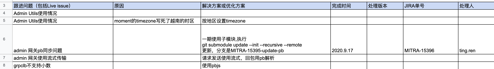
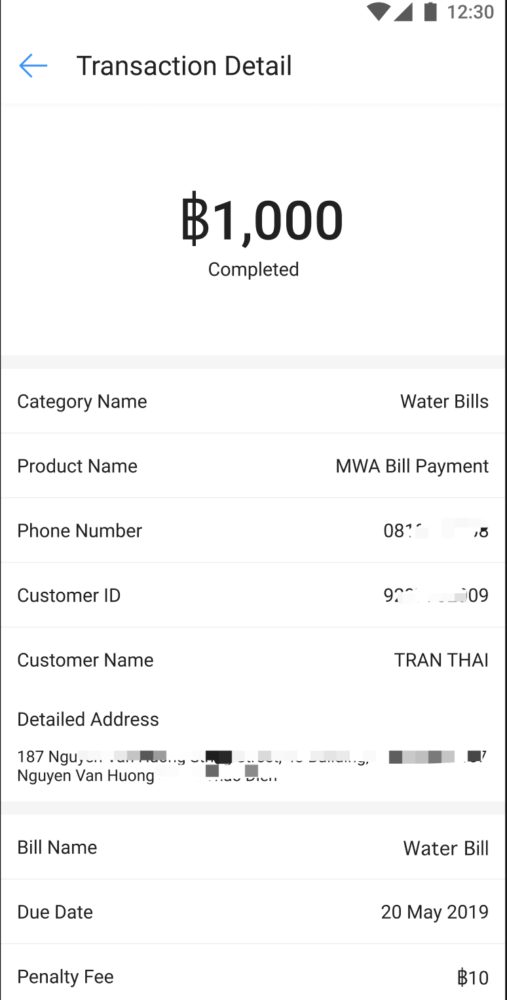

上次写总结文章，是来 Shopee 刚好半年后，那时刚刚适应从个人贡献者到技术架构师和管理者的身份转变，有一些感悟与心得，拿出来与大家分享。
又一年过去了，来 Shopee 已经一年半，团队从刚开始时的 4 个人，到现在 18 人，公司股价，也从当初的 20 美金，到 180 美金。很有幸，公司在进步，我也在进步。

今天主要想分享三个作为前端，可能经历的瓶颈，然后讲讲我为了突破这些瓶颈，所做的一些思考与努力。这三个突破，分别是

- 从个人贡献者到技术架构师与管理者转变的突破
- 从带领单项技术到带领多项技术的突破
- 从带技术到带业务的突破

## 瓶颈一：从个人贡献者到技术架构师与管理者转变的突破

其实这个可以从架构能力与管理能力两个层面讲。咱们先来讲一下架构能力。

### 架构师

所谓架构能力，简单地说就是将不同的模块、组件、系统组装起来，联动发挥作用，解决业务或技术需求的一个过程，网上可能有更详尽的解释，大家可以自行去了解。开发者在个人贡献者阶段，更多只是接受架构师指派的任务，完成自己一个小模块的设计与代码。而在架构师的阶段，要担负起的责任与工作则更多，而且既要兼顾全局，有时也要 Review 细节的落实，有时候是又当建筑设计师，又当工地监工。

作为架构师，首先要对需求的把握非常清晰，一个是需求要落实的功能点，另一个是要考虑一些特性，譬如性能，未来的扩展性等等。以最近我们计划要做的一个产品的官网为例，这个官网比较核心的特性，一个是发布新闻、一些推广活动还有常见问答，另一个是可以提供这些内容的相关搜索，还有对个别商家做一些排行榜。

由于后台的人力不足，我们是计划由前端完成大部份的前端与后台开发工作，这里就需要由一位既懂前端，又懂后台的架构师去设计把关这里的架构（当然分开架构也可以）。这里你可能会有疑问，为什么前端的架构师，有能力在这个需求里，对前后台做架构设计呢？前端的同事是何德何能可以承担这里的前后台开发呢？这里就涉及到技术管理的梯队建设与才能储备，咱们讲管理的时候再详聊。

基于该**需求的特性**，我们在做设计之前，还需要收集一下这个站点未来可能的访问量（**数据**），这些数据对我们的技术选型非常关键！没错，我们点出了架构第一个重要的环节，**技术选型**。据了解，该站点每天访问量，每秒的并发都不大，基本不需要上到一些应对高并发的手段。另外，由于要做内容的全文搜索，如果通过数据库的全文检索，尽管使用量不大，但随着内容越来越多（运营人员更新内容的频率还是很高的），查询性能会越来越慢。而且我们的数据库暂时跟一些核心交易数据放在同一个数据库集群里，这种耗时操作可能会加大对数据库集群的压力，因此我们可能需要用到`ElasticSearch`帮我们做切词与搜索。而对商家数据做排行榜，这个由于涉及到核心数据，我计划是让后台的微服务出一个 `API`，再由咱们 `Node.js`(由于是前端来实现后台能力，基于**熟悉度**的考量，用`Node.js`对于前端来说，开发与维护都相当方便) 服务层去调用。

在技术选型的基础上，架构师平时积累的一些**经验**、**方法论**、**指标关注面**，在架构设计中，也起到比较重要的作用。这里以团队做的热更新服务、配置中心、运营搭建页面这几个平台为例。刚组建团队的时候，我们亟需热更新平台来给`React Native`提供动态更新的能力。这里当时是采用了`MySQL + Redis + Node.js + Serverless Function(做代码差分)`的架构。

有了热更新服务的经验，后面在做配置中心和运营搭建页面的时候，也从中吸取了经验，用了类似的架构做数据的存储与缓存。但随着业务的发展，我们发现为了让系统的**可用性**更高、**性能**更好，在一些场景里，对数据量比较大的读取，经常会将数据放到内存里（Redis 读取大数据也会有瓶颈）；另外在做差分的时候，为了保证准确性，设计了一个任务队列，保证任务不会被重复运行，也安排了一些失败重试、人工处理等的机制。在设计任务队列的时候，我们有考虑过引入 `Kafka` 这类中间件，但实质上用`MySQL`也能满足到诉求，那考虑到**可移植性**，因此咱们直接就用`MySQL`顶上。上面讲的这些例子，都是在业务发展过程中，架构的演进，并且在这种迭代的过程中，自己的架构经验与方法论也不断丰富，日后遇到类似的问题，就像砌积木那样子，搬出曾经用过、思考过、验证过的种种方案，构建成心目中的模样。你可能会说，架构师的工作难度蛮大的，时刻会遇到自己无知的领域，比如自己之前没有用过的一些中间件，在真正面临需求的时候，怎么会想得到？这里感觉并没有捷径，只有在日常工作中不断涉猎，打开自己的眼界，才能在不断变化的需求世界里更为从容。

小结一下，成为架构师需要做到的事情：

1. 根据需求特性、指标数据、团队熟悉度，做好**技术选型**。
2. 根据经验、方法论、指标数据，不断丰富与完善自己的**架构方案与套件**
3. 不断学习，没有捷径

### 管理者

技术管理这个话题，可能讲几天几夜也讲不完，这里我只摘取我认为最为重要与关键的一些做法与理念。在理念上，我认为要让大家**高效工作**、**快乐工作**，在实施上，要想尽办法给团队、给成员**赋能**。

从业界的趋势来看，许多业务、技术领域也已经走到了深水区、国际比较前沿的阶段，不是简单的拼人力、拼时间就可以将事情做对、做漂亮的，让大家抱着快乐的心情，发挥自己的创造力地去做事情，比让大家拼尽一切时间，还时不时在工位摸鱼，更能可能将事情做好。毕竟我们是将要在国际舞台上跟巨头拼刺刀的公司，在找对方向后，跟时间赛跑是没问题的，但在找对方向之前盲目地虚耗大家的精力与创造力，可能会引发一将无能，累死三军的局面。

**高效工作**，可以从个人与团队两个角度进行赋能。

个人层面上，本质就是希望个人的能力不断提升，大家能够找到自己发展的目标，技能上做到一专多长，并且最终达成为一位自带“体系”的技术人。譬如今年我们团队来了一位 `React Native` 的大牛，自己的曾经的创业项目也是整体用 `React Native` 搭建 `iOS`和 `Android` 的 `APP`。但 `React Native`，有一个很重要的特性就是热更新，在他之前的项目里还没用到过，更别说自研了。来我们团队后，有契机让他参与热更新项目的研发，并且也让他多了解客户端实现这套体系的一些基本的逻辑。后续如果公司有新的业务有需要到 `React Native`，那这位同事就可以作为自带“体系”的架构师，去帮忙搭建业务的架构，促进业务的发展。

团队层面上，做好**模块划分**、**流程优化**、**技术规划**与**梯队建设**。

所谓**模块划分**，就是大家在相对稳定的模块中工作，当你比较熟悉业务逻辑的话，工作都相对容易。当然对相似工作内容产生倦怠人皆有之，这个又是可以开另一个专题阐述了。早期我在这里也踩过一些坑，也是由于团队早期的业务比较紧，尽管同事还是会尽量做他们熟悉的模块，奈何不同的版本，不同模块的业务压力大小不尽相同，会经常抽调同事去负责全新的模块，这样其实对工作的效率与质量都是不利的，花的时间长，产生的 BUG 也多。所以后续也尽量让人员相对更加固定，即使后续某个模块非常忙，也尽量由负责该模块的同事主导业务开发的工作，支援的同事需要在良好的指引下（文档一定要完备）开展工作。

**流程优化**，即使减少工作中的流程对研发人员带来的桎梏。工作流程有许多，创建新项目的流程，如Git 工作流、JIRA 工作单管理流程等等。如何优化流程我认为主要是**识别反人性的流程，然后用工具优化之**。这里以团队中的 JIRA 流程优化为例，在 Shopee，研发团队是用 JIRA 做研发流程的管理的，大家都会在 JIRA 上面记录工作量以及扭转状态。团队刚开始的时候人比较少，谁忙谁闲一目了然，但随着团队人员不断增加，单纯通过肉眼、心算去看看大家的忙闲程度，分配工作就变得极具挑战性了，在没有工作的帮助下，管理半径就会限制在 5 - 8 个人左右，而且为了分配工作会把自己忙死——要做大量的手动统计工作。于是为了提供管理的效率，我决定写了一个脚本，帮我统计 JIRA 的开放 API，将团队内成员的工作量，全部都拉下来放到 Excel 里被自动将工作量总量统计出来。这样分配工作，只需要跑一个脚本，就可以轻松统计出每个人的已经排的工作量。当然，如果能统计出甘特图是最完美的，但受限于个别数据团队没有要求填（比如工作开始时间），因此就无法画出来。

除此以外，由于项目经理一些研发统计的需要，对每个同事建 JIRA 单的要求、填字段的数量都越来越多。将心比己，即使是我本人作为 member，都可能会疏忽未能填写完成准确。这些措施对管理上可能会更加方便，但对每个研发来说都会增加负担与困扰。于是我们也计划做一些工具与平台，一方面方便管理者做统计，另一方面也减少研发人员在一些行政、流程上的事情浪费过多的时间。

**技术规划**，主要就是引领整个团队的技术方向，并努力将之落地，这个是技术管理者体现价值的非常重要的环节。因为模块划分、流程优化，有做导师带过小项目之后，都能得心应手，但技术规划，怎么顺应着业务的发展变化，提前做一些技术的储备与布局，怎么将团队的技术水平带到业界一流水平，这个是当上技术管理者之后才能得到的体会。

所谓的规划，不能是单点的突破，而是需要多点，并且点连成线面；不能只着重于一个个工具与平台的建设，而更要关注这些工具与平台如何有机地结合在一起，协同发挥作用，形成**体系**。当然，也需要这些技术与时俱进，在技术的规划前路上，也逐步识别并摘除一些**技术债务**。

**梯队建设**也是我认为非常重要的一环。能否规划与组建你的团队，是技术管理者与架构师非常重要的区别之一。梯队建设为什么重要，那是因为良好的梯队建设，一方面能让你的团队人员更稳固，毕竟大家都有成长的诉求，无论是当技术管理还是架构师，都或多或少需要带人完成更具挑战性的项目，单打独斗能成事者寥寥无几。今年年中的时候，大批校招生准备进场。当时分析自己的团队，有 5 - 6 个高级或者准高级工程师了，这些高级的工程师工作经验都比较丰富了，但一直没有带人的机会，同时也由于业务比较繁忙，于是我就趁机会要了足够数量的毕业生，让他们带带人。我是希望通过手把手带人，可以更好地激发他们的责任心，也可以让毕业生跟着他们去做一些技术规划里的项目，让这些高级工程师也多锻炼架构与管理能力。虽然早期难免会有阵痛，比如毕业生对流程不熟悉，研发质量可能会有下降，但经过三个月的试用期后，毕业生的工作都步入正规，有充足人力的情况下，许多的技术规划落地都比较顺利。

其次，梯队建设的好坏，能决定你之前的技术规划能否顺利落地。除了前面提到的不同职级与经验的人的比例要均衡，还需要在各个技术方向有技术储备，最好是有技术领头人，甚至能有技术小组，毕竟孤身一人去探索某个技术方案还是挺孤独寂寞的，也没有人一起做技术讨论。另外有这样的一个技术小组，也可以有备份人。在团队中，因应着定下的技术规划，基本上每个体系的建设都会成立一个技术小组，这些人可能在公司组织上并不是同一个组，但只要他们对这块感兴趣，或者在这块有建树，就可以参与到这块的建设中。比如在 Web 体系建设小组里面，有三位同事，这块需要负责的项目比较多，包括 Web 发布的自动化、精细化，Web 组件建设，Figma 组件生成自动化，同构渲染研究等都归属到这里，每个人都有自己主攻的方向，但每一个时期侧重点可能有不同，有可能会有有几个人共同参与到某一个项目的建设当中，快速将该项目先做成。

**高效工作** 如果落实得好，**快乐工作**其实也就达成一半以上了，因为高效工作可以让工作效率提高，加班减少，也能让大家有成长的快感，再加之以打造良好的技术氛围（技术分享、外出参与技术会议、内部开放的技术讨论），相信员工的工作满意度会相对较高。

小结一下，成为好的管理者，需要通过**赋能**做到：

1. 高效工作

   - 模块划分，让职责明确，业务熟练
   - 流程优化，减少行政工作，提高代码时间
   - 技术规划，指明方向，甩掉债务，提升个人技能与团队效益
   - 梯队建设，储备技术与落地规划

2. 快乐工作
   - 高效工作是前提
   - 打造良好的技术氛围

## 瓶颈二：从带领单项技术到带领多项技术的突破

随着职级的提升，要跟跨团队的技术合作、甚至带跨技术的项目、同时带其它的技术组的情况会越来越多。如果倒推几年，前端要进入后台、客户端的领域，难度还是比较大的，这个是整个业界都存在的问题。但随着一些重要的技术的诞生与成熟，比如 Node.js，React Native, Electron 进入前端人的视野，前端有更多的机会可以参与到这些。所以从大局上、宏观上讲，我们要多支持这些技术的成长，无论是给这些开源项目贡献源码、布道、贡献最佳实践，最终都能让我们自己受益。所以我在团队里也比较鼓励大家贡献开源项目，或者通过造开源项目的周边小轮子练练手。

但从自己团队的业务与技术发展，这个微观的层面来看更着重看的是自己团队在某块跨领域技术的知识储备、人才储备与项目历练。举个例子，如果前端要能够承接个别的中后台业务，必需要团队里面的 Node.js 基建设施比较完善，并且要有相关的人才能够 Hold 得住，否则哪里报了 Node.js 的错误，哪里产生的性能瓶颈，哪里出现疑难杂症，没有人有思路解决，这就很可能会阻塞到业务的进展。

我个人的建议是，首先要让基建设施完备，譬如将 Node.js 部署到 K8S 的设施搭建起来，包括进程管理器、上报埋点的工具库、Node.js 的基础 Docker 镜像等等。基建完备后，我们先用一些技术项目练手，尤其是在许多跟客户端一起合作的项目里，由于有前端能写 Node.js 的缘故，一些大前端的公共平台，比如热更新发布平台、配置中心等的一些项目，都可以由前端来做主要推手，通过这些项目来积累一些高并发、高可用的后台开发与运维经验，从而获取后台开发的经验。如果不想如此的激进，也可以从一些偏管理后台的项目开始，这些老板们是比较放心让 Node.js 来实现的。当拥有了基础的 Node.js 开发与运维经验后，可以开始在业务中做一些尝试，尤其是那些中台的接口转发项目、或者是同构渲染提升性能的项目。只有跨越出来，能做一些用户侧业务的 Node.js 服务，这样才能更进一步通过解决用户侧的服务挑战来提升团队的实力。我们当时是选择了一个非常适合前端 Node.js 来实现的服务，就是用户购买商品后的订单详情页。这个页面，产品要求的动态化非常高，不同产品的字段不尽相同，而且可能时不时调整顺序或者添加字段。而且后台提供的定的接口，又不太好表现一些字段的分类、字段的排序、字段展示的格式等。于是我们就提出，用 Node.js 做一个中间服务，将这些商品的详情字段全部做成可配置化，并在 React Native 侧做了一个基础的展示引擎，基于后台返回的字段动态渲染。

有了不少的技术项目还有这次业务项目的实践成功，大大增强了前端的信心，等到后续后台由于人力原因无法投入太多精力到产品官网的开发，前端就顺其自然地接受了这个挑战，会去做全站的前后台开发任务，在业务中更深层次地使用 Node.js。

做一下小结，想突破目前单一技术的管理，如果以中后台为例的话，可以尝试走以下的步骤：

1. 搭好基础设施，以小项目练手
2. 在大前端中主导一些相关的后台项目建设，赢得高可用、高性能的经验
3. 切入中台业务，尝试后台服务的中间层
4. 往“后”拓展，可尝试非核心业务的全栈落地

## 瓶颈三：从带技术到带业务的突破

前端，乃至大部份的研发，被作为工具人，长久只是需求的实现机器，能真正突破从做技术到带业务的人少之又少。这个突破有两个层次，一个是成为这个业务模块的整体技术负责人，另一个层次是直接成为这个业务的总负责人。遗憾的是，本人都未能达到这些层次，目前只是粗略地谈一下我自己做的一些尝试，而且主要是第一个层次的尝试。

一个研发是不是关注业务，其实只要你问一下他，是否知道这个产品面向的用户，用户规模、活跃用户有多少，GMV 有多少等等的一些关键业务数据，如果他能答出一些，而不是完全不知道，那证明这位研发还是比较关心业务的。有这样良好的关心业务数据的习惯，相信更进一步，让这位研发不仅只了解自己模块的业务逻辑，可以将后台、客户端跟某个模块相关的业务逻辑都了解一遍还是比较容易的。并且老板、产品、测试人员来问的时候，都能比较清楚地做出解释，那这位研发熟悉业务的名声就已经远播了。

但是，有的时候尽管你可能对这些业务有所了解，但由于在前端这个岗位上，天然可能就比后台有一定的劣势——毕竟业务的最主要的流程是在后台实施的。这些对于金融、电商的行业尤其如此，可能相比之下，社交、内容、工具等平台，前端的话语权可能反倒更大一些。加上如果你做了大量的技术项目，尽管你对业务其实也了解，也可能会给别人留下过于关注技术，而忽略业务的印象——毕竟每次项目会上，需要解决的后台的问题，比前端和客户端高出一大截，我们也不太好去插话。因此，在重视技术建设的同时，也可以多对业务的流程提出一些优化，比如后续我就吸取一些经验教训，希望在一些商品上新的流程上做一些简化，减少每次上新投入的人力，使整个项目组的人力规划可以向其它更重要的事情上倾斜。

此外，我们也可以尝试针对业务当下或者未来的诉求做一些产品的孵化。比如作为金融电商平台，比较容易想到的就是一些常规运营页面的搭建工具，毕竟前端在产品做用户增长这块，还是可以发挥比较大的作用。于是断断续续，我们团队就搭建了一个可以跨多个 APP 运行的运营页面搭建工具。在做这些项目的孵化过程中，并不是一帆风顺的，比方说这些产品要从策略、设计到落地都需要团队的人从头做起，推动运营人员的使用也并非一帆风顺，也成就也有挫败。但经过这些历练之后，让自己对业务、产品的把握也会有另一番的见解。虽然目前的这些努力未有很明显的成效，但团队人员在产品设计、打磨、落地方面的能力得到了储备，正所谓养兵千日，用在一时，相信未来可能将会有这些产品、人员发挥的地方。

小结一下，从带技术到带业务的一些努力：

1. 关注业务，从关注业务的数据、逻辑开始，并且多端的逻辑都需要熟悉
2. 技术项目与业务项目都要两手抓，并且需要有自己团队主推落地的一些核心业务需求与优化
3. 尝试孵化与业务相关或者与公司发展战略一致的产品

## 总结

来 Shopee 一年半，变化翻天覆地，从来不敢想象自己会有机会去突破这些职业的界限，或者摸到这些职业界限的天花板。希望这些粗浅的经验能够对后来都有些启发，也希望一些同行、前辈可以多多指点，不吝赐教。同时感谢我团队的同事与老板，这一年多以来对我不遗余力的支持！
