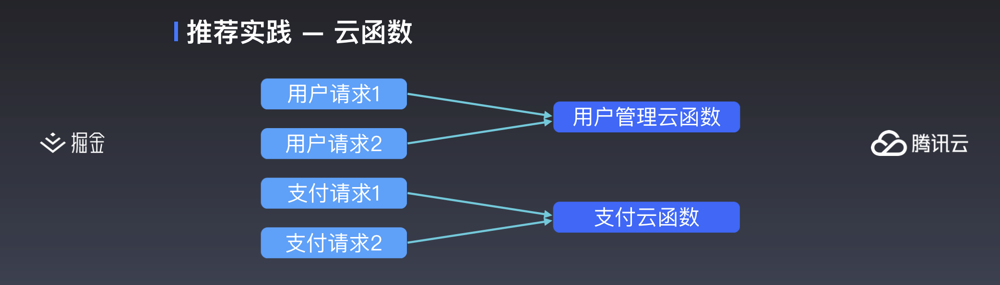
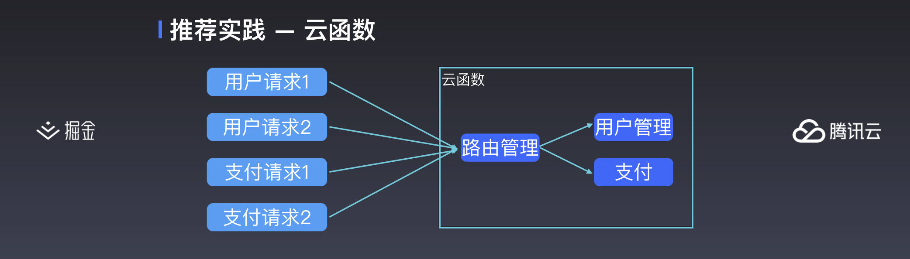

> 李成熙，腾讯云高级工程师。2014年度毕业加入腾讯AlloyTeam，先后负责过QQ群、花样直播、腾讯文档等项目。2018年加入腾讯云云开发团队。专注于性能优化、工程化和小程序服务。[微博](https://weibo.com/leehkfs/) | [知乎](https://www.zhihu.com/people/leehey/) | [Github](https://github.com/lcxfs1991)

## 概念回顾

在掘金开发者大会上，在推荐实践那里，我有提到一种云函数的用法，我们可以将相同的一些操作，比如用户管理、支付逻辑，按照业务的相似性，归类到一个云函数里，这样比较方便管理、排查问题以及逻辑的共享。甚至如果你的小程序的后台逻辑不复杂，请求量不是特别大，完全可以在云函数里面做一个单一的微服务，根据路由来处理任务。

用下面三幅图可以概括，我们来回顾一下：


比如这里就是传统的云函数用法，一个云函数处理一个任务，高度解耦。



第二幅架构图就是尝试将请求归类，一个云函数处理某一类的请求，比如有专门负责处理用户的，或者专门处理支付的云函数。



最后一幅图显示这里只有一个云函数，云函数里有一个分派任务的路由管理，将不同的任务分配给不同的本地函数处理。

## `tcb-router` 介绍及用法

为了方便大家试用，咱们腾讯云  Tencent Cloud Base 团队开发了 [tcb-router](https://github.com/TencentCloudBase/tcb-router)，云函数路由管理库方便大家使用。

那具体怎么使用 `tcb-router` 去实现上面提到的架构呢？下面我会逐一举例子。

**架构一**：一个云函数处理一个任务
这种架构下，其实不需要用到 `tcb-router`，像普通那样写好云函数，然后在小程序端调用就可以了。

*  云函数
```js
// 函数 router
exports.main = (event, context) => {
    return {
        code: 0,
        message: 'success'
    };
}；
```

* 小程序端
```js
wx.cloud.callFunction({
      name: 'router',
      data: {
        name: 'tcb',
        company: 'Tencent'
      }
    }).then((res) => {
      console.log(res);
    }).catch((e) => {
      console.log(e);
});
```

**架构二**： 按请求给云函数归类
此类架构就是将相似的请求归类到同一个云函数处理，比如可以分为用户管理、支付等等的云函数。

* 云函数
```js
// 函数 user
const TcbRouter = require('tcb-router');

exports.main = async (event, context) => {
    const app = new TcbRouter({ event });
    
    app.router('register', async (ctx, next) => {
        await next();
    }, async (ctx, next) => {
        await next();
    }, async (ctx) => {
        ctx.body = {
            code: 0,
            message: 'register success'
        }
    });

    app.router('login', async (ctx, next) => {
        await next();
    }, async (ctx, next) => {
        await next();
    }, async (ctx) => {
        ctx.body = {
            code: 0,
            message: 'login success'
        }
    });

    return app.serve();
}；

// 函数 pay
const TcbRouter = require('tcb-router');

exports.main = async (event, context) => {
    const app = new TcbRouter({ event });
    
    app.router('makeOrder', async (ctx, next) => {
        await next();
    }, async (ctx, next) => {
        await next();
    }, async (ctx) => {
        ctx.body = {
            code: 0,
            message: 'make order success'
        }
    });

    app.router('pay', async (ctx, next) => {
        await next();
    }, async (ctx, next) => {
        await next();
    }, async (ctx) => {
        ctx.body = {
            code: 0,
            message: 'pay success'
        }
    });

    return app.serve();
}；
```

* 小程序端
```js
// 注册用户
wx.cloud.callFunction({
      name: 'user',
      data: {
        $url: 'register',
        name: 'tcb',
        password: '09876'
      }
    }).then((res) => {
      console.log(res);
    }).catch((e) => {
      console.log(e);
});

// 下单商品
wx.cloud.callFunction({
      name: 'pay',
      data: {
        $url: 'makeOrder',
        id: 'xxxx',
        amount: '3'
      }
    }).then((res) => {
      console.log(res);
    }).catch((e) => {
      console.log(e);
});
```

**架构三：** 由一个云函数处理所有服务

* 云函数
```js
// 函数 router
const TcbRouter = require('tcb-router');

exports.main = async (event, context) => {
    const app = new TcbRouter({ event });
    
    app.router('user/register', async (ctx, next) => {
        await next();
    }, async (ctx, next) => {
        await next();
    }, async (ctx) => {
        ctx.body = {
            code: 0,
            message: 'register success'
        }
    });

    app.router('user/login', async (ctx, next) => {
        await next();
    }, async (ctx, next) => {
        await next();
    }, async (ctx) => {
        ctx.body = {
            code: 0,
            message: 'login success'
        }
    });

    app.router('pay/makeOrder', async (ctx, next) => {
        await next();
    }, async (ctx, next) => {
        await next();
    }, async (ctx) => {
        ctx.body = {
            code: 0,
            message: 'make order success'
        }
    });

    app.router('pay/pay', async (ctx, next) => {
        await next();
    }, async (ctx, next) => {
        await next();
    }, async (ctx) => {
        ctx.body = {
            code: 0,
            message: 'pay success'
        }
    });

    return app.serve();
}；
```

* 小程序端
```js
// 注册用户
wx.cloud.callFunction({
      name: 'router',
      data: {
        $url: 'user/register',
        name: 'tcb',
        password: '09876'
      }
    }).then((res) => {
      console.log(res);
    }).catch((e) => {
      console.log(e);
});

// 下单商品
wx.cloud.callFunction({
      name: 'router',
      data: {
        $url: 'pay/makeOrder',
        id: 'xxxx',
        amount: '3'
      }
    }).then((res) => {
      console.log(res);
    }).catch((e) => {
      console.log(e);
});
```

## 借鉴 Koa2 的中间件机制实现云函数的路由管理

小程序·云开发的云函数目前更推荐 `async/await` 的玩法来处理异步操作，因此这里也参考了同样是基于 `async/await` 的 Koa2 的中间件实现机制。

从上面的一些例子我们可以看出，主要是通过 `use` 和 `router` 两种方法传入路由以及相关处理的中间件。

`use` 只能传入一个中间件，路由也只能是字符串，通常用于 use 一些所有路由都得使用的中间件
```js
// 不写路由表示该中间件应用于所有的路由
app.use(async (ctx, next) => {

});

app.use('router', async (ctx, next) => {

});
```

`router` 可以传一个或多个中间件，路由也可以传入一个或者多个。
```js
app.router('router', async (ctx, next) => {

});

app.router(['router', 'timer'], async (ctx, next) => {
    await next();
}, async (ctx, next) => {
    await next();
}, async (ctx, next) => {

});
```

不过，无论是 `use` 还是 `router`，都只是将路由和中间件信息，通过 `_addMiddleware` 和 `_addRoute` 两个方法，录入到 `_routerMiddlewares` 该对象中，用于后续调用 `serve` 的时候，层层去执行中间件。

最重要的运行中间件逻辑，则是在 `serve` 和 `compose` 两个方法里。

`serve` 里主要的作用是做路由的匹配以及将中间件组合好之后，通过 `compose` 进行下一步的操作。比如以下这段节选的代码，其实是将匹配到的路由的中间件，以及 `*` 这个通配路由的中间件合并到一起，最后依次执行。

```js
let middlewares = (_routerMiddlewares[url]) ? _routerMiddlewares[url].middlewares : [];
// put * path middlewares on the queue head
if (_routerMiddlewares['*']) {
    middlewares = [].concat(_routerMiddlewares['*'].middlewares, middlewares);
}
```

组合好中间件后，执行这一段，将中间件 `compose` 后并返回一个函数，传入上下文 `this` 后，最后将 `this.body` 的值 `resolve`，即一般在最后一个中间件里，通过对 `ctx.body` 的赋值，实现云函数的对小程序端的返回：

```js
const fn = compose(middlewares);

return new Promise((resolve, reject) => {
    fn(this).then((res) => {
        resolve(this.body);
    }).catch(reject);
});
```

那么 `compose` 是怎么组合好这些中间件的呢？这里截取部份代码进行分析

```js
function compose(middleware) {
    /**
     * ... 其它代码 
     */
    return function (context, next) {
        // 这里的 next，如果是在主流程里，一般 next 都是空。
        let index = -1;

        // 在这里开始处理处理第一个中间件
        return dispatch(0);

        // dispatch 是核心的方法，通过不断地调用 dispatch 来处理所有的中间件
        function dispatch(i) {
            if (i <= index) {
                return Promise.reject(new Error('next() called multiple times'));
            }

            index = i;

            // 获取中间件函数
            let handler = middleware[i];

            // 处理完最后一个中间件，返回 Proimse.resolve
            if (i === middleware.length) {
                handler = next;
            }

            if (!handler) {
                return Promise.resolve();
            }

            try {
                // 在这里不断地调用 dispatch, 同时增加 i 的数值处理中间件
                return Promise.resolve(handler(context, dispatch.bind(null, i + 1)));
            }
            catch (err) {
                return Promise.reject(err);
            }
        }
    }
}
```

看完这里的代码，其实有点疑惑，怎么通过 `Promise.resolve(handler(xxxx))` 这样的代码逻辑可以推进中间件的调用呢？

首先，我们知道，`handler` 其实就是一个 `async function`，`next`，就是 `dispatch.bind(null, i + 1)` 比如这个：

```js
async (ctx, next) => {
    await next();
}
```

而我们知道，`dispatch` 是返回一个 `Promise.resolve` 或者一个 `Promise.reject`，因此在 `async function` 里执行 `await next()`，就相当于触发下一个中间件的调用。

当 `compose` 完成后，还是会返回一个 `function (context, next)`，于是就走到下面这个逻辑，执行 `fn` 并传入上下文 `this` 后，再将在中间件中赋值的 `this.body` `resolve` 出来，最终就成为云函数数要返回的值。

```js
const fn = compose(middlewares);

return new Promise((resolve, reject) => {
    fn(this).then((res) => {
        resolve(this.body);
    }).catch(reject);
});
```

看到 `Promise.resolve` 一个 `async function`，许多人都会很困惑。其实撇除 `next` 这个往下调用中间件的逻辑，我们可以很好地将逻辑简化成下面这段示例：

```js
let a = async () => {
    console.log(1);
};

let b = async () => {
    console.log(2);

    return 3;
};


let fn = async () => {
    await a();
    return b();
};

Promise.resolve(fn()).then((res) => {
    console.log(res);
});

// 输出
// 1
// 2
// 3
```

