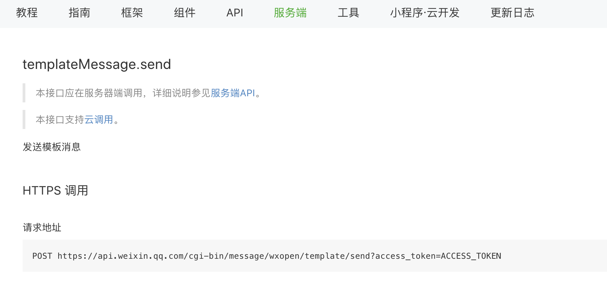
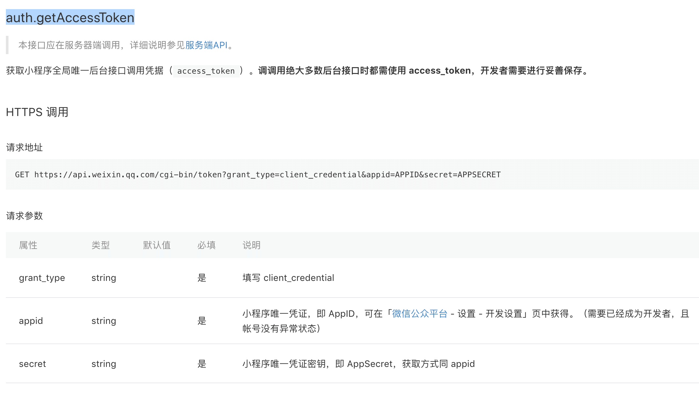
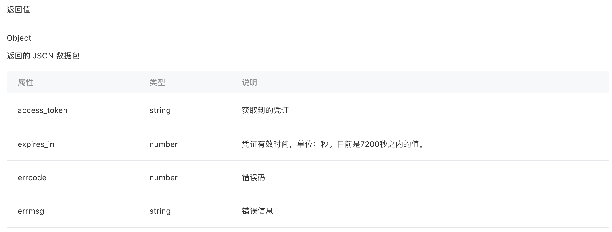
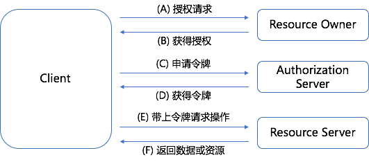
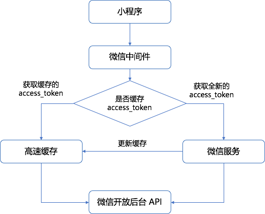
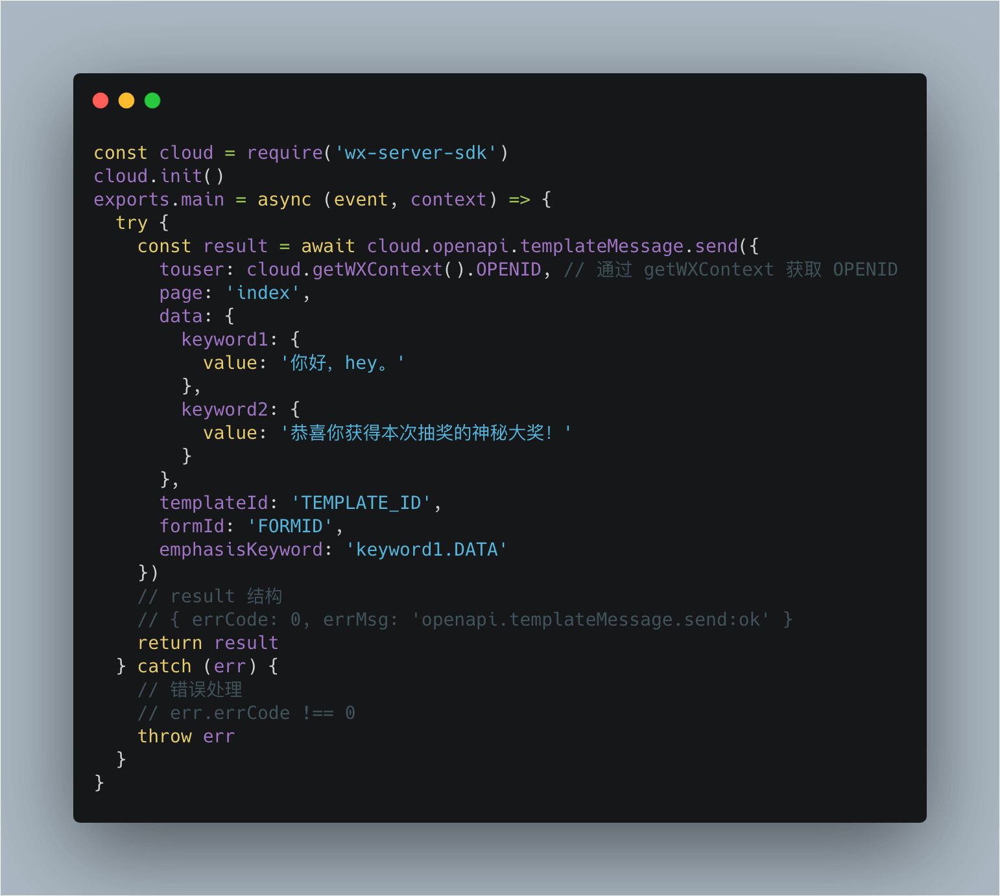
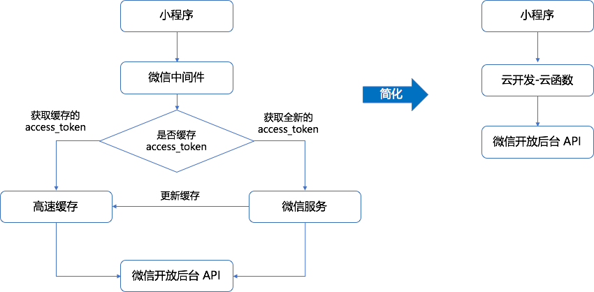
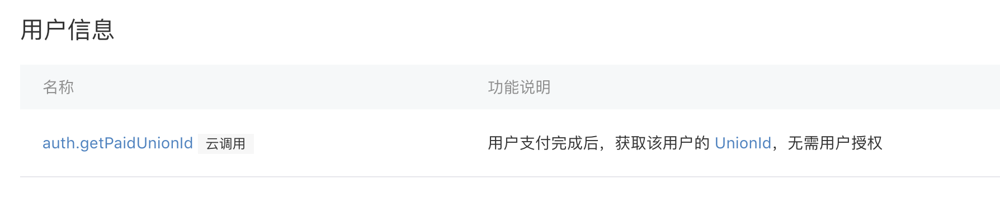

[原文链接](https://github.com/lcxfs1991/blog/issues/31)

互联网的应用，大大小小，不同的场景，都离不开鉴权，从简单的可被用户感知的登录的鉴权，到技术侧不给感知的各种技术参数鉴权，都有着形形色色的鉴权方式和表现形式。其实本质上来讲，鉴权就是要证明你就是你，你可以做哪些事情。

所以鉴权分为两部分，一部分是鉴别身份，一部分是确定权力。而现代网络设计中，权力的分配一般都是预先分配好的，在鉴别身份之后，拿着身份信息，去权限中心确定权力范围，就完成了用户的鉴权过程。

## 现实生活中的身份鉴权方法

身份证是现代社会用于鉴别身份的一种方式，说起身份证, 据相关史实考证,我国的身份证最早出现在战国时期,在商鞅在秦国变法,发明了照身帖。照身帖由官府发放,是一块打磨光滑细密的竹板, 上面刻有持有人的头像和籍贯信息。 国人必须持有, 如若没有就被认为是黑户, 或者间谍之类的。这可能是早期身份证的雏形, 在隋唐时期，我国出现了最早的“身份证”，当时的朝廷发给官员一种类似身份证的“鱼符”，他是用木头或者金属所作，形状像鱼，分左右两片，上有小孔，并可有官员姓名、任职衙门、官员品级等。那时，凡亲王、三品以上官员“鱼符”用黄金制作；五品以上用白银；六品以下为铜制。五品以上官员，还备有存放鱼符的专用袋子，称为“鱼袋”。

从秦朝到清朝的这个阶段, 出现的这些身份的标识, 形式多样性, 但总体来说,都是属于身份证明的这一范畴。然而,这样的身份证, 在核验其身份的真实性, 只能凭眼观, 造假很容易蒙混过关, 没有人 能真正的证明其真实性。 这种核验身份方法, 是最初级最原始的方法。 现代身份证雏形的阶段。
而身份证这种鉴权方式由如密码鉴权一样，属于一种固定密钥鉴权方式。密钥要不被私有不公开，要不很难伪造。

同样，在武侠小说中的令牌，也是如此。最近热播的倚天屠龙记，明教的圣火令，见之如见教主。而圣火令就是令牌的一种方式，使一种固定的密钥鉴权方式。

## 简单的密码鉴权体系

我这有一把锁，我把钥匙发给你，你使用资源的时候过来开锁使用就好了。可以形象的比喻现代互联网中使用的密码鉴权体系。资源管理者只信任密码凭证，无论谁持有了密码，就可以使用对应的权利资源。比如不管谁持有圣火令，就可以使用明教教主的权利资源。那么密钥鉴权体系的特点：
1.简单
2.密码成本，不公开或伪造有门槛

## 频繁的鉴权场景下的优化方案

想象一种场景，持有圣火令的教主，每次施号发令，都要将圣火令从自己藏的密道里取出来才能发令？如果自己心爱的人正在被屠杀，取个圣火令回来可能人就没了，所以这里应该是有一个简单的方式来优化这一过程。
互联网密码鉴权体系中，常常在通过身份验证后，将通过认证的信息保持一段时间，同样，实际武侠江湖中，大家都是有记忆的，圣火令持有者亮出圣火令的一段时间后，看到的人就能记下他已经是圣火令的持有者了，下次发号施令，就不必取来圣火令了。
在web认证体系下，http协议是一种无状态的协议，用户通过输入密码后获得身份认证，这种状态是无法保持下来的，为了保持这种状态，客户端和服务端可以一起想办法把鉴权状态保留一段时间。比如客户端可以记下用户的密码，下次只需要把密码自动带入到服务端，但这种方式是极为不安全的。客户端和传输端的可能泄漏密码。为了避免这种风险的发生，客户端和服务端通过其他的约定来保持这种状态，比如通过一种临时密码来降低这种风险发生的危害，这种临时规则可以是session + cookie，可以是token等等。

## 第三方鉴权体现下的设计

密码鉴权体系一般都是发生在两方之间的鉴权方案。但是回归到武侠世界中，如果一个人拿了伪造的圣火令来发号施令，那不是对明教的危害很大？怎么解决这个问题？这就需要一个可以被信任的人，能够先先甄别圣火令的真假，然后其他的人信任这个人，最终完成身份的验证。
所以这就引入了一个可信任的第三方代为鉴别令牌的，然后告知鉴别结果。
比如第三方登录场景下， 平台需要第三方平台代为身份验证后告知平台此人的身份是什么。这就是我们常见到的oAuth鉴权，现在被广泛应用再第三方登录平台中，比如微信登录、QQ登录等等。

## oAuth 2.0鉴权体系

oAuth 2.0分为客户端鉴权和服务器端鉴权两种方式。拿比较常见的qq登录来举例，第三方平台需要在QQ互联平台申请一个appid, 互联平台同时会分配一个私密的appkey（密钥，始终不公开）
下面以web版 服务端oAuth鉴权方式举例:
1.用户: 点击使用QQ登录按钮（平台方页面）
2.浏览器： 跳转到QQ互联登录页面（第三方平台页面)
        > url参数：平台方appid和平台方回调地址（用于接收第三方的校验信息）
        > 第三方平台会校验appid和回调地址对应情况
        
3.浏览器： 用户和第三方平台鉴权（第三方平台）
4.浏览器： 第三方平台跳回回调页面（平台方）

> url参数： 第三方平台颁发的临时token

5.服务器：第三方通过token加appkey来获取用户信息（服务端发起，避免appkey暴露）
通过上述过程完成了第三方平台的鉴权，获取到了第三方平台提供的临时密钥token，平台之后就可以通过这些信息向第三方索取更多的数据和权力，比如获取用户的openid和基本信息等等。

说了这么多广而全的鉴权方式，我们看看小程序开发中的鉴权是如何实现的

## 聚焦到点：小程序服务端接口的鉴权方式

有过小程序开发经验的开发者，都会或多或少地用上小程序的开放能力，其中为数不少的能力是通过服务端 API 接口的方式提供给广大的开发者。比如我们常用来发送通知用户给用户的模板消息能力：

然后如果你查阅这些开放的服务端 API ，会发现几乎每个 API 都需要填一个参数，那就是 `access_token`。这个参数主要是用于微信侧的服务器鉴权。微信侧的服务器拿到 `access_token` 后，就会知道该小程序有没有权限可以替用户进行开放能力的操作。那么这个参数是怎么获取的呢？它是通过一个`auth.getAccessToken` 的接口来获取的，它具体的入参出参如下：

## 简化版的 OAuth 2.0

这种调用方式，基本上的思路跟 OAuth 2.0 的客户端模式很类似。OAuth 2.0 比较完整的模型如下图：

上图有一些主体概念，我们以微信小程序这个场景来解释一下：

- Client 表示当前正在开发的这个小程序。
- Resource Owner 表示微信官方服务端开放能力的数据及资源的拥有者，
- Authorization Server 表示调微信官方的鉴权服务
- Resource Server 表示微信官方存放开放能力数据及资源的服务器

整个流程其很显而易见：

(A) 小程序的后台向 Resource Owner 发送授权请求

(B) Resource Owner 获得授权

(C) 小程序的后台向 Authorization Server 根据上一步获得的授权，向 Authorization Server 申请令牌

(D) 获取令牌 Access Token

(E) 小程序的后台带上 Access Token 向 Resource Server 发请求，申请操作开放数据及资源

(D) Resource Server 返回数据或操作结果

实际上，微信将这个流程简化成下图，具体的步骤是：

(A) 小程序带上 appid 和 secret 向 Authorization Server  申请鉴权及获取令牌
(B) Authorization Server 确认 appid 和 secret 密钥对无误后，会返回一个临时密钥 Access  Token （一般是2小时）

(C) 带上 Access Token，就可以向 Resource Server 发请求，申请操作开放数据及资源

(D) Resource Server 返回数据或操作结果

其中步骤 A 里，`grant_type` 表示授权类型，小程序这里的固定值是 `client_credentials`。外面有的服务还需要填一个 `scope` 字段，表示 `Access Token` 的适用获围，这里则省略了，表示适用所有的服务端 API。

基于这种 OAuth 2.0 的开发模式，很多公司都会多搭建一个中间服务层，或者直接用中间件，去获取类似 `Access Token` 这种跟小程序相关的信息，因为这个令牌是有一定时效性，而且每天都有接口调用的限制，因此不可能每个用户操作的时候，都调用接口获取新的 `Access Token`。

这种开发模式有一定的局限性，那就是在开发微信相关业务的时候，需要额外部署缓存或数据服务，而存储的数据量其实很少，造成了资源的浪费和抬高了维护成本。

## 鉴权是否可以优化

安全性与便利性就像一对互有恩怨情仇的侠侣，总是无法很好地调和。如果希望系统更安全，多设几道防御屏障，用加密级数更高的算法，那便利性、性能等方面就会承受一定的折损。而如果想用户更方便，少设几道安全关卡，那安全方面自然就会大打折扣。

因此，如果需要自己搭建一套微信小程序的服务，首先微信开放平台的鉴权服务是自然跑不掉的，需要按照文档规范逐一落实。而这套服务跟小程序前端的鉴权，也自然是个棘手的问题。简单一点的，用 JWT (JSON Web Token) 实现去中心化的鉴权，缺点是无法保证用户端的泄漏风险以及过期时间。而高级一点的是自己维护一套有过期时间的中心化 Cookie/Session 体系，看起来是安全些，但对服务的平行扩容却又并不太友好。

看起来，真的没有既安全，又便利的小程序鉴权服务体系了吗？

## 云调用免鉴权体系

小程序最近推出的云调用能力，则是对原有的这种鉴权模式的巨大优化。官方对云调用的描述是这样的：

> 云调用是云开发提供的基于云函数使用小程序开放接口的能力。云调用需要在云函数中通过 `wx-server-sdk` 使用。在云函数中使用云调用调用服务端接口无需换取 `access_token`，只要是在从小程序端触发的云函数中发起的云调用都经过微信自动鉴权，可以在登记权限后直接调用如发送模板消息等开放接口。

主要是有几个关键点：

1. 基于 [小程序·云开发](https://developers.weixin.qq.com/miniprogram/dev/wxcloud/basis/getting-started.html) 开发的云函数能力
2. 通过 [wx-server-sdk](https://www.npmjs.com/package/wx-server-sdk) 才能调用
3. 只有在小程序前端侧调用云函数，才能这样的能力

我们来看一下云调用如何在云函数中发送模板消息。

从这个例子看出，其实入参并无差异，只是不需要再去获取 `access_token`。那意味着整个开发的架构，可以简化成这样，架构的复杂度大大降低：

那目前有哪些的小程序使用场景可以用上云调用呢？统计了一下，主要用户信息获取、访问留存、消息(模板、统一服务、动态)、小程序码、内容安全等十几个大类几十个开放接口已经支持云调用。具体可以参考[小程序服务端接口列表](https://developers.weixin.qq.com/miniprogram/dev/api-backend/)，如果接口旁边有一个"云调用"的标签，表明该接口支持云调用。

但总得来说，这种使用方式已经算是给小程序开发效率的提高，带为质的飞跃。

## 未来鉴权畅想

总之，鉴权场景从古至今都是一个高频场景，从古代的鱼符号，现代的身份证，都是一种令牌凭证的鉴权方式，到了线上的系统中，大部分场景也是基于密码鉴权体系，除此之外，基于生物特征的鉴权，比如基于指纹、基于面容ID等等也都在广泛使用起来。第三方鉴权体系也随着各大平台的开放而逐渐发展起来，单看小程序体系下鉴权也是无处不在，小程序云开发推出了免鉴权体系，为小程序的开发带来了极大的方便。
更进一步，未来是否可以有一种不基于密码的授权方式？比如基于机器学习和区块链模式下的鉴权，区块链的信任是去中心化的一种实现方式，未来的鉴权能否也可以做到去中心化的鉴权？

