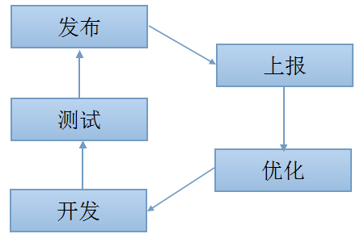
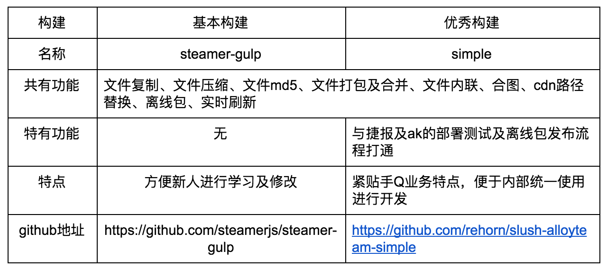

## 背景：
1. 接手新项目，发现项目最基本的文件压缩没有，离线包有多余文件，md5也并没有做好，
2. 构建是用coffeescript写的，维护成本及交接成本大，关键的是，构建维护的人离职了
3. 作为新人，希望从头写一个构建，这样为以后独立开展项目获取经验
## 页面情况：

手Q群成员分布页面。每天PV约260万，约60万人点击活跃群成员头像，点击申请加群14万人，转化率约5%。

示例连接，需要QQ登录态，可到腾讯网门户进行登录:
[链接](http://web.qun.qq.com/statistics/index.html?_bid=149&_wv=3&gc=60478266&sid=AXR5hz1VViG-63A40b8vK4FB)

## 目标：
1. 对文件进行压缩
2. 删除离线包冗余文件，精简大小
3. 对文件名md5化
## 成果：
### 1. 构建工具搭建的思路及原则总结

这次的构建优化主要带来的思考是，一个基本的构建、优秀的构建分别是怎么样的。

我们应该引入怎么样的评判标准呢？ 市面上还没有人做过标准的回答。一般而方，作为构建，它的使命是提高开发人员的效率，并能对项目进行足够的性能优化。也就是说， 开发效率及性能优化应该作为两个最基本的评判标准。

对于一个前端项目而言，基本的构建功能应该包括下面的功能。

(1)  文件复制
(2)  文件压缩
(3) 文件md5
(4) 文件打包及合并
(5) 文件内联
(6) 合图

在构建工具的选择的时候，如果包含这些功能的话，那么称得上是“合格”的构建工具。它的目标，是为前端的项目带来最为基本的优化和开发效率。如果结合手Q的业务来说，那么离线包和cdn路径替换也应该作为第7和第8点的基本功能。

那么什么算是优秀的构建呢。优秀构建应该比基本的构建带来更进一步的开发效率和项目性能优化方面的提升。一些比较好的构建特性可能会被包含在内，例如图片压缩、实时刷新、性能上报打点生成、自动化测试、代码性能优化检测等等。除此之外，更优秀的构建会做的是，结合自己业务的需求，将打包、部署测试、发布等一系列流程打通，形成整个开发的闭环。

根据学习需要，参考了[Simple](https://github.com/rehorn/slush-alloyteam-simple)，我写了一个基本的构建工具，[steamer-gulp](https://github.com/steamerjs/steamer-gulp)(蒸汽机的意思，第一次工业革命的动力之源。寓意给前端带来自动化)。这个构建代码大约300多行，由于学习需要，代码会稍有冗余之处，但比较便于新人学习及修改。

对于构建的功能来说，第三方插件有时候是你非常重要扩展功能的重要途径，而且功能插件化，能使你的构建更加精炼，代码更为优雅。但有时候你并不能找到令人满意的插件，这时候你就需要动手自己写。grunt的插件并不能开发，因为只是文件的操作，而gulp的插件在开发之前，你要首先理解清楚stream和buffer的概念，并阅读一下官方的文档和例子。下面三个链接提供了中文官方文档和两个笔者开发用于steamer-gulp的插件例子：

（1） [插件开发](http://www.gulpjs.com.cn/docs/writing-a-plugin/)
（2） [gulp-bigpipe-template](https://github.com/lcxfs1991/gulp-bigpipe-template) (bigpipe模板生成)
（3） [gulp-inline-res](https://github.com/lcxfs1991/gulp-inline-res) (内联js, css和html)
### 2. 构建的文件目录组织方式

使用构建的时候，你会发现会被约束各种文件应该放的位置，以及文件名的命名。Simple和steamer-gulp采用的是常用的约束方式，同类型的文件就放在相同的文件夹下，我们不妨将之称为**同类文件约束方式**。但在组件化的大潮下面，越来越多的工程师可能会采用组件化的思维的约定方式。与同一组件相关的文件归到组件的文件夹下面。UC浏览器的张云龙，以及旁边组的Q.js框架的构建，都推崇后一种的思路。这种思维我们可将之称为**组件化约束方式**。

同类文件的约束方式对开发模式的采用并没有很大的限制，你可以自由选择喜欢的开发模式。至于组件化的约束方式，它推荐，并且很大程度限制于使用组件化的开发思路，在js开发的时候喜欢采用观察者模式或者中介者模式。例如Q.js喜欢采用emit和on分发和监听事件，React目前的最佳实践是类flux框架(flux采用观察者模式，redux采用中介者模式)。

手Q群成员分布一开始就采用了同类文件约束方式。在搭建steamer-gulp的时候，也曾考虑过使用组件化的约束方式。但一旦选择这类约束方式立即就会面临问题。**其一**，组件化约束方式看来无法脱离组件化的开发方式，如果新人对这种开发方式不熟悉，开发起来会比较痛苦。**其二**，即使熟悉组件化的开发方式，你也要面临组件化开发框架的选择问题。例如，如果你选择还未成熟的Q.js框架(期待逐渐成熟)，开发效率并没有带来提升，倒不如使用兴趣部落的老王模型结合同类文件约束方式开发得爽。
### 3. 性能

性能会与预期一样更好，但做这些基本的优化也跟预期一样，并不会带来非常大的优化。性能其实不算是这次成果的重点。另外，离线包大小通过构建离线包由原来的423kb，减少到247kb。节约了带宽成本，加快了用户下载离线包的速度。

## 总结及展望

通过构建，我们可以达成开发效率的提升，以及对项目最基本的优化。因此，能够通过构建自动化做到的优化和效率提升，请尽量做足。这样才能让我们有更多时间将优化花在更为精辟独到、难以自动化的优化层面上。

但仅仅通过构建达到的优化其实还是有限的，更大范围的优化还需要建立于前端的工程化之上。前端工程化是一个很广阔与高深的话题就不在本文篇幅里面，作为新人，在用好构建工具之后，可以对前端工程化作进一步的探讨与尝试。

写这篇文章也是为了引起新人对构建的重视。作为新人，仅仅信手拿别人的构建使用并不足够，我们还需要有能力动手搭建或完善我们使用的构建工具。
## 附： 构建工具学习好文章

webpack:
[一小时包教会 —— webpack 入门指南](http://www.cnblogs.com/vajoy/p/4650467.html)
[Webpack 和 React 小书](http://segmentfault.com/a/1190000002985564)
[webpack-demos](https://github.com/ruanyf/webpack-demos)
[webpack 教程大全](http://webpack.github.io/docs/list-of-tutorials.html)

gulp:
[前端构建工具gulp入门教程](http://segmentfault.com/a/1190000000372547)
[Gulp入门教程](http://markpop.github.io/2014/09/17/Gulp%E5%85%A5%E9%97%A8%E6%95%99%E7%A8%8B/)
[Gulp 范儿——Gulp 高级技巧](http://csspod.com/advanced-tips-for-using-gulp-js/)
