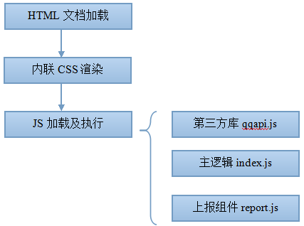
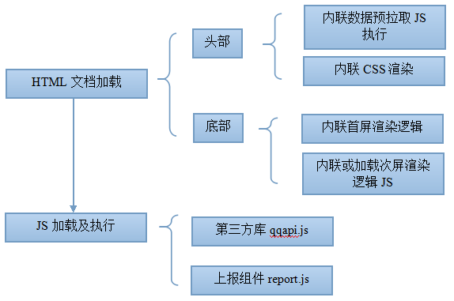
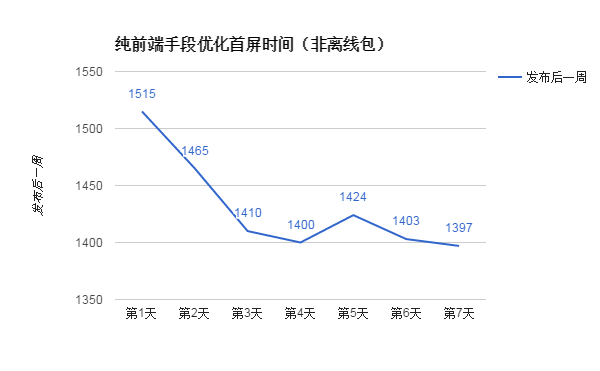
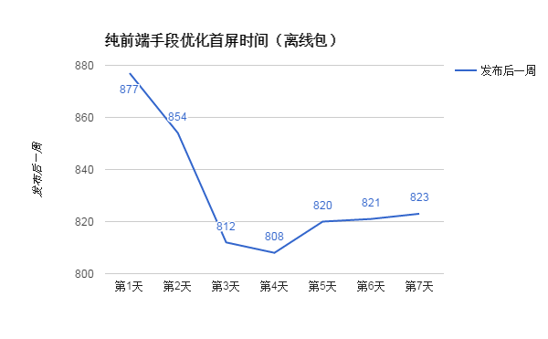
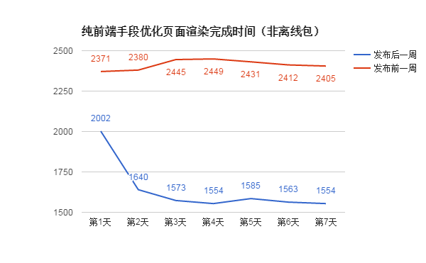
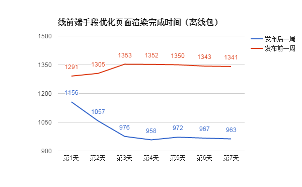

## 背景：
1. 对构建的改造已经完成，目前构建的能力可以较为灵活地支撑进一步的优化
2. 希望进一步减少首屏时间，将首屏时间控制在2秒以内
## 页面情况：

优化之前，并没有上报首屏时间，页面加载时间约为2.4秒。

研究认为[1]，用户最满意的网页打开时间是2秒以内。作为一个相对简单的页面，我们就应该最可能将首屏时间甚至加载时间控制在2秒以内，让用户体验到最佳的页面体验。
## 定义页面的首屏与加载时间：

首屏时间，英文称之为above the fold(首屏线之上)。我们以手Q群成员分布的页面作为例子。在iPhone5屏幕下，这个页面在没有往下滚动的时候，如上图。滚动到底部时，如下图。

我们所说的首屏时间，就是指用户在没有滚动时候看到的内容渲染完成并且可以交互的时间。至于加载时间，则是整个页面滚动到底部，所有内容加载完毕并可交互的时间。

在这个页面中，我们可以划分成四个部份，分别是活跃 群成员、男女比例、省市分布及年龄。我们将前三个部份归入首屏渲染时间。剩下的内容加载时间加上首屏加载时间即是页面加载时间。

另外值得一提的是，由于之前项目的开发将动画渲染时间也纳入统计，因此为了方便对比，我也将渲染时间纳入统计。实际上，如果除去动画渲染时间，首屏及加载时间会快300 - 500ms。
## 已经做好的优化:

除非各种性能优化书籍提出的要点之外，在这篇优化之前已经做到的优化并值得简单提出来的有两点。
1. 活跃群成员头像的懒加载。由于手Q的头像允许gif，因此直接加载头像性能会比较低下。因此之前在完成这块业务的逻辑的时候，已经添加上懒加载，业务渲染的时候显示默认头像，等真实头像加载完成的时候再进行渲染。而且，在这次的优化项目中，我们并不将头像的加载时间也纳入首屏时间内。
2. 其它内容动画的滚动渲染。其它部份的内容是会由滚动渲染效果的（这些逻辑并不由本人写）。感谢前人做比较模块化地做好了这部份逻辑，因此我能够比较容易地进行代码的搬迁与更改。
   纯前端手段优化页面加载及渲染模式:

上图是项目旧有的加载模式，是比较通常的页面加载渲染模式。将css放在head标签内，为了避免阻塞将js放在底部。因此页面渲染完成后，还需要等待js的加载，js拉取数据以及js的渲染。 这便大大地减慢了首屏及加载时间。

从性能的角度看，将整个加载渲染模式换成下面的模式更有利于首屏的渲染，我们可以称之为首屏优先加载渲染模式。

根据上述的模型，我们可以将首屏优先模式总结为三个原则，一是首屏数据拉取逻辑置于顶部，二是首屏渲染css及js逻辑优先内联HTML，三是次屏逻辑延后处理和执行。

**原则一：**首屏数据拉取逻辑置于顶部，是为了数据能够第一时间返回，相比起将数据拉取逻辑放在外部资源会少了一个JS资源加载的往返时间。

**原则二：**首屏渲染css及js逻辑优先内联HTML，这是为了当HTML文档返回时CSS和JS能够立即执行。但要注意的是HTML文档最好不要超过14kb。这是由于，TCP协议里面有一个流控机制，被称为 slow start，也就是在连接建立过程中逐渐增加传输的分段(segments)大小[2]，根据Paul Irish在他的演讲“Delivering the Goods”给出的结论是，一个Web应用最开始的 14kb 数据是最重要的[3]。

**原则三：**次屏逻辑延后处理和执行，各种数据上报最好是延时上报，这样可以减少阻塞。对于首屏的数据上报，可以先将数据存在变量里面，等上报组件report.js加载完毕后，再调用回调进行上报。
新人可能会问将这么多代码内联很不优雅，而且很麻烦呀。如果你用的构建是一个合格的构建，你大可以用构建帮你进行内联，这并不是很费时的事情（这也是为什么我将构建作为优化的第一篇章，构建给优化带来便利）。
经过优化以后，首屏时间方面，非离线包版本达到1400ms左右，离线包版本则达到850ms左右。

页面渲染完成时间方面，非离线包版本从平均2400ms左右，降至平均1600ms，性能提升33%。离线包版本从平均1350ms，降至平均970ms，性能提升28%。

[1] http://www.ruanyifeng.com/blog/2009/03/the_psychology_of_web_performance.html
[2] http://lenciel.cn/2014/11/7-principles-of-rich-web-applications/
[3] https://docs.google.com/presentation/d/1MtDBNTH1g7CZzhwlJ1raEJagA8qM3uoV7ta6i66bO2M/present?slide=id.g3eb97ca8f_1536
