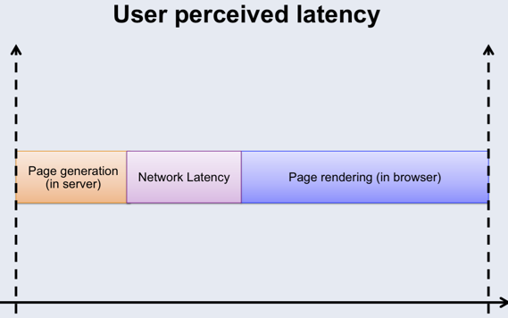
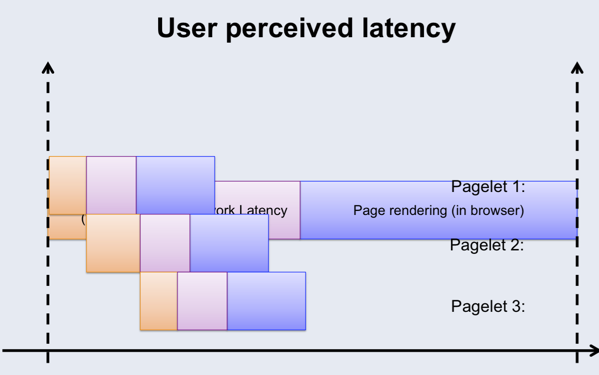
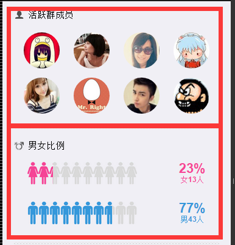
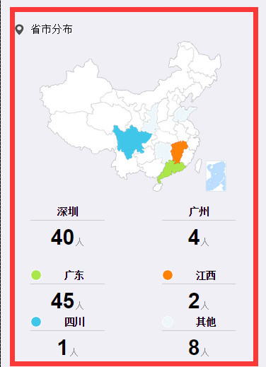
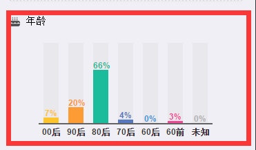
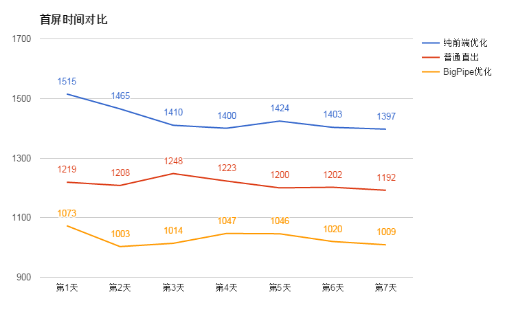
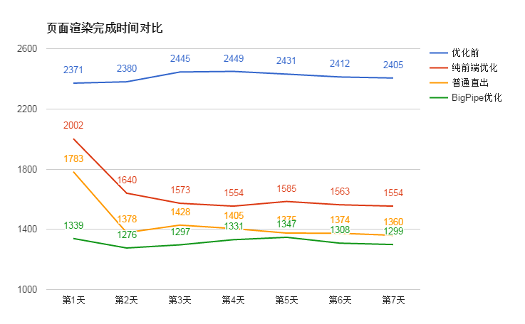

## 项目： 手Q群成员分布直出
## 原因：
- 为家校群业务直出做准备
- 群成员分布业务是小型业务，而且逻辑相当简单，方便做直出试验田
## 基本概念：

直出其实并不算是新概念。只不过在Web2.0单页应用流行的年代，一直被人遗忘在身后。其实在Web1.0时代，前后端没有分离的时候，程序员直接用后台程序渲染出模板，这便是直出。而到了今天，当Node大大提高了前端开发者的能力时，前端人员也可以做一些后台的事情，通过Node来实现模板的渲染和数据的吞吐。
## 框架及技术：

由AlloyTeam开发的，建基于Koa之上的玄武直出框架。该框架的优势在于：
(1) 安装与本地开发简单：只需要几行命令安装和几行代码部署本地开发环境。
(2) 完善的文档和规范的开发实践：经过数个项目的试验，文档已经日臻完善，并总结出一套可供大部份业务使用的实践方案。
(3) 部署测试和发布成熟：目前已有兴趣部落、群搜索等数个项目成功发布。
(4) 较好的容错功能： 通过公司的L5负载均衡服务，完美兼容直出与非直出版本，即使直出挂了，也能顺利走非直出版本，让前端可以安心睡大觉。
## 直出方案：
### 1. 数据拉取

玄武框架提供一个封装了开源request库的一个同名request框架，并且提供异步拉取数据方案。文档代码如下：

```
function(req, res, next) {
    var hander = function(error,response,body){
        var data = JSON.parse(body);
        res.body = body;
        next();
    };
    ajax.request(opt,hander);
}
```

也有不少人认为写异步比较不优雅，因此会使用promise, bluebird等第三方库。我在实践手Q群成员分布的时候，经过对generator的学习之后，探索出一个简易的同步写法，这种写法简单易懂，而且大大减少了对第三方库的依赖。如下面代码：

```
function*(req, res) {
 var opt = {
    url : 'xxxxxxxxx',
        method: 'POST',
        form: {
                bkn: getBkn(skey),
                gc: gc,
        },
         headers : {
                 'host' : 'web.qun.qq.com',
                 'Referer' : 'web.qun.qq.com'
         }
 };
function requestSync(opt) {
    return function(callback) {
                ajax.request(opt, function(error, response, body) {
                        callback(error, response);
                });
        }
    }
    var content = yield requestSync(opt);
}
```

只要像上面代码一样进行简单的封装，就可以写出同步的写法。具体代码的分析和理解可以看文章的附录一部份。
### 2. 模板渲染

除了数据拉取，模板如何渲染也是直出的重要环节。下面有三种方案提供：
（1） 在服务器中搭建一个浏览器，渲染好所有东西然后传给前台
这种方案应该是最快的办法，但由于需要在服务器中搭建浏览器进行渲染，因此会消耗服务器大量性能，因此并不可取。
（2） 通过玄武写主要逻辑，然后吐给前台再渲染
这种方案的性能也是非常好的，但由于要将原本代码的部份逻辑放到服务器写，因此需要对后台和前台都做容错，会耗费一些开发时间。
（3）只给前台吐出数据，然后完全由前台渲染
这种方案的改动小，而且容错比较容易实现。例如，我在手Q群成员分布中，在html里加入如下代码：

```
<script>
        {{'xw-data'}}
</script>
```

然后在直出入口文件做替换：
`this.body = tpl.init().replace('{{\'xw-data\'}}', 'var xw_data = ' + body + ';');`
然后在js文件里对xw_data做判断，如果有数据，直接去渲染，如果没数据，走旧有逻辑。
## BigPipe
### 1. 实现原理

BigPipe是一个重新设计的动态网页服务体系。 将页面分解成一个个Pagelet，然后通过Web 服务器和浏览器之间建立管道，进行分段输出 （减少请求数）。BigPipe不需要改变现有的网络浏览器或服务器（百度百科）。


BigPipe实际上也可以算作出直的一种特殊方案，最先是由Facebook提出(2010 Velocity Conference)，在国内由新浪微博最先进行大规模实践(2011 Velocity Conference)。
传统的渲染方式，用户所感知的页面延时如下图，从页面生成，网络延迟到页面渲染都是串行进行的。



而BigPipe使得整个用户感知流程变成并行，使页面首屏渲染时间更快。如下图：



BigPipe的渲染方式，首先是在页面头部添加一个全局的加载Pagelet的onPageletArrive函数，然后渲染出HTML各Pagelet的占位标签，等各标签的数据到达的时候，依次调用全局onPageletArrive加载函数进行渲染。如以下代码。

```
<html>
<head>
<!-- 全局 onPageletArrive function -->
<script>
window.onPageletArrive = function(obj){
// load css
// load js
// load html
};
</script>
</head>
<body>
<!-- Pagelet 占位 -->
<div id="pagelet1"></div>
<div id="pagelet2"></div>
….
<div id="pageletN"></div>
<!-- 后台返回的js代码，用于直接吐出执行全局onPageletArrive -->
<script>
onPageletArrive({                                        
"id" : "pagelet1",
"css" : [ <list of css resources>],
"js" : [ <list of JavaScript resources>] "content" : <html>
"onload": [JavaScript init code]
});
</script>
…
<script>
// onPageletArrive for pageletN
</script>
</body>
</html>
```

从开发模式来说，BigPipe这种的写法比较适合组件化、模块化的前端开发模式。从网站规模来说，对于大型网站的优化效果会比较明显，毕竟分步吐出内容也是会有延时存在的，对于小型网站来说，有可能直接吐出所有内容会比分步吐出更快。
### 2. 项目实践

了解完基本的原理之后，我们来谈谈BigPipe在手Q群成员分布项目中用Node的具体实践。

(1)  对页面分模块并设计好占位符
首先要对页面尽可能地划分好不同的模块，亦即Pagelet。读过上一篇优化文章的人都记得，手Q群成员分布可以分为活跃群成员、男女比例、省市分布、年龄四大模块，如下面图片红框标框好的部份。







相应地，我们得出如下的占位符。

```
<section>
        <!-- 活跃群成员 -->
        <div id="active"></div>
        <!-- 男女比例 -->
        <div id="gender"></div>
        <!-- 成员省份 -->
        <div id="area"></div>
        <!-- age -->
        <div id="age"></div>
</section>
```

(2) 设计每个Pagelet需要渲染的内容，并对前后台的代码进行分工
根据Facebook的方式，每个Pagelet都有自己独立需要加载的样式，JS文件，模板文件。这对于小型项目来说，大可不必。如手Q群成员分布项目中，我已直接将样式内联，模板文件也存在变量当中。因此，前端全局渲染函数主要负责将内容嵌入占位符当中。因此在head标签内，我设定了一个componentRender的函数，用于负责将后台吐出的内容嵌入占位符。代码大概如下:

```
function componentRender(target, tplString) {
        // targetObj.innerHTML = tplString
}
```

而后台的代码，则在拼好模板字符串之后，分步吐出内容，代码大体如下：

```
this.push("<script>componentRender(\"#active\," + tplString )</script>");
this.push("<script>componentRender(\"#gender\," + tplString )</script>");
this.push("<script>componentRender(\"#area\," + tplString )</script>");
this.push("<script>componentRender(\"#age\," + tplString )</script>");
```

对于后台的代码，尤其是使用Koa框架，可能会无从入手，大家可以参考Github上的BigPipe Example。大体的写法和解释如下：

```
// BigPipe需要的模块，用于flush内容到页面
var Readable = require('stream').Readable;
// 生成分片段页面内容函数
var createChunkedView = function(end) {
    function noop() {};
    typeof end === 'function' || (end = noop);
    util.inherits(View, Readable);
    function View(ctx) {
        Readable.call(this);
        ctx.type = 'text/html; charset=utf-8';
        ctx.body = this;
        this.app = ctx;
    }
    View.prototype._read = noop;
    View.prototype.end = end;
    return View;
};
function* end() {
// 页面主逻辑，这里也要以用各种yeild
// this.push(xxx)
// this.push(xxx)
// this.push(null) 最末尾请push空内容，通知框架内容flush结束
}
module.exports = function*() {
        // 原本的koa view函数
        const View = createChunkedView(end);
            yield * new View(this).end();
}
```
### 3. 成果

首屏时间方面，直出方案比纯前端的方案有大概400ms的优化，提升约28.6%的性能。而BigPipe对比普通直出的优化有大约200ms，提升约16.7%。虽然实践的项目规模较小，模块数量也较少，但BigPipe的优化成果也算是比较令人满意的。



页面渲染完成时间方面，纯前端的的优化对比优化前有了质的飞跃（在前一篇文章也提到），性能提升33%。普通直出对纯前端的优化提升约200ms, 性能提升约13.3%。而BigPipe优化跟普通直出优化则没有非常明显的优劣，只快了几十毫秒。


## 总结

纯前端的优化对其实也已经为项目带来比较好的提升。直出对于首屏的渲染也能带来不错的提升。另外，由于玄武框架只是一个简单的页面接入层，并不能直接对数据库进行操作，因此框架方面可以做的事情还有更多。

系列文章里面所介绍到的纯前端优化方案、直出方案，都属于过去数年的方案。随着直出框架、方案及优秀实践的不断完善，相信应该要成为每个项目的标配。

文中略略提到的离线包方案，属于腾讯手Q方面独立研发出来的针对手机端优化的方案，对于其它非腾讯业务也有一定借鉴的意义，具体要参考我导师2014年在InfoQ上有关离线包系统的讲解(链接)。至于未来数年，我们可以将希望寄放在websocket，当然还有即将普及的HTTP2.0身上。
## 附录一

数据拉取同步方案：

```
function*(req, res) {
var opt = {
url : 'xxxxxxxxx',
        method: 'POST',
        form: {
                bkn: getBkn(skey),
                gc: gc,
        },
         headers : {
                 'host' : 'web.qun.qq.com',
                 'Referer' : 'web.qun.qq.com'
         }
};
function requestSync(opt) {
        return function(callback) {
                ajax.request(opt, function(error, response, body) {
                        callback(error, response);
                });
        }
}
var content = yield requestSync(opt);
}
```

如何理解?
简单的回调用法：

```
function* Hello() {
         yield 1;
         yield 2;
}

var hello = Hello() // hello 是一个generator
var a = hello.next() // a: Object {value: 1, done: false}
var b = hello.next() // b: Object {value: 2, done: false} 
var c = hello.next() // c: Object {value: undefined, done: true}
```

在next中传入参数：

```
function* gen() {
        while(true) {
                var value = yield null;
                   console.log(value);
        }
}
var g = gen();
g.next(1); 
// "{ value: null, done: false }"
g.next(2); 
// "{ value: null, done: false }"
// 2
// 在该示例中，调用 next 方法并传入了参数，请注意，首次调用 next 方法时没有出任何输出, 这是 因为初始状态时生成器通过yield 返回了null.
```

经典示例一，按顺序执行：

```
funciton delay(time, cb) {
 setTimeout(function() {
   cb && cb()
 }, time)
}
delay(200, function() {
 delay(1000, function() {
   delay(500, function() {
     console.log('finish')
   })
 })
})
function delay(time) {
 return function(fn) {
   setTimeout(function() {
     fn()
   }, time)
 }
}

co(function* () {
 yield delay(200);
 yield delay(1000);
 yield delay(500);
})(function() {
 console.timeEnd(1) // print 1: 1702.000ms 
})
function co(GenFunc) {    // GenFunc → function*() { yield ……….}
 return function(cb) {   // function() { console.log.timeEnd(1); }
   var gen = GenFunc()
   next()
   function next() {
     if (gen.next) {
       var ret = gen.next(); 
      // {done: true/false, value=delay 返回的function}
       if (ret.done) { // 如果结束就执行cb
         cb && cb()
       } else { // 继续next
         ret.value(next)
       }
     }
   }
 }
}
```

经典示例二，按顺序执行并且下一个执行依赖于上一个执行的返回值：

```
function delay(time) {
        return function(fn) {
                   setTimeout(function() {
                     fn(time) // time为回调参数
                   }, time)
         }
}

co(function* () {
        var a;
         a = yield delay(200); // a: 200
         a = yield delay(a + 100); // a: 300
         a = yield delay(a + 100); // a: 400
    return a;
})(function(data) {
         console.log(data) // print 400, 最后的值被回调出来
});
function co(GenFunc) {
        return function(cb) {
                   var gen = GenFunc();
                   next();
                   function next(args) { // 传入args
                     if (gen.next) {
                               var ret = gen.next(args) // 给next传入args
                               if (ret.done) {
                                         cb && cb(args)
                               } else {
                                 ret.value(next);
                       }
             }
           }
}
```

回到玄武直出代码：

```
module.exports = function*(req, res) {
}
co(function*(req, res){
    // some code
        function requestSync(opt) {
        return function(callback) {
                ajax.request(opt, function(error, response, body) {
                        callback(error, response);
                });
        }
}
var content = yield requestSync(opt); 
// 在gen.next()之后，yield会返回值给content
// other code
});
```

参考：
http://www.alloyteam.com/2015/03/es6-generator-introduction/
http://www.alloyteam.com/2015/04/solve-callback-hell-with-generator/
http://www.html-js.com/article/Nodejs-commonly-used-modules-detailed-address-correction-in-Pyramid-Harmony-Generator-yield-ES6-CO-framework-of-learning
