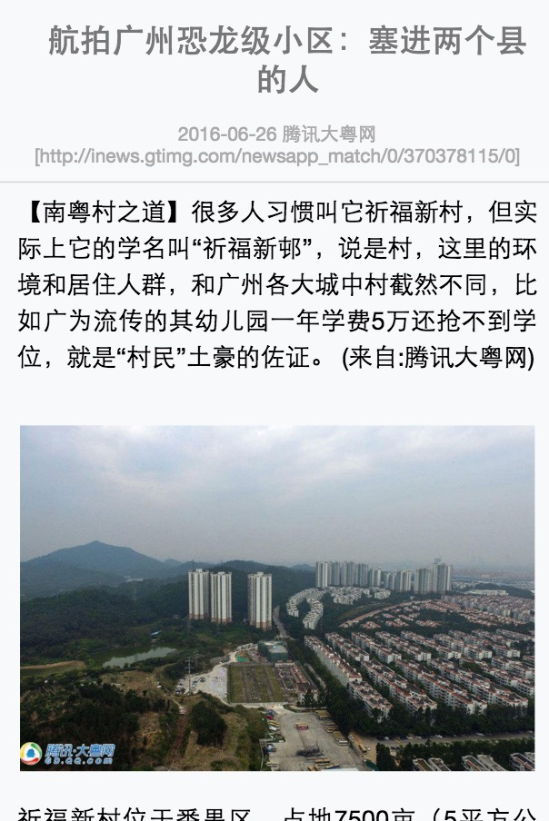
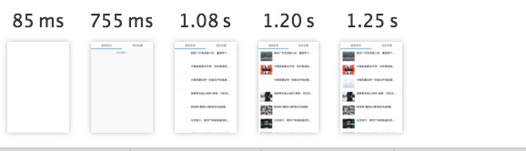
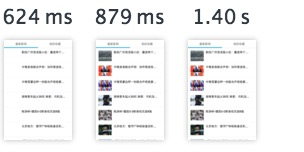

[原文地址](https://github.com/lcxfs1991/blog/issues/10)
[本文starter kit: steamer-react](https://github.com/SteamerTeam/steamer-react)
## 为什么做直出

就是为了“性能”！！！
按照经验来说，直出，能够减少20% - 50%不等的首屏时间，因此尽管增加一定维护成本，前端们还是前赴后继地在搞直出。

除此之外，有些特定的业务做直出能够弥补前后端分离带来的SEO问题。像这次选取的腾讯新闻，大多数页面首屏其实都是直出的（但肯定不是React直出）。
## 性能指标

刚提到的首屏时间，只是单纯内容的渲染，另外还有首屏可交互时间，即除了内容渲染之余，还能够让用户能够对首屏的内容进行交互，如点击、滚动等等。现在市面上有关React的性能报告，尤其是那些截了Chrome渲染映像的，都归到首屏时间。
## 为什么选择腾讯新闻
- 我并非腾讯新闻的业务相关方，可以比较大胆地作为例子使用
- 腾讯新闻页面更为丰富，可以做更多场景的实践
- 验证全套脱胎手Q家校群react的优化策略、实践方案和开发工具

由于只是实验，数据都是拉取腾讯新闻现网提供的，而样式简单地仿照了一下，做得略粗糙，请见谅。
## 参考的资料和使用的工具

做这次实践阅读了不少文章，文章提到过的内容我这里就不再赘述了，后文主要是做补充。
这次同构直出实践，我们使用的是脱胎于手Q家校群的react start kit，名曰[steamer-react](https://github.com/SteamerTeam/steamer-react)。目前可以试用。它有2个分支，一个是react分支，目前只是提供纯前端的boilerplate。另一个是react-isomorphic，同时包括前端和后台的boilerplate。有什么问题可以给我提issue。

文章：
- [React+Redux 同构应用开发](http://www.aliued.com/?p=3077)
- [React 同构实践与思考](https://segmentfault.com/a/1190000004671209#articleHeader2)
- [React同构直出优化总结](https://github.com/joeyguo/blog/issues/9)
- [ReactJS 服务端同构实践QQ音乐web团队](http://toutiao.com/i6284121573897011714/)
- [How to Implement Node + React Isomorphic JavaScript & Why it Matters](https://strongloop.com/strongblog/node-js-react-isomorphic-javascript-why-it-matters/)
- [性能优化三部曲之三——Node直出让你的网页秒开](https://github.com/lcxfs1991/blog/issues/6)
## 分析场景

这次我们选取的是腾讯新闻的列表页、详情页和评论页。平时我们浏览腾讯新闻的时候，都会发现从列表页进详情页，或者从详情页进入评论页，都需要跳转，就像steamer-react中，访问index.html页一样。这样对于用户体验欠佳，因此我做了另外一版，spa.html，使用react + react-router做了一版无跳转的单页面应用。
- 列表页
  
- 详情页
  
- 评论页
  

可是单页面应用在SEO的优化方面，处于略势，因此对于新闻类业务来说，需要做直出来弥补。下面我们逐步来拆解React同构直出的步骤。
## 用Koa搭建后台

AlloyTeam团队目前以Koa为基础搭建了玄武直出平台，目前不少手Q基础的web业务也有接入，包括早前做过同构优化的手Q家校群列表页。是次实践，在steamer-react下面新建了一个node文件夹，存放后台服务。后台服务包括返回数据的api，还有直出的controller层。controller层仿照玄武的写法，对于腾讯内的同事，做适当修改便可以快速接入玄武直出平台，对于腾讯外的，也可以作有用的参照，嵌入自己的业务也不费什么功夫。

那直出的controller层具体怎么写呢？

直出controller层和数据返回的api都一律写在controller.js里面，然后去require存放在node/asset/下面具体直出逻辑文件，然后将yield出来的值直接吐出来：

```
exports.spa = function* () {
    let dir = path.dirname(path.resolve()),
        appPath = path.join(dir, '/pub/node/index.js');

    if (fs.existsSync(appPath)) {  // 若asset中无此文件，则输出其它值
        var ReactRender = require(appPath);
        yield ReactRender(this.request, this.response);   // 给ReactRender函数传入request和response
        this.body = this.response.body;
    }
    else {
        this.body = "spa list";
    }
};
```

而ReactRender函数，大概长这样，其实就是一个generator function，具体拉取数据和React同构渲染的逻辑都写在这里面。

```
module.exports = function* (req, res) {
    // some code
｝
```

你直接写好的逻辑，有不少可能node并不识别，例如import, window对象等，这些需要构建去处理，后文会有论述。

其实整个直出过程非常简单。基本就是三部曲，拉数据、存数据和吐内容。
### 拉数据

拉数据这里封装了一个requestSync的库，可以直接通过yield对request库做同步的写法：

```
// requestSync.js
var request = require('request');

exports.requestSync = function(option) {
    return function(callback) {
        request(option, function (error, response, body) {
                callback(error, response);
        });
    };
} ;

// 拉数据逻辑
var response = yield requestSync.requestSync({
    uri: CGI_PATH['GET_TOP_NEWS'] + urlParam,
    method: 'GET'
});
```

// 在编译的时候，你可能会发现`require('request')`报错，这是因为你缺少了一些babel插件。但也有另外一个办法让你去寻找一个不知名的babel插件。我改用plugin('requestSync')而不是require。因为require会直接去读取node_modules包的内容，plugin并不会编译，它会保留原样，等Koa读取的时候再实时运行。plugin实质是定义在global全局变量里的一个函数，然后将它nodeUtils在controller.js中require进来，就能达到保留原样的效果。

```
// 直出逻辑
var requestSync = plugin('requestSync');

// nodeUtils.js
global.plugin = function(pkg) {
    return require('./' + pkg);
}

// controller.js
var nodeUtils = require('../common/nodeUtils');
```
### 存数据

由于我们采用redux做统一数据的处理，因此我们需要将数据存一份到store里，以便后面吐内容。

```
const store = configureStore();

store.dispatch({
        type: 'xxx action',
        data: response.body,
        param:{

        }
});
```
### 吐内容

如果我们没有使用react-router，我们直接将store存给最主要的React Component，然后就可以开始直出了，像这样：

```
import { renderToString } from 'react-dom/server';
var Root = React.createFactory(require('Root').default);
ren html = renderToString(Root(store.getState()));

```

但如果我们使用了react-router，我们就需要引用react-router比较底层的match来做路径匹配和内容吐出。

```
import { match, RouterContext } from 'react-router';
import { routeConfig } from 'routes';

match({ routes: routeConfig, location: req.url }, (error, redirectLocation, renderProps) => {
     if (renderProps) {
     reactHtml = renderToString(
        <Provider store={store}>
            <RouterContext {...renderProps} />
        </Provider>
    );
     } 
    else {
      res.body = "404";
    }
});
```

客户端也需要做类似的写法，且我们不采用hashHistory，而是browserHistory

```
let  history = syncHistoryWithStore(browserHistory, store);
const { pathname, search, hash } = window.location;
const location = `${pathname}${search}${hash}`;

match({ routes: routeConfig, location: location }, () => {
    render(
        <Provider store={store}> //  Redux相关
            <div>
                <Router routes={routeConfig} history={history} /> // Router 相关
            </div>
        </Provider>,
        document.getElementById('pages')
    )
});
```

在吐内容(html)的同时，请记得将store也吐一份到`<script>`标签里，因为客户端的js中也需要用到。

在首次吐出内容之后，你会发现还不能马上进行交互，需要客户端再次执行一行Root.js里面的代码，才能够将可交互的事件绑定。
## 前端代码的改动

前端的代码改动不大，不过前端这里主要完成最后关键的一步，事件挂载。
### 事件挂载

后台渲染完后，给客户端吐出html字符串，这时还没有任何事件的绑定，需要客户端的代码进行事件挂载，这里需要注意2点：
- 保持dom结构一致
  否则会报错或者触发重新渲染
- 将部份事件放到componentDitMount中触发
  服务端的生命周期只走到componentWillMount，而客户端则会有完整的生命周期，因此部份事件可以挪到componentDidMount中处理。例如这次实践做的列表页有一个我的收藏功能，这里的数据存储用到localstorage。这个服务端无法渲染，因此会选择在componentDidMount的时候再去触发读取localstorage数据的action。
- 兼顾后台没有的对象
  除了以上提到的，前端部份的代码主要注意的是一些后台没有的对象，例如window。可以通过构建手段注入全局变量去替换或者在服务端渲染的时候不执行部份代码。
## 构建的使用

react-isomorphic比react的分支多了一个webpack.node.js，用于设置直出的相关构建内容。一些需要留意的配置如下：

```
target: 'node',  // 构建输出node可以识别的内容
node: {
    __filename: true,
    __dirname: true
},
{ 
    test: /\.js?$/,
    loader: 'babel',
    query: {
        cacheDirectory: '/webpack_cache/',
        plugins: [
            'transform-decorators-legacy',
            [
                "transform-runtime", {  
                    "polyfill": false,
                    "regenerator": true // 识别regenerator
                }
            ]
        ],
        presets: [
            'es2015-loose', 
            'react',
        ]
    },
    exclude: /node_modules/,
},
{
    test: /\.css$/,
    loader: "ignore-loader",   // ignore-loader对css/scss输出空内容
},
plugins: [
    new webpack.BannerPlugin("module.exports = ", {entryOnly : true, raw: true}), 
    // react/node/asset/下的文件生产到/react/pub/node/之后，需要在最前面注入module.exports，
   // 这样Koa才能正常引用
]
```
## 性能优化

如下面两图，是直出前后的Chrome映像对比图，直出要比非直出快400ms，近40%的性能提升。除了直出之外，还采用了react-router，使页面可以无缝切换，大大提高了用户的体验。你可能还会担心这么多页面的逻辑放在一个js bundle会让js很大，如果js bundle膨胀到一定程度，你可以考虑使用webpack和react-router的特性进行拆包。





## 总结

可能你会惊诧于习惯写长文的我居然只写这么少，但React同构下出真的就是这么简单，而借助脱胎于手Q家校群，验证于腾讯新闻的[steamer-react](https://github.com/SteamerTeam/steamer-react) start kit，你会更事半功倍。

如有错误，恳请斧正。
