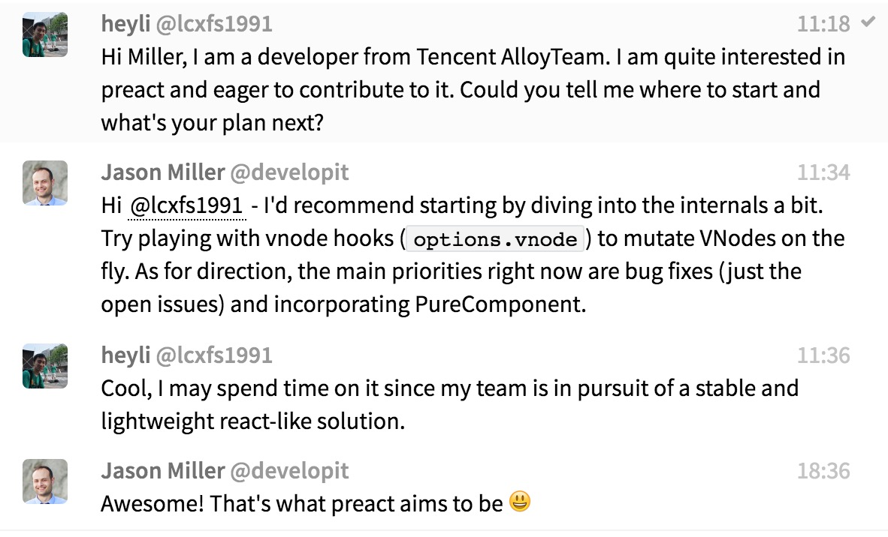

[原文链接](https://github.com/lcxfs1991/blog/issues/13)
本文使用starter-kit：[steamer-react react分支](https://github.com/SteamerTeam/steamer-react/tree/react)。此分支已集成react与preact。
## 背景

最近接手了互动视频的项目，做了一个月的运营活动。跟基础功能不同，运营活动更为轻量。因此许多同事并不想用那么“重”的React。但同时，大家由于之前度过React的上手痛苦期后，开始体会到React的许多好处，裸写运营活动的时候，又开始对React的好处念念不忘记：良好的组件化、解放js能力的jsx等。
因此，寻找轻量化的类React解决方案便提上日程。
## Preact的优点

选型的时候，首先有几个考量：
- 开源社区有较多star（认可）
- 较好的性能和兼容性
- api跟React接近
- 足够的框架周边，配置redux，router等使用
- 团队成员有能力维护的

基本上以上几点，Preact都能够很好的满足，因此最终选定为团队的类React轻量化框架进行使用和研究。
### 开源社区有较多star（认可）

相比起[react-lite](https://github.com/Lucifier129/react-lite)，[Deku](https://github.com/anthonyshort/deku), [Virtual-DOM](https://github.com/Matt-Esch/virtual-dom)，Preact虽然不是最多的star，但也能排第2，也具备测试用例，且作者开通了gitter chat跟开发者保持联系，某天在上面留言，作者也是回复得很迅速。


### 较好的性能和兼容性

性能方面，Preact也不俗。加载性能方面，由于本身的bundle在gzip后大概只有3kb，跟React相比小太多，自由就有优势。渲染性能方面，参考了一篇[JS WEB FRAMEWORKS BENCHMARK](http://www.stefankrause.net/wp/?p=283)系列测评文章，发现Preact在创建、更新、删除节点等方面，都有良好的表现。

第一次性能测试：


第二次性能测试：
<a href="http://www.stefankrause.net/js-frameworks-benchmark2/webdriver-java/table.html"></a>

包大小：

| framework | version | minimized size |
| --- | --- | --- |
| React | 0.14.3 | 136.0kb |
| React-lite | 0.15.6 | 25kb |
| Preact | 5.6.0 | 10kb |
| Deku | 2.0.0-rc16 | 51.2kb |
| Virtual Dom | 2.1.1 | 50.5kb |

除了性能的良好表现，此框架的[浏览器兼容性](https://preactjs.com/about/browser-support)也不错，能兼容目前的主流浏览器，并且在添加polyfill的情况下，能够兼容在国内还有不少份额的IE8，确实是不少还需要兼容IE8开发者的福音。
### api跟React接近

Preact的常用api基本跟React一致，这使得对React熟悉的开发者，完全没有上手的难度，Preact作者单独开辟了一个文档[Differences to React](https://preactjs.com/guide/differences-to-react)，介绍React与Preact的异同。Preact主要缺少的React Api有PropType，Children, 和 Synthetic Events（合成事件）。作者解释道，PropType其实许多人都不使用，并不影响开发； Children其实是数组，所以也并不是必须的；而合成事件，由于不需要过度考虑不同浏览器对事件处理的异同，所以也并没有做过度封装。如果真的想使用以上这些缺失的React Api，作者也提供了[preact-compat](https://github.com/developit/preact-compat)，使用的时候，在Webpack上的external这样替换便可：

```
{
    // ...
    resolve: {
        alias: {
            'react': 'preact-compat',
            'react-dom': 'preact-compat'
        }
    }
    // ...
}
```
### 足够的框架周边，配置redux，router等使用

对于React开发者来说，最常用的就是redux, router这些周边的插件。而Preact也有提供[preact-redux](https://github.com/developit/preact-compat)和[preact-router](https://github.com/developit/preact-router)，甚至还有帮助Preact做同构直出的[preact-render-to-string](https://github.com/developit/preact-render-to-string)。
### 团队成员有能力维护的

Preact项目的框架小而美，合并成的dist文件也只有500行左右，比较容易学习和维护。若团队选择此框架作为React的轻量解决方案的话，我们最好能具备维护和开发此框架的能力，这能够在遇到bug的时候第一时间修复，而且能够很好地开发一些组件，提升框架的开发效率。
## 如何上手及如何和React在同一构建下使用

作者在[Getting Started](https://preactjs.com/guide/getting-started)里有比较好的介绍。其实不外乎就2点差异：
- 引入preact与引入react的差异。
  引入preact的时候，大概是这样的：

```
import preact, { h, render, Component } from 'preact';
```

而引入react的时候，大概是这样的：

```
import React, { Component, PropTypes } from 'react';
import { render } from 'react-dom';
```
- 编译所需的插件差异。
  preact的jsx编译，主要借助[babel-plugin-transform-react-jsx](https://www.npmjs.com/package/babel-plugin-transform-react-jsx)，而react则是借助[babel-preset-react](https://www.npmjs.com/package/babel-preset-react)。

如果你想在一个构建里面同时使用React和Preact（有的页面使用React，有的用Preact），你可以通过Webapck的loader include或者exclude，然后凭路径区分。而我在steamer-react的[react-preact](https://github.com/SteamerTeam/steamer-react/tree/react-preact)分支里的处理是直接用文件名后缀。如果是有React相关引入的，则用`.js`后缀，而有Preact相关引入的，则用`.jsx`后缀。

补充自@zbinlin的答案：
babel-preset-react 也是依赖于 babel-plugin-transform-react-jsx，而 babel-plugin-transform-react-jsx 在将 jsx 编译成 js 代码时，提供了一个选项 pragma 来选择 react（默认）还是其他的 Virtual-DOM。该选项可以通过在 .babelrc 中指定，或者直接在 jsx 的源文件里通过 /*\* @jsx XXX */ pragma 来指定。

因此如果混合使用 react 和 preact，可以在使用 preact 的 jsx 文件里添加 /*\* @jsx h _/（或者 /_\* @jsx preact.h */，如果你只 import preact，而没有 import h 的话）来处理。
## Preact的实现简介

粗略看了一下Preact的实现，简单介绍一下。
### Virtual Dom

Virtual Dom算是类React框架的最大卖点。Preac作者写了一篇[WTF is JSX](http://www.jasonformat.com/wtf-is-jsx/)。主要就是借助[babel-plugin-transform-react-jsx](https://www.npmjs.com/package/babel-plugin-transform-react-jsx)的能力，里面有个pragma参数，用于设定用什么函数来做virtual dom的转换。此处定义的是`preact.h`

```
 ["transform-react-jsx", { "pragma":"preact.h" }]
```

所以，你会看到编译后，有类似的代码：

```
_preact2.default.h(
    'p',
    { className: 'info-content' },
    item.des
)
```

查看源码，preac定义了`h`的函数，用于将传入的值转换成virtual dom:

```
function h(nodeName, attributes, firstChild) {
    // some code here
}
```

所以，如果传入上面的p和对应属性，则会转换成下面的对象：

```
VNode {nodeName: "p", attributes: {class:"info-content"}, children: undefined, key: undefined}
```

但virtual dom需要转换成真实的dom，还需要一个函数进行转换。在Preact中，大体是通过这个流程，然后最终转换成真实dom：

```
render (类似于react-dom里的render，主入口，触发渲染) => diff => idiff （看起来应该是做dom diff） => createNode （生成真实dom）
```
### 组件化与生命周期

组件化也是类React框架的一大特色。Preact的组件化，主要是通过`Component`这一方法来实现的。主要包括，setState，render以及一众生命周期。主要的渲染，生命周期的触发，也主要定义在`renderComponent`和`setComponentProps`方法内。用户的自定义组件只需要继承`Component`就可以自由使用Preact组件化的能力。
### 事件机制

Preact并没有像React那样自己实现了一套事件机制，主要还是用浏览器自带的能力。因此，在给生成真实dom并通过`setAccessor`给dom插入属性的时候，有这么一段代码：

```
else if ('o' === name[0] && 'n' === name[1]) {
     var l = node._listeners || (node._listeners = {});
     name = toLowerCase(name.substring(2));
     if (value) {
         if (!l[name]) node.addEventListener(name, eventProxy);
     } else if (l[name]) node.removeEventListener(name, eventProxy);
     l[name] = value;
 }
```

判断属性中是否含有`o`和`n`，也就是在看，有没有`on`开头的属性（一般就是事件）。然后就进行addEventListener或者removeEventListener。看起来跟我们写原生js的事件绑定没有什么区别。
