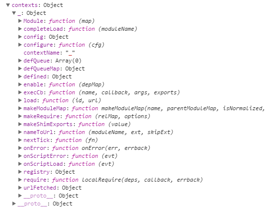

`requirejs` 算是几年前一个比较经典的模块加载方案(AMD的代表)。虽然不曾用过，但它对 `webpack`, `rollup` 这些后起之秀有不少借鉴的意义，因此也决定大体分析一下它的源码进行学习。

# 整体结构

requirejs 首先定义了一些基本的全局变量（在requirejs自执行函数里的全局），比方说版本号，对运行环境的判断、特殊浏览器(Opera)的判断等。

其次，是定义了一系列的 `util 函数，如类型判断、迭代器、`对象属性判断、Mixin（掺合函数）等等。（个人感觉这些函数在版本的浏览器都有，但这里定义主要是有兼容性的考虑）。

接下来出现下面几个判断，主要是判断 `define`, `requirejs`, `require` 三个关键函数是否已经被定义，如果已经被定义，则不进行重写。

```javascript
if (typeof define !== 'undefined') {
    //If a define is already in play via another AMD loader,
    //do not overwrite.
    return;
}

if (typeof requirejs !== 'undefined') {
    if (isFunction(requirejs)) {
        //Do not overwrite an existing requirejs instance.
        return;
    }
    cfg = requirejs;
    requirejs = undefined;
}

//Allow for a require config object
if (typeof require !== 'undefined' && !isFunction(require)) {
    //assume it is a config object.
    cfg = require;
    require = undefined;
}
```

然后，是一个横跨了几乎上千行的函数，`newContext` ，吓得我要报警了。大概浏览一下，根据注释的描述，它主要干了几件事：

1. 定义了一些模块加载相关的变量。
2. 定义了一些资料路径找寻的函数，如 `trimDots`, `normalize` 等。
3. 定义了资源模块(Module)及其依赖处理相关函数。
4. 定义了资源上下文(Context)及其加载模块的相关函数。

最后的部份，主要是定义了一些跟主入口 (main entry) 加载相关，及对外暴露的一些接口，如`require`, `requirejs`, `define`，分别用作加载配置、依赖加载、依赖（模块）定义。 

# 主入口的分析与加载

在理解了整体的架构之后，我们从主入口开始，进行更深入的分析。我们可以写一个简单的 `demo` 进行分析，示例代码如下：

```html
// index.html
<!DOCTYPE html>
<html>
    <head>
        <title>My Sample Project</title>
        <!-- data-main attribute tells require.js to load
             scripts/main.js after require.js loads. -->
        <script data-main="index" src="require.js"></script>
    </head>
    <body>
        <h1>My Sample Project</h1>
    </body>
</html>
```

```javascript
// index.js
// 定义加载的配置
require.config({
    paths: {
        util: 'helper/util'
    }
});
// 主入口的加载依赖定义
requirejs(["util"], function(util) {
	console.log(util);
});
```


正式加载主入口文件之前，`requirejs` 先初始化好资源的上下文 (context)，而这个时候 `newContext` 粉墨登场。

```javascript
req = requirejs = function (deps, callback, errback, optional) {
// some other code

if (!context) {
    context = contexts[contextName] = req.s.newContext(contextName);
}

// some other code
}
```

```javascript
// 创建默认的上下文
 req({});
```

打开 Chrome Debug 面板，能看到这个上下文 (context) 包含了以下一些属性与函数，默认上下文是 `_`，因此推断这还可以进行上下文的自定义，这个与 `requirejs` 的[多版本支持](http://requirejs.org/docs/api.html#multiversion)有关：




下面这段源码便是寻找这个主入口文件：

```javascript
if (isBrowser && !cfg.skipDataMain) {
    //Figure out baseUrl. Get it from the script tag with require.js in it.
    eachReverse(scripts(), function(script) {
        //Set the 'head' where we can append children by
        //using the script's parent.
        if (!head) {
            head = script.parentNode;
        }

        //Look for a data-main attribute to set main script for the page
        //to load. If it is there, the path to data main becomes the
        //baseUrl, if it is not already set.
        dataMain = script.getAttribute('data-main');
        if (dataMain) {
            //Preserve dataMain in case it is a path (i.e. contains '?')
            mainScript = dataMain;

            //Set final baseUrl if there is not already an explicit one,
            //but only do so if the data-main value is not a loader plugin
            //module ID.
            if (!cfg.baseUrl && mainScript.indexOf('!') === -1) {
                //Pull off the directory of data-main for use as the
                //baseUrl.
                src = mainScript.split('/');
                mainScript = src.pop();
                subPath = src.length ? src.join('/') + '/' : './';

                cfg.baseUrl = subPath;
            }

            //Strip off any trailing .js since mainScript is now
            //like a module name.
            mainScript = mainScript.replace(jsSuffixRegExp, '');

            //If mainScript is still a path, fall back to dataMain
            if (req.jsExtRegExp.test(mainScript)) {
                mainScript = dataMain;
            }

            //Put the data-main script in the files to load.
            cfg.deps = cfg.deps ? cfg.deps.concat(mainScript) : [mainScript];

            return true;
        }
    });
}
```

呼应的是 `html` 文件里，有这么一段 js 的引用：

```javascript
<script data-main="index" src="require.js"></script>
```
这样写， `requirejs` 就会帮我们去自动加载主入口文件，而它需要去提取的是 `data-main` 属性里的 `index` 值。

在最底部，有下面这段调用，`requirejs` 正式开始处理加载。

```javascript
//Set up with config info.
req(cfg);
```

第二次调用 `req` 函数，之前的配置和上下文都已经配置过，因此不会再重复配置，而此时 `config.deps` 资源依赖已经放上了主入口文件。因此 `requirejs` 开始调用 `context.require` (localRequire) 函数进行加载。

`localRequire` 函数中关键用于寻找可加载模块的逻辑主要集中在这里：

```javascript
//Grab defines waiting in the global queue.
intakeDefines();

//Mark all the dependencies as needing to be loaded.
context.nextTick(function() {
    //Some defines could have been added since the
    //require call, collect them.
    intakeDefines();

    requireMod = getModule(makeModuleMap(null, relMap));

    //Store if map config should be applied to this require
    //call for dependencies.
    requireMod.skipMap = options.skipMap;

    requireMod.init(deps, callback, errback, {
        enabled: true
    });

    checkLoaded();
});
```

 `intakeDefines` 及里面的 `takeGlobalQueue` 函数，先针对 `html` 文件中 定义的模块进行加载，然后再调用主入口文件中定义的模块。

`getModule`  和 `makeModuleMap` 主要用于生成及获取模块相关的参数。

`requireMod.init` (Module.init) 表示需要加载的模块开始进行加载的初始化工作。在该函数里，通过 `enable` => `check` => `fetch` => `load` 几个函数之后，你会逐渐看见添加并加载 `script` 的逻辑。

对于主入口文件 `index.js` 加载 `util` 逻辑，原理也是大体类似。

# 模块的定义与加载

除了主入口以外，其它模块都会采用 `define` 函数进行模块的定义，下面是例子中 `util` 及其相关依赖模块。

```javascript
// helper/utils.js
define(["helper/cart", "helper/inventory"], function(cart, inventory) {
    return {
        color: "blue",
        size: "large",
        addToCart: function() {
            inventory.decrement(this);
            cart.add(this);
        }
    }
});
```

```javascript
// helper/inventory.js
define(function() {
    return {
        decrement: function() {

        }
    }
});
```

```javascript
// helper/cart.js
define(function() {
    return {
        add: function() {

        }
    }
});
```

`define` 函数里面，还可以直接使用 `require` 进行异步加载，`requirejs` 除了通过第一个参数的依赖数组以外，还会通过匹配  `cjsRequireRegExp` 的值，进行依赖的分析，然后将相关的模块名、上下文都进行初始化：

```javascript
/**
 * The function that handles definitions of modules. Differs from
 * require() in that a string for the module should be the first argument,
 * and the function to execute after dependencies are loaded should
 * return a value to define the module corresponding to the first argument's
 * name.
 */
define = function(name, deps, callback) {
    var node, context;

    //Allow for anonymous modules
    if (typeof name !== 'string') {
        //Adjust args appropriately
        callback = deps;
        deps = name;
        name = null;
    }

    //This module may not have dependencies
    if (!isArray(deps)) {
        callback = deps;
        deps = null;
    }

    //If no name, and callback is a function, then figure out if it a
    //CommonJS thing with dependencies.
    if (!deps && isFunction(callback)) {
        deps = [];
        //Remove comments from the callback string,
        //look for require calls, and pull them into the dependencies,
        //but only if there are function args.
        if (callback.length) {
            callback
                .toString()
                .replace(commentRegExp, commentReplace)
                .replace(cjsRequireRegExp, function(match, dep) {
                    deps.push(dep);
                });

            //May be a CommonJS thing even without require calls, but still
            //could use exports, and module. Avoid doing exports and module
            //work though if it just needs require.
            //REQUIRES the function to expect the CommonJS variables in the
            //order listed below.
            deps = (callback.length === 1 ? ['require'] : ['require', 'exports', 'module']).concat(deps);
        }
    }

    //If in IE 6-8 and hit an anonymous define() call, do the interactive
    //work.
    if (useInteractive) {
        node = currentlyAddingScript || getInteractiveScript();
        if (node) {
            if (!name) {
                name = node.getAttribute('data-requiremodule');
            }
            context = contexts[node.getAttribute('data-requirecontext')];
        }
    }

    //Always save off evaluating the def call until the script onload handler.
    //This allows multiple modules to be in a file without prematurely
    //tracing dependencies, and allows for anonymous module support,
    //where the module name is not known until the script onload event
    //occurs. If no context, use the global queue, and get it processed
    //in the onscript load callback.
    if (context) {
        context.defQueue.push([name, deps, callback]);
        context.defQueueMap[name] = true;
    } else {
        globalDefQueue.push([name, deps, callback]);
    }
};
```

`requirejs` 加载完主入口文件之后，会开始依次加载这些依赖模块，并且也会逐个依赖模块进行依赖分析，以此类推。

# 点评
不过 `requirejs` 的缺陷还是很明显的。如果纯粹使用 `requirejs` 这种 AMD 的异步加载，一旦依赖非常多，就会导致加载速度很慢。当然它也提供了 `r.js` 这样的下构建工具，通过将文件打包到一起来解决问题，但相起比 `webpack` 和 `rollup`，还是免不了许多手动的工作。